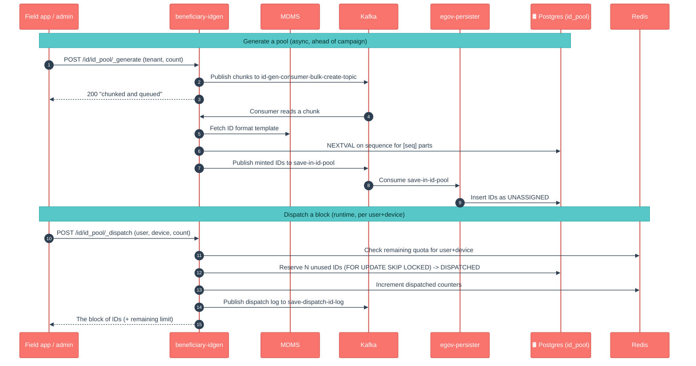

# beneficiary-idgen

## Enhancements in v2.1

Changes from v2.0 to v2.1. For this service the window is **dependency / plumbing only — no functional, API, or DB-migration changes.**

- **Version bump** `1.1.0-SNAPSHOT` → `1.1.1-SNAPSHOT`.
- **Tracer upgraded to 2.9.2** for `DataAccessException` handling via tracer's `ExceptionAdvise`, and the **direct tracer dependency was removed** — tracer now comes in **transitively** through `health-services-common`. This keeps the tracer line consistent across the health services.
- **Shared libraries bumped**: `health-services-common` `1.1.1` → `1.1.3` and `health-services-models` `1.0.29` → `1.0.30` (line-wide propagation, part of the same multi-service release).
- **OpenTelemetry BOMs added** to dependency management for version resolution, and OTEL exporters explicitly **disabled** in `application.properties` (`otel.traces/logs/metrics.exporter=none`) to avoid noisy/failed exports where no collector is configured.

There were **no changes** to controllers, services, repositories, the ID-pool/dispatch logic, or the Flyway migrations in this window.

> Note on the official LLD diagrams (`docs.digit.org/health/design/architecture/low-level-design/services/beneficiary-idgen`): the published page describes the **distributor "fetch unique IDs by device + user"** concept (the dispatch flow) but is high-level, and its sequence diagrams are images. The internal mechanics — the pre-generated **database** ID pool, **Redis-backed** per-user/per-device limits, `FOR UPDATE SKIP LOCKED` reservation, and the async Kafka **generate** pipeline — are richer than the published text and are captured in the mermaid flow above. These are implementation details that have grown since the page was written, not contradictions of it.

## 1. Purpose

beneficiary-idgen is the **ID factory and vending machine** for a health campaign. Beneficiaries (and other entities) need unique, human-readable IDs — often pre-printed on cards, wristbands, or QR stickers handed out in the field. This service:

1. **Pre-generates** large pools of unique IDs ahead of time, in the format the campaign needs (e.g. `[tenantid]-[SEQ_...]` or a random pattern), and parks them in a database "pool".
2. **Dispatches** a block of those IDs to a specific **user + device** on request, so an offline field app can carry a stock of IDs and assign them to beneficiaries without calling the server each time.

In short: *"make a big batch of unique IDs now, then hand out a safe, non-overlapping slice to each device on demand."*

## 2. Business Flow

- **During campaign setup**, an admin process calls `_generate` to mint a pool of IDs for the tenant. This is done **ahead of the campaign** because generating millions of IDs takes time — so it runs asynchronously.
- **During the campaign (runtime)**, a field worker's device calls `_dispatch` to draw down a block of unused IDs (subject to per-user/per-device limits). Each ID is marked **DISPATCHED** and logged against that user and device.
- If a device needs to **re-sync** the IDs it was already given (e.g. after a reinstall), it calls `_dispatch` with a "fetch already-allocated" flag instead of drawing new ones.
- IDs can later be **searched** (`_search`) or have their **status updated** (`_update`, e.g. marked used/returned), typically as part of reconciling what was actually assigned to beneficiaries.

## 3. Key APIs / Entry Points

Base path `/beneficiary-idgen`, controller path `/id/`.

| Endpoint | Purpose |
|---|---|
| `POST /id/id_pool/_generate` | Queue **asynchronous** generation of a pool of IDs (per tenant, by count). Returns immediately with "chunked and queued". |
| `POST /id/id_pool/_dispatch` | Hand a block of unused IDs to a **user + device** (subject to total/daily limits). With `fetchAllocatedIds=true`, returns IDs already given to that device instead. |
| `POST /id/id_pool/_search` | Look up ID records by id list, status, and tenant. |
| `POST /id/id_pool/_update` | Async **bulk** status update of ID records (e.g. mark used). Accepts the request and processes it off a Kafka topic. |

**Kafka entry points (async).**
- `_generate` splits the request into chunks and publishes to `id-gen-consumer-bulk-create-topic`; the service's own consumer mints the IDs and emits them on `save-in-id-pool` for the persister.
- `_update` publishes the request to `id-gen-consumer-bulk-update-topic`; the consumer validates and emits status changes on `update-id-pool-status`.
- Dispatch and update both write audit rows on `save-dispatch-id-log`.

> No public Swagger contract is shipped for this service in `docs/health-api-specs/contracts/`, so none is linked here. The four endpoints above are the contract.

### Kafka topics

| Topic | Dir | Purpose |
|---|---|---|
| `id-gen-consumer-bulk-create-topic` | in | Bulk id-pool create requests |
| `id-gen-consumer-bulk-update-topic` | in | Bulk id-pool update requests |
| `save-in-id-pool` | out | Persist generated ids into the pool |
| `update-id-pool-status` | out | Update id status (dispatched / used) |
| `save-dispatch-id-log` | out | Persist id-dispatch log |

## 4. Dependencies

- **egov-mdms-service** — supplies the **ID-format template** (the `IdFormat` master under `common-masters`) per tenant. Format placeholders like `[seq...]`, `[fy:...]`, `[cy:...]`, `[city]`, `[tenantid]` and random `[d{n}]` patterns are expanded into the final IDs. (A DB fallback exists if `idformat.from.mdms=false`.)
- **PostgreSQL** — the ID pool itself. Tables: `id_pool` (each ID + status UNASSIGNED/DISPATCHED) and `id_transaction_log` (who/which device got which IDs). Postgres **sequences** back the `[seq]` portion of formats. Schema is created by Flyway migrations under `db/migration/main`.
- **Redis (via Redisson)** — holds **per-user/per-device dispatched-count counters** (total and per-day) used to enforce dispatch limits, with TTL-based expiry. This is the "have you already taken your quota?" bookkeeping.
- **Kafka** — async pipeline for pool generation, status updates, and dispatch logging.
- **egov-persister** (deployed via config; YAMLs `id-pool-persister.yml` and `id-pool-dispatch-log-persister.yml` ship in this repo) — actually writes the `save-in-id-pool`, `update-id-pool-status`, and `save-dispatch-id-log` events into Postgres.
- **health-services-common / -models** — shared idgen POJOs, validators, producer, `ResponseInfo` utilities.
- **mdms-client**, **tracer** (inherited transitively via health-services-common) — MDMS access and correlation-id / exception handling.

## 5. Processing Flow

Generation is **asynchronous** (queued and chunked through Kafka, then persisted). Dispatch is **synchronous** at the API but reserves IDs atomically in the database (`FOR UPDATE SKIP LOCKED`) so two devices never get the same ID, then records the hand-out via Kafka.

## 6. Failure / Retry Handling

- **Generation never blocks the caller and never half-fails the request.** `_generate` returns once chunks are queued; the actual minting happens in the consumer. If a chunk fails, it is logged and the request is **not** retried automatically — check consumer logs. (A note in the code marks where a DLQ/retry could be added.)
- **Dispatch is concurrency-safe.** The pool draw uses `FOR UPDATE SKIP LOCKED`, so simultaneous dispatches to different devices skip locked rows rather than deadlock or double-allocate.
- **Dispatch limits are enforced.** Per-user/per-device **total** and **per-day** caps are checked against Redis counters; exceeding them returns `USER_DEVICE_LIMIT_EXCEEDED`. Counters carry a TTL and expire automatically.
- **No IDs left** returns `NO IDS AVAILABLE` — a signal that the pool needs topping up via `_generate`.
- **Random-format buffer.** When a format contains a random pattern, the batch is over-generated by a configurable buffer percentage to absorb collisions; the pool insert uses `ON CONFLICT (id) DO NOTHING`, so duplicate random IDs are silently dropped rather than failing the batch.
- **Persister dependency trap.** As with other async services: if the persister config for these topics is missing/stale in an environment, the API will accept generate/update requests but rows will silently not appear in Postgres.

## 7. Known Risks / Limitations

- **The pool must be filled before it can be drawn from.** `_dispatch` only hands out IDs that `_generate` already minted; an empty/exhausted pool returns `NO IDS AVAILABLE`. Capacity planning (generate enough, early enough) is an operational concern.
- **Two stores must agree.** The authoritative pool is in **Postgres**, but dispatch quotas live in **Redis**. If Redis is flushed/lost, dispatched-count tracking resets (limits effectively relax) even though the Postgres pool still shows IDs as DISPATCHED. Treat Redis here as enforceable bookkeeping, not the source of truth.
- **Limits are per user+device, keyed by date in a configured timezone.** "Per day" boundaries follow `id.timezone`/`app.timezone`; mis-set timezones shift when a day's quota resets.
- **Generation failures are swallowed in the consumer** (logged, not retried) — there is no dead-letter queue today, so a silently failed chunk just means fewer IDs in the pool.
- **`_update` validation assumes a single tenant per bulk request** (it reads tenantId from the first record) and treats `status` as a free string validated against the `IdStatus` enum — mixed-tenant batches are not supported.
- **`status` and the ID format are convention-driven**, not constrained by rich DB types beyond the status index; a malformed MDMS `IdFormat` surfaces as an `INVALID_FORMAT` / `ID_NOT_FOUND` at generation time, not at config time.

## 8. Release Version

| Field | Value |
|---|---|
| Release | **v2.1** — service artifact `1.1.1-SNAPSHOT` |
| Stack | Spring Boot 3.2.2 / Java 17; PostgreSQL + Flyway, Kafka, Redis (Redisson 3.45.1) |
| Shared libs | `health-services-common` 1.1.3-SNAPSHOT, `health-services-models` 1.0.30-SNAPSHOT, `mdms-client` 2.9.0-SNAPSHOT, `tracer` 2.9.2 (transitive via health-services-common) |
| Doc updated | 2026-06-12 |
| Maintainers | Health Campaign Services team (CODEOWNERS: `@kavi-egov`, `@sathishp-eGov`) |

## Reference document

Details on every parameter and its significance are mentioned in the document: `https://digit-discuss.atlassian.net/l/c/eH501QE3`
