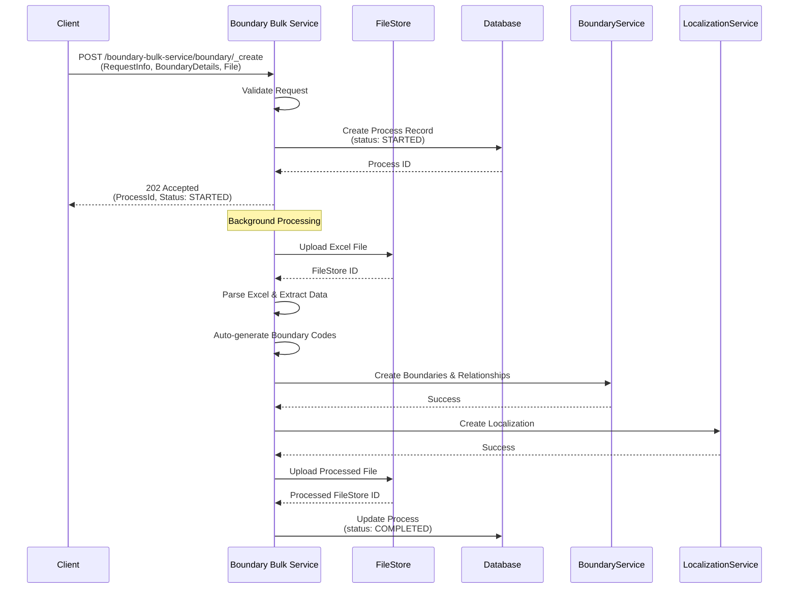
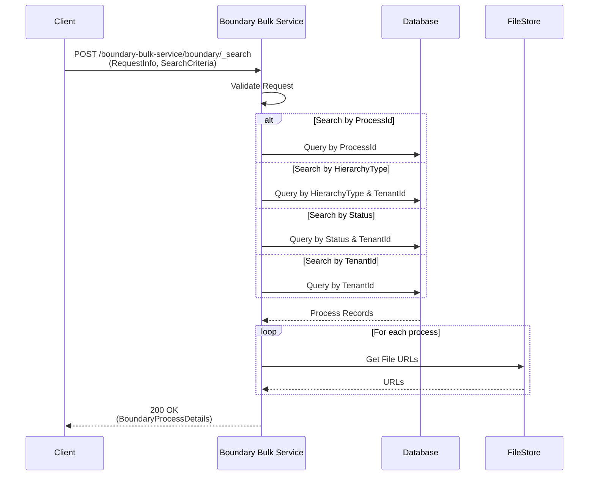
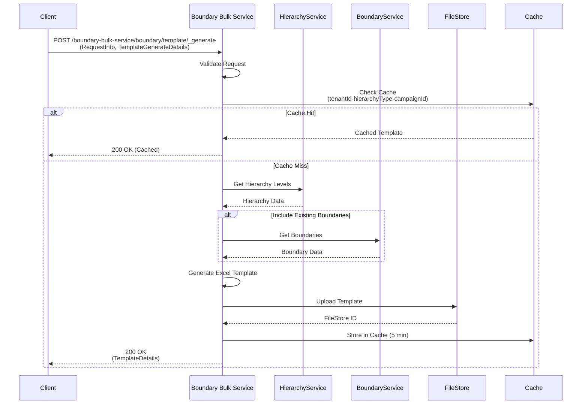
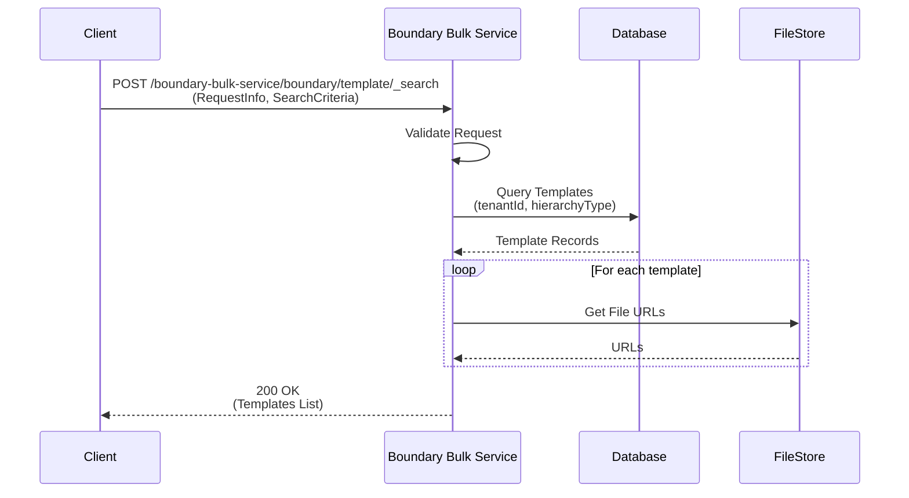

# Boundary Bulk Service APIs - Sequence Diagrams

## Overview
This document contains sequence diagrams for the new Boundary Bulk Service APIs that will handle boundary creation with support for Excel file uploads and process tracking.

## API Specifications

### 1. Boundary Bulk Create API

**Endpoint:** `/boundary-bulk-service/boundary/_create`

**Request Body:**
```json
{
  "RequestInfo": {
    "authToken": "string",
    "userInfo": {...}
  },
  "BoundaryDetails": {
    "tenantId": "string",
    "hierarchyType": "string",
    "fileType": "excel"
  }
}
```

**Response:**
```json
{
  "ResponseInfo": {...},
  "ProcessDetails": {
    "processId": "uuid",
    "status": "started"
  }
}
```

**Sequence Diagram:**



### 2. Boundary Bulk Search API

**Endpoint:** `/boundary-bulk-service/boundary/_search`

**Request Body:**
```json
{
  "RequestInfo": {
    "authToken": "string",
    "userInfo": {...}
  },
  "SearchCriteria": {
    "processId": "uuid",
    "tenantId": "string",
    "hierarchyType": "string",
    "status": "string"
  }
}
```

**Response:**
```json
{
  "ResponseInfo": {...},
  "BoundaryProcessDetails": [{
    "processId": "uuid",
    "status": "completed",
    "fileStoreId": "string",
    "processedFileStoreId": "string",
    "tenantId": "string",
    "hierarchyType": "string",
    "createdBy": "string",
    "createdTime": 1234567890,
    "errors": []
  }]
}
```

**Sequence Diagram:**



### 3. Boundary Template Generate API

**Endpoint:** `/boundary-bulk-service/boundary/template/_generate`

**Request Body:**
```json
{
  "RequestInfo": {
    "authToken": "string",
    "userInfo": {...}
  },
  "TemplateGenerateDetails": {
    "tenantId": "string",
    "hierarchyType": "string",
    "campaignId": "string",
    "includeExistingBoundaries": true
  }
}
```

**Response:**
```json
{
  "ResponseInfo": {...},
  "TemplateDetails": {
    "fileStoreId": "string",
    "templateUrl": "string"
  }
}
```

**Sequence Diagram:**



### 4. Boundary Template Search API

**Endpoint:** `/boundary-bulk-service/boundary/template/_search`

**Request Body:**
```json
{
  "RequestInfo": {
    "authToken": "string",
    "userInfo": {...}
  },
  "SearchCriteria": {
    "tenantId": "string",
    "hierarchyType": "string"
  }
}
```

**Response:**
```json
{
  "ResponseInfo": {...},
  "Templates": [{
    "id": "uuid",
    "tenantId": "string",
    "hierarchyType": "string",
    "fileStoreId": "string",
    "createdBy": "string",
    "createdTime": 1234567890
  }]
}
```

**Sequence Diagram:**



## Key Components and Their Responsibilities

### 1. **Boundary Bulk Service**
- Main service handling bulk boundary operations
- Manages async processing with process IDs
- Coordinates with other services for boundary creation

### 2. **Process Management**
- Generates unique process IDs
- Tracks process status (STARTED → PROCESSING → COMPLETED/FAILED)
- Stores process metadata in database

### 3. **Excel Processing**
- Parses uploaded Excel files
- Validates data format and hierarchy
- Auto-generates boundary codes

### 4. **Boundary Service**
- Creates boundary entities
- Establishes parent-child relationships
- Manages boundary hierarchy

### 5. **Localization Service**
- Creates localization messages for boundary names
- Supports multiple languages
- Batch processes localization data

## Error Handling

All APIs implement comprehensive error handling:

1. **Validation Errors (400)**
   - Missing required fields
   - Invalid file format
   - Invalid hierarchy type

2. **Processing Errors (500)**
   - File processing failures
   - Database connection issues
   - External service failures

3. **Not Found Errors (404)**
   - Process ID not found
   - Template not found

## Performance Considerations

1. **Batch Processing**
   - Boundary entities created in batches of 200
   - Localization messages processed in chunks

2. **Caching**
   - Template generation cached for 5 minutes
   - Redis used for performance optimization

3. **Async Processing**
   - Long-running operations handled asynchronously
   - Process status tracking for monitoring

## Database Schema

### Process Table
```sql
CREATE TABLE boundary_process (
    id UUID PRIMARY KEY,
    tenant_id VARCHAR(64) NOT NULL,
    hierarchy_type VARCHAR(128) NOT NULL,
    file_type VARCHAR(32),
    file_store_id VARCHAR(256),
    processed_file_store_id VARCHAR(256),
    status VARCHAR(32) NOT NULL,
    errors JSONB,
    created_by VARCHAR(256),
    created_time BIGINT,
    last_modified_by VARCHAR(256),
    last_modified_time BIGINT
);
```

### Template Table
```sql
CREATE TABLE boundary_template (
    id UUID PRIMARY KEY,
    tenant_id VARCHAR(64) NOT NULL,
    hierarchy_type VARCHAR(128) NOT NULL,
    campaign_id VARCHAR(256),
    file_store_id VARCHAR(256) NOT NULL,
    created_by VARCHAR(256),
    created_time BIGINT
);
```