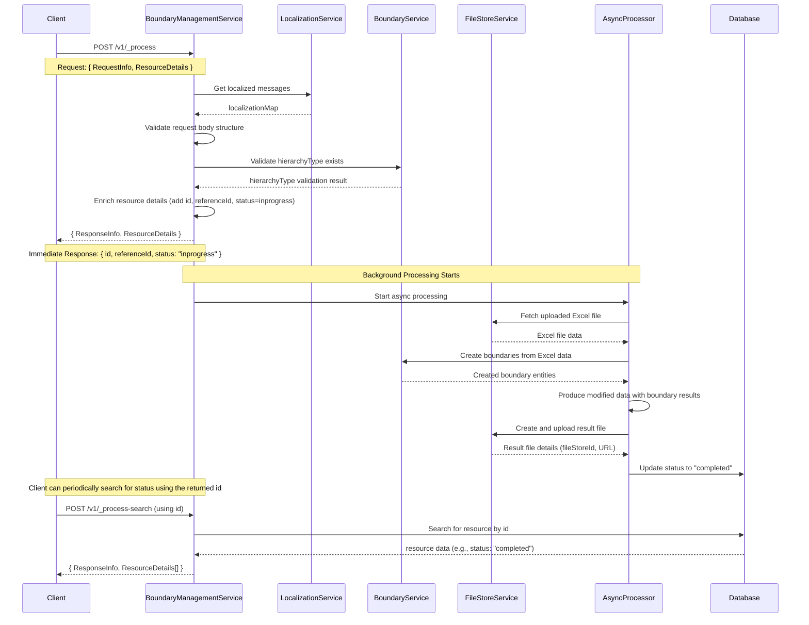
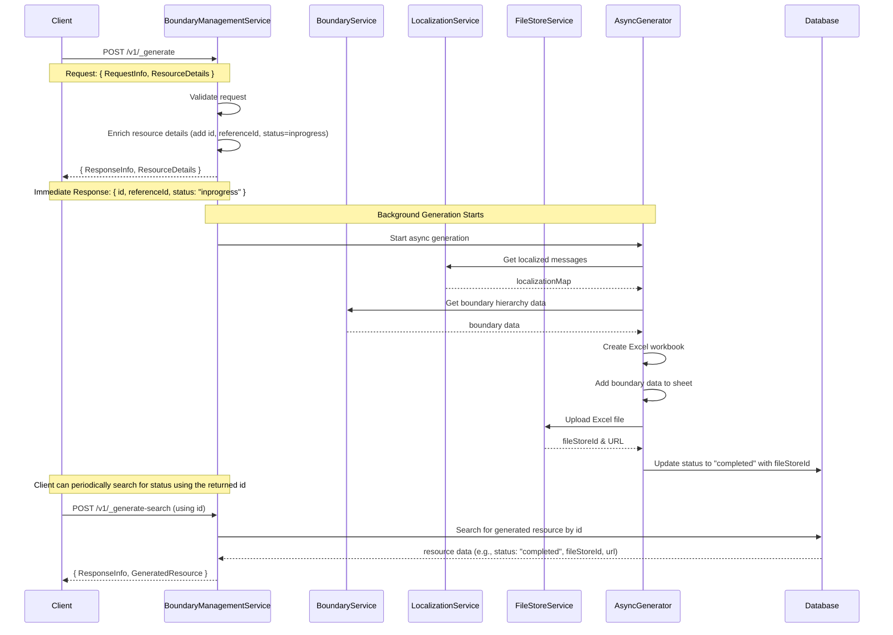
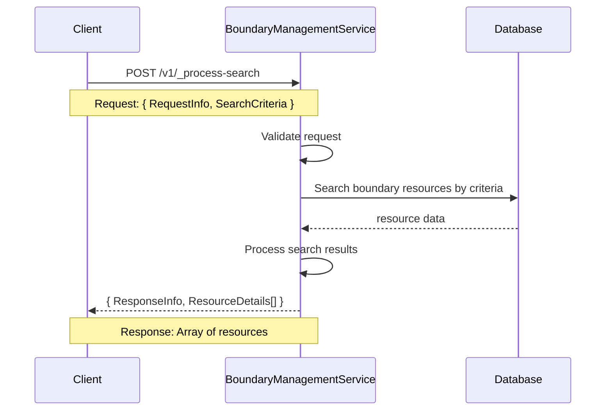
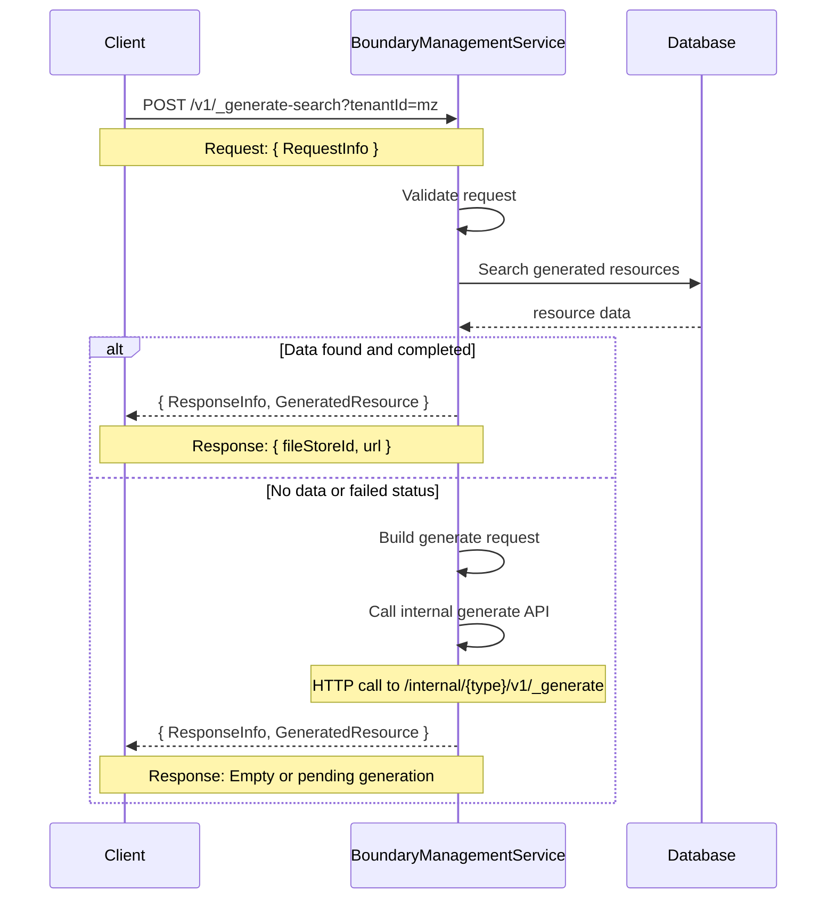

# Boundary Management Service Design

## Overview
The Boundary Management Service provides APIs for processing, generating, searching and downloading boundary data with proper hierarchy management and localization support.

## Service Architecture

### Core Components
- **Controller**: `BoundaryManagementController` - Handles HTTP requests and responses
- **Service**: `boundaryManagementService` - Contains business logic
- **Utils**: Various utility modules for localization, Excel processing, Redis caching
- **Validators**: Request validation modules
- **APIs**: External API integration modules

### Key Features
- **Hierarchy Management**: Supports multiple boundary hierarchy types (ADMIN, Health, etc.)
- **Localization**: Multi-language support with localized messages
- **Excel Processing**: Generate and process Excel templates
- **Redis Caching**: Performance optimization for frequent requests
- **Auto-generation**: Automatic resource generation when not found

## API Flow Diagrams

### 1. Process Boundary Data API (`POST /v1/_process`)



### 2. Generate Boundary Template API (`POST /v1/_generate`)



### 3. Search Boundary Resources API (`POST /v1/_process-search`)



### 4. Download Boundary Data API (`POST /v1/_generate-search`)



## API Flow Descriptions

### 1. Process Boundary Data Flow
**Purpose**: Process uploaded boundary data files and create boundary entities (Async)

**Immediate Response Steps**:
1. **Localization Setup**: Get localized messages for hierarchy type and module
2. **Request Body Validation**: Validate ResourceDetails structure and required fields
3. **Hierarchy Validation**: Validate hierarchyType exists in boundary service
4. **Resource Enrichment**: Add unique IDs (id, referenceId), timestamps, and status="inprogress"
5. **Immediate Response**: Return ResourceDetails with status="inprogress"

**Background Processing Steps**:
6. **File Processing**: Fetch uploaded Excel file from file store service
7. **Boundary Creation**: Use boundary service to create boundary entities from Excel data
8. **Result File Generation**: Generate processed Excel file with boundary creation results
9. **File Upload**: Upload processed file to file store service
10. **Status Update**: Update database status to "completed" with result file details

**Key Fields**:
- Input: `type`, `hierarchyType`, `tenantId`, `fileStoreId`, `action`
- Immediate Output: `id`, `referenceId`, `status: "inprogress"`
- Final State (in DB): `id`, `referenceId`, `status: "completed"`, `processedFileStoreId`, `additionalDetails`

**Search Usage**: Use the returned `id` or `referenceId` to search for progress via `/v1/_process-search`

**Validation Steps**:
- **Request Body**: Check required fields (hierarchyType, tenantId, fileStoreId)
- **Hierarchy Type**: Verify hierarchyType exists and is valid in boundary service
- **File Access**: Ensure uploaded file is accessible and in correct format
- **Data Format**: Validate Excel structure matches hierarchy requirements

### 2. Generate Boundary Template Flow
**Purpose**: Generate downloadable Excel templates for boundary data (Async)

**Immediate Response Steps**:
1. **Request Validation**: Validate generate request parameters
2. **Resource Enrichment**: Add unique IDs (id, referenceId), timestamps, and status="inprogress"
3. **Immediate Response**: Return ResourceDetails with status="inprogress"

**Background Generation Steps**:
4. **Localization Setup**: Get localized messages for hierarchy type and module
5. **Template Generation**: Create Excel workbook with boundary structure
6. **Data Population**: Add hierarchy-specific data and localized headers
7. **File Upload**: Upload to file store and get URL
8. **Status Update**: Update database status to "completed" with file details

**Key Fields**:
- Input: `type`, `hierarchyType`, `tenantId`
- Immediate Output: `id`, `referenceId`, `status: "inprogress"`
- Final State (in DB): `id`, `referenceId`, `status: "completed"`, `fileStoreId`, file URL

**Search Usage**: Use the returned `id` or `referenceId` to search for progress via `/v1/_generate-search`

### 3. Search Boundary Resources Flow
**Purpose**: Search existing boundary resources by criteria

**Steps**:
1. **Request Validation**: Validate search parameters
2. **Database Query**: Search resources by tenantId and other criteria
3. **Data Processing**: Format and filter results
4. **Response**: Return array of matching resources

**Key Fields**:
- Input: Query parameter `tenantId`
- Output: Array of `ResourceDetails` objects

### 4. Download Boundary Data Flow
**Purpose**: Download previously generated boundary files. Can also be used to check the status of a generation job. Includes auto-generation fallback for some criteria.

**Steps**:
1. **Request Validation**: Validate search parameters from the request body.
2. **Database Search**: Look for generated resources in database based on criteria.
3. **Auto-generation**: If searching by criteria other than `id` and no completed data is found, trigger automatic generation via internal API call.
4. **Response**: Return file details from database or an empty/inprogress response if generation was just triggered.

**Auto-generation Details**:
- **Trigger Condition**: No data OR empty results OR failed status (when searching by properties like `hierarchyType`, not by `id`).
- **Process**: Builds new generate request and calls `/internal/{type}/v1/_generate`
- **Response**: Original search results (may be empty, generation happens async)

**Key Fields**:
- Input: Criteria in request body. Can be `id` or `referenceId` to check status, or a combination of `tenantId`, `hierarchyType`, `campaignId`, `type` to download a file.
- Output: `GeneratedResource` with `fileStoreId` and `url` (from database or empty if generating)

## Key Design Patterns

### 1. **Localization Pattern**
- All APIs support multi-language through localization maps
- Hierarchy-specific and module-specific localization
- Localized Excel headers and error messages

### 2. **Caching Pattern**
- Redis caching for frequently accessed data
- Cache TTL management and reset functionality
- Cache key generation based on hierarchy type

### 3. **Auto-generation Pattern**  
- Download API triggers auto-generation when no completed resources found
- Calls internal generate API to create resources on-demand
- Uses `buildGenerateRequest()` to construct proper generate request
- Makes HTTP call to `/internal/{type}/v1/_generate` endpoint
- Prevents empty responses by ensuring data availability

### 4. **Validation Pattern**
- Dedicated validators for each operation type
- Request structure validation before processing
- Error handling with proper status codes

### 5. **Resource Enrichment Pattern**
- Automatic ID generation for tracking
- Status management throughout processing
- Additional details for metadata storage

## Error Handling

### Standard Error Response
```json
{
  "ResponseInfo": {
    "apiId": "boundary-service",
    "status": "FAILED"
  },
  "Errors": [
    {
      "code": "VALIDATION_ERROR",
      "message": "Invalid request parameters",
      "description": "Required field missing: hierarchyType"
    }
  ]
}
```

### Error Types
- **VALIDATION_ERROR**: Request validation failures
- **PROCESSING_ERROR**: Data processing failures  
- **FILE_NOT_FOUND**: Missing files or resources
- **INTERNAL_SERVER_ERROR**: System failures

## Performance Considerations

### Caching Strategy
- Redis caching for boundary data with 5-minute TTL
- Cache key format: `${hierarchyType}`
- Cache reset capability for updated data

### File Processing
- Excel streaming for large files
- Chunked file uploads to file store
- Asynchronous processing for time-intensive operations

### Database Optimization
- Indexed searches on tenantId and hierarchyType
- Paginated results for large datasets
- Connection pooling for concurrent requestshes on tenantId and hierarchyType
- Paginated results for large datasets
- Connection pooling for concurrent requests