# Boundary Management Service Design

## Overview
The Boundary Management Service provides APIs for processing, generating, searching and downloading boundary data with proper hierarchy management and localization support.

**Base Path**: `/boundary-management`

All API endpoints are prefixed with the context path `/boundary-management`.

## Service Architecture

### Core Components
- **Controller**: `BoundaryManagementController` - Handles HTTP requests and responses
- **Service**: `boundaryManagementService` - Contains business logic
- **Utils**: Various utility modules for localization, Excel processing, Redis caching
- **Validators**: Request validation modules
- **APIs**: External API integration modules

### Key Features
- **Hierarchy Management**: Supports multiple boundary hierarchy types (ADMIN, Health, etc.)
- **Localization**: Multi-language support with localized messages
- **Excel Processing**: Generate and process Excel templates
- **Redis Caching**: Performance optimization for frequent requests
- **Auto-generation**: Automatic resource generation when not found
- **Asynchronous Processing**: All data processing and generation operations are asynchronous

## API Endpoints Summary

| Method | Endpoint | Purpose |
|--------|----------|---------|
| POST | `/boundary-management/v1/_process` | Process boundary data from uploaded Excel file |
| POST | `/boundary-management/v1/_generate` | Generate boundary template Excel file |
| POST | `/boundary-management/v1/_process-search` | Search processed boundary resources |
| POST | `/boundary-management/v1/_generate-search` | Download generated boundary files |

## API Flow Diagrams

### 1. Process Boundary Data API (`POST /v1/_process`)


### 2. Generate Boundary Template API (`POST /v1/_generate`)


### 3. Search Boundary Resources API (`POST /v1/_process-search`)

```mermaid
sequenceDiagram
    participant Client
    participant BoundaryManagementService
    participant Database

    Client->>BoundaryManagementService: POST /v1/_process-search
    Note over Client,BoundaryManagementService: Request: { RequestInfo, SearchCriteria }
    
    BoundaryManagementService->>BoundaryManagementService: Validate request
    
    BoundaryManagementService->>Database: Search boundary resources by criteria
    Database-->>BoundaryManagementService: resource data
    
    BoundaryManagementService->>BoundaryManagementService: Process search results
    
    BoundaryManagementService-->>Client: { ResponseInfo, ResourceDetails[] }
    Note over BoundaryManagementService,Client: Response: Array of resources
```



### 4. Download Boundary Data API (`POST /v1/_generate-search`)


## API Specifications

### 1. Process Boundary Data API
**Endpoint**: `POST /boundary-management/v1/_process`

**Request Schema (ResourceDetails)**:
```json
{
  "tenantId": "string (required, 1-128 chars)",
  "fileStoreId": "string (required, 1-128 chars)",
  "action": "string (required, enum: [create, validate])",
  "hierarchyType": "string (required, 1-128 chars)",
  "referenceId": "string (optional, 1-128 chars)",
  "additionalDetails": "object (optional)",
  "isActive": "boolean (optional)"
}
```

**Response Schema**:
```json
{
  "ResponseInfo": { ... },
  "ResourceDetails": {
    "id": "string",
    "referenceId": "string",
    "status": "inprogress | completed | failed | invalid",
    "tenantId": "string",
    "hierarchyType": "string",
    "fileStoreId": "string",
    "action": "string",
    "additionalDetails": "object"
  }
}
```

## API Flow Descriptions

### 1. Process Boundary Data Flow
**Purpose**: Process uploaded boundary data files and create boundary entities (Async)

**Immediate Response Steps**:
1. **Localization Setup**: Get localized messages for hierarchy type and module
2. **Request Body Validation**: Validate ResourceDetails structure and required fields (tenantId, fileStoreId, action, hierarchyType)
3. **Hierarchy Validation**: Validate hierarchyType exists in boundary service
4. **Resource Enrichment**: Add unique IDs (id, referenceId), timestamps, and status="inprogress"
5. **Immediate Response**: Return ResourceDetails with status="inprogress"

**Background Processing Steps**:
6. **File Processing**: Fetch uploaded Excel file from file store service
7. **Boundary Creation**: Use boundary service to create boundary entities from Excel data
8. **Result File Generation**: Generate processed Excel file with boundary creation results
9. **File Upload**: Upload processed file to file store service
10. **Status Update**: Update database status to "completed" with result file details

**Request Fields**:
- **Required**: `tenantId`, `fileStoreId`, `action`, `hierarchyType`
- **Optional**: `referenceId`, `additionalDetails`, `isActive`

**Response Fields**:
- Immediate Output: `id`, `referenceId`, `status: "inprogress"`
- Final State (in DB): `id`, `referenceId`, `status: "completed"`, `processedFileStoreId`, `additionalDetails`

**Search Usage**: Use the returned `id` or `referenceId` to search for progress via `/v1/_process-search`

**Validation Steps**:
- **Request Body**: Check required fields (hierarchyType, tenantId, fileStoreId, action)
- **Hierarchy Type**: Verify hierarchyType exists and is valid in boundary service
- **File Access**: Ensure uploaded file is accessible and in correct format
- **Data Format**: Validate Excel structure matches hierarchy requirements
- **Action**: Must be either "create" or "validate"

### 2. Generate Boundary Template API
**Endpoint**: `POST /boundary-management/v1/_generate`

**Request Schema (ResourceDetails)**:
```json
{
  "tenantId": "string (required, 1-128 chars)",
  "hierarchyType": "string (required, 1-128 chars)",
  "forceUpdate": "string (optional, enum: [true, false])",
  "source": "string (optional)",
  "referenceId": "string (optional, 1-128 chars)"
}
```

**Response Schema**:
```json
{
  "ResponseInfo": { ... },
  "ResourceDetails": {
    "id": "string",
    "referenceId": "string",
    "status": "inprogress | completed | failed",
    "tenantId": "string",
    "hierarchyType": "string",
    "fileStoreId": "string (after completion)",
    "additionalDetails": "object"
  }
}
```

### 2. Generate Boundary Template Flow
**Purpose**: Generate downloadable Excel templates for boundary data (Async)

**Immediate Response Steps**:
1. **Request Validation**: Validate generate request parameters (tenantId, hierarchyType required)
2. **Resource Enrichment**: Add unique IDs (id, referenceId), timestamps, and status="inprogress"
3. **Immediate Response**: Return ResourceDetails with status="inprogress"

**Background Generation Steps**:
4. **Localization Setup**: Get localized messages for hierarchy type and module
5. **Template Generation**: Create Excel workbook with boundary structure
6. **Data Population**: Add hierarchy-specific data and localized headers
7. **File Upload**: Upload to file store and get URL
8. **Status Update**: Update database status to "completed" with file details

**Request Fields**:
- **Required**: `tenantId`, `hierarchyType`
- **Optional**: `forceUpdate`, `source`, `referenceId`

**Response Fields**:
- Immediate Output: `id`, `referenceId`, `status: "inprogress"`
- Final State (in DB): `id`, `referenceId`, `status: "completed"`, `fileStoreId`, file URL

**Search Usage**: Use the returned `id` or `referenceId` to search for progress via `/v1/_generate-search`

### 3. Search Boundary Resources API
**Endpoint**: `POST /boundary-management/v1/_process-search?tenantId={tenantId}`

**Query Parameters**:
- `tenantId` (required): Tenant identifier

**Request Schema**:
```json
{
  "RequestInfo": { ... }
}
```

**Response Schema**:
```json
{
  "ResponseInfo": { ... },
  "ResourceDetails": [
    {
      "id": "string",
      "referenceId": "string",
      "type": "string",
      "hierarchyType": "string",
      "tenantId": "string",
      "fileStoreId": "string",
      "action": "string",
      "status": "string",
      "additionalDetails": "object"
    }
  ]
}
```

### 3. Search Boundary Resources Flow
**Purpose**: Search existing boundary resources by criteria

**Steps**:
1. **Request Validation**: Validate search parameters (tenantId required in query)
2. **Database Query**: Search resources by tenantId and other criteria from RequestInfo
3. **Data Processing**: Format and filter results
4. **Response**: Return array of matching resources

**Request Parameters**:
- **Required**: `tenantId` (query parameter)
- **Optional**: Additional search criteria in RequestInfo

**Response**:
- Array of `ResourceDetails` objects with all resource information

### 4. Download Boundary Data API (Generate Search)
**Endpoint**: `POST /boundary-management/v1/_generate-search?tenantId={tenantId}`

**Query Parameters**:
- `tenantId` (required): Tenant identifier

**Request Schema (Search Criteria in body)**:
```json
{
  "RequestInfo": { ... }
}
```

**Note**: Additional search criteria can be passed in the request body:
- `tenantId` (string, 1-128 chars, required)
- `hierarchyType` (string, 1-128 chars, required)
- `id` (string, 1-128 chars, optional) - To check specific generation job status
- `status` (string, 1-500 chars, optional) - Filter by status
- `referenceId` (string, 1-128 chars, optional)
- `forceUpdate` (string, optional)

**Response Schema**:
```json
{
  "ResponseInfo": { ... },
  "GeneratedResource": {
    "fileStoreId": "string",
    "url": "string"
  }
}
```

### 4. Download Boundary Data Flow
**Purpose**: Download previously generated boundary files. Can also be used to check the status of a generation job. Includes auto-generation fallback for some criteria.

**Steps**:
1. **Request Validation**: Validate search parameters (tenantId, hierarchyType required)
2. **Database Search**: Look for generated resources in database based on criteria
3. **Auto-generation**: If searching by criteria other than `id` and no completed data is found, trigger automatic generation via internal API call
4. **Response**: Return file details from database or an empty/inprogress response if generation was just triggered

**Auto-generation Details**:
- **Trigger Condition**: No data OR empty results OR failed status (when searching by properties like `hierarchyType`, not by `id`)
- **Process**: Builds new generate request and calls `/internal/{type}/v1/_generate`
- **Response**: Original search results (may be empty, generation happens async)

**Request Parameters**:
- **Required**: `tenantId`, `hierarchyType`
- **Optional**: `id`, `status`, `referenceId`, `forceUpdate`

**Response**:
- `GeneratedResource` with `fileStoreId` and `url` (from database or empty if generating)

## Key Design Patterns

### 1. **Localization Pattern**
- All APIs support multi-language through localization maps
- Hierarchy-specific and module-specific localization
- Localized Excel headers and error messages

### 2. **Caching Pattern**
- Redis caching for frequently accessed data
- Cache TTL management and reset functionality
- Cache key generation based on hierarchy type

### 3. **Auto-generation Pattern**  
- Download API triggers auto-generation when no completed resources found
- Calls internal generate API to create resources on-demand
- Uses `buildGenerateRequest()` to construct proper generate request
- Makes HTTP call to `/internal/{type}/v1/_generate` endpoint
- Prevents empty responses by ensuring data availability

### 4. **Validation Pattern**
- Dedicated validators for each operation type
- Request structure validation before processing
- Error handling with proper status codes

### 5. **Resource Enrichment Pattern**
- Automatic ID generation for tracking
- Status management throughout processing
- Additional details for metadata storage

## Error Handling

### Standard Error Response
```json
{
  "ResponseInfo": {
    "apiId": "boundary-service",
    "status": "FAILED"
  },
  "Errors": [
    {
      "code": "VALIDATION_ERROR",
      "message": "Invalid request parameters",
      "description": "Required field missing: hierarchyType"
    }
  ]
}
```

### Error Types
- **VALIDATION_ERROR**: Request validation failures
- **PROCESSING_ERROR**: Data processing failures  
- **FILE_NOT_FOUND**: Missing files or resources
- **INTERNAL_SERVER_ERROR**: System failures

## Performance Considerations

### Caching Strategy
- Redis caching for boundary data with 5-minute TTL
- Cache key format: `${hierarchyType}`
- Cache reset capability for updated data

### File Processing
- Excel streaming for large files
- Chunked file uploads to file store
- Asynchronous processing for time-intensive operations

### Database Optimization
- Indexed searches on tenantId and hierarchyType
- Paginated results for large datasets
- Connection pooling for concurrent requests

## Database Schema

### Tables

#### 1. eg_bm_processed_template
Stores information about processed boundary data uploads.

**Key Columns**:
- `id`: Unique identifier (Primary Key)
- `reference_id`: Reference identifier for external tracking
- `tenant_id`: Tenant identifier
- `hierarchy_type`: Type of boundary hierarchy (e.g., ADMIN)
- `file_store_id`: ID of the uploaded Excel file
- `action`: Action performed (create/validate)
- `status`: Processing status (inprogress/completed/failed/invalid)
- `is_active`: Active status flag
- `additional_details`: JSON field for metadata
- `created_time`: Record creation timestamp
- `last_modified_time`: Last update timestamp

#### 2. eg_bm_generated_template
Stores information about generated boundary templates.

**Key Columns**:
- `id`: Unique identifier (Primary Key)
- `reference_id`: Reference identifier for external tracking
- `tenant_id`: Tenant identifier
- `hierarchy_type`: Type of boundary hierarchy
- `file_store_id`: ID of the generated Excel file
- `status`: Generation status (inprogress/completed/failed)
- `source`: Source of generation request
- `additional_details`: JSON field for metadata
- `created_time`: Record creation timestamp
- `last_modified_time`: Last update timestamp

## Configuration

### Environment Variables

**Application Configuration**:
- `APP_PORT`: Application port (default: 8080)
- `CONTEXT_PATH`: API context path (default: /boundary-management)
- `APP_LOG_LEVEL`: Logging level (default: debug)
- `INCOMING_REQUEST_PAYLOAD_LIMIT`: Request size limit (default: 2mb)

**Database Configuration**:
- `DB_SCHEMA`: Database schema (default: egov)
- `DB_USER`: Database user (default: postgres)
- `DB_HOST`: Database host (default: localhost)
- `DB_NAME`: Database name (default: postgres)
- `DB_PASSWORD`: Database password
- `DB_PORT`: Database port (default: 5432)

**External Service Configuration**:
- `EGOV_HOST`: Main eGov host URL
- `EGOV_MDMS_HOST`: MDMS service host
- `EGOV_MDMS_V2_HOST`: MDMS V2 service host
- `EGOV_FILESTORE_SERVICE_HOST`: Filestore service host
- `EGOV_BOUNDARY_HOST`: Boundary service host
- `EGOV_LOCALIZATION_HOST`: Localization service host

**Redis Configuration**:
- `CACHE_ENABLED`: Enable/disable Redis caching
- `REDIS_HOST`: Redis server host (default: localhost)
- `REDIS_PORT`: Redis server port (default: 6379)
- `RESET_CACHE`: Reset cache on startup

**Kafka Configuration**:
- `KAFKA_BROKER_HOST`: Kafka broker host (default: kafka-v2.kafka-cluster:9092)
- `KAFKA_CREATE_PROCESSED_BOUNDARY_MANAGEMENT_TOPIC`: Topic for created processed resources
- `KAFKA_UPDATE_PROCESSED_BOUNDARY_MANAGEMENT_TOPIC`: Topic for updated processed resources
- `KAFKA_CREATE_GENERATED_BOUNDARY_MANAGEMENT_TOPIC`: Topic for created generated resources
- `KAFKA_UPDATE_GENERATED_BOUNDARY_MANAGEMENT_TOPIC`: Topic for updated generated resources

**Localization Configuration**:
- `LOCALE`: Default locale (default: en_MZ)
- `LOCALIZATION_MODULE`: Localization module name (default: hcm-admin-schemas)
- `LOCALIZATION_WAIT_TIME_IN_BOUNDARY_CREATION`: Wait time for localization (default: 30000ms)
- `LOCALIZATION_CHUNK_SIZE_FOR_BOUNDARY_CREATION`: Chunk size for localization batch (default: 2000)

**Boundary Configuration**:
- `BOUNDARY_CODE_HEADER_NAME`: Boundary code header name (default: HCM_ADMIN_CONSOLE_BOUNDARY_CODE)
- `BOUNDARY_TAB_NAME`: Boundary tab name (default: HCM_ADMIN_CONSOLE_BOUNDARY_DATA)
- `EXCLUDE_HIERARCHY_TYPE_FROM_BOUNDARY_CODES`: Exclude hierarchy type from codes (default: false)
- `EXCLUDE_BOUNDARY_NAME_AT_LAST_FROM_BOUNDARY_CODES`: Exclude boundary name from codes (default: false)
- `IS_ENVIRONMENT_CENTRAL_INSTANCE`: Central instance flag (default: false)

## Service Dependencies

### External Services
1. **MDMS Service**: For master data management and schema definitions
2. **Boundary Service**: For boundary hierarchy and entity management
3. **Filestore Service**: For file upload and download operations
4. **Localization Service**: For multi-language support
5. **Kafka**: For asynchronous event processing
6. **Redis**: For caching and performance optimization
7. **PostgreSQL**: For data persistence

### Internal Dependencies
- **Node.js**: Runtime environment
- **Express**: Web framework
- **ExcelJS**: Excel file processing
- **PostgreSQL Client**: Database connectivity