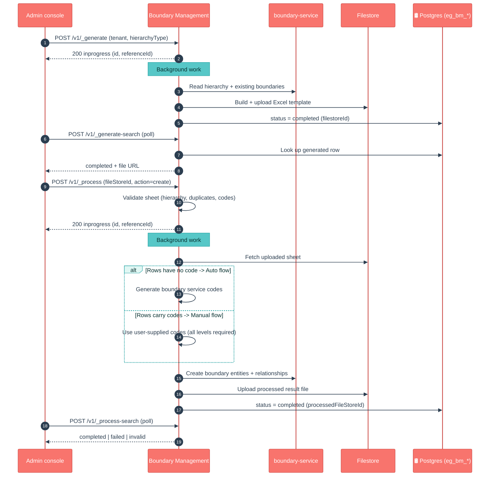

# Boundary Management

## Enhancements in v2.1

**There are no code changes to boundary-management in the v2.1 line.** The service is unchanged between v2.0 and v2.1. It was introduced as a new service just before the `v2.0` cut and shipped with its current capabilities, which are the ones often discussed under the v2.1 / Nigeria work:

- **Auto vs Manual processing flow** — _process auto-detects whether to generate boundary service codes (rows without codes) or accept user-supplied codes (Manual flow, which requires codes on every level).
- **GeoJSON-aware boundaries** — when reading boundaries back from boundary-service, `Point` geometries are picked up as lat/long for the codes (boundary entities are created with `geometry: null` and enriched later).
- **Multi-hierarchy support** — works across hierarchy types (ADMIN, Health, …), with localized headers/tabs per tenant locale.
- **Same display name across levels** — boundaries are tracked per hierarchy level (level + name + parent context), so two boundaries that share the same display name at different levels are disambiguated rather than collapsed.

If a future release does touch this service, that is where incremental v2.1 notes would go.

## 1. Purpose

Boundary Management is an **admin-console helper** that turns a campaign's geography into something an administrator can edit in a spreadsheet and load into the platform. It does two jobs:

- **Generate** a ready-to-fill Excel template that lists every boundary (country → region → district → village …) for a chosen hierarchy.
- **Process** that filled-in spreadsheet back: validate it, assign or accept boundary **service codes**, and push the boundaries into the platform's boundary store.

It is a convenience layer, **not the system of record**. The canonical place where boundaries actually live is **boundary-service** in Digit-Core; Boundary Management only prepares templates and feeds boundaries into that service. Think of it as *"download the boundary worksheet, fill it, upload it, and let the platform register the boundaries."*

It is a **Node.js / TypeScript** Express service (a "backend-for-frontend" for the HCM admin console), not a Java/Spring service like most of the other health services.

## 2. Business Flow

- **During campaign setup**, an administrator picks a **hierarchy type** (e.g. ADMIN, Health) and calls **_generate** to get an Excel template pre-filled with the existing boundary tree and localized headers.
- The administrator **fills the sheet** — adding new villages/areas and, optionally, their boundary service codes — and uploads the file to the file store.
- They call **_process** with that file. The service validates the sheet and registers boundaries in two ways depending on what was entered:
  - **Auto flow** — rows have no service code, so the service **generates the codes** automatically.
  - **Manual flow** — every boundary already carries a user-supplied service code, which the service uses as-is (it insists all parent/intermediate rows also have codes).
- The processed result (status + an output file) is saved so the console can **poll** for completion via the `*-search` endpoints.
- The registered boundaries then become the geography that **project-factory, project, household, facility, plan-service** and the dashboards all hang campaign data off of.

## 3. Key APIs / Entry Points

Base path `/boundary-management/v1`. All four endpoints are HTTP POST. The two "action" endpoints kick off background work and return immediately with `status: inprogress`; the two `*-search` endpoints are how a client checks on that work.

| Endpoint | Purpose |
|---|---|
| `POST /v1/_generate` | Start building a boundary Excel template for a hierarchy. Returns immediately (`inprogress`); the file is produced asynchronously. |
| `POST /v1/_generate-search` | Poll for / download a generated template by `tenantId` + `hierarchyType` (or `id`). If none exists yet, it auto-triggers a generate. |
| `POST /v1/_process` | Upload a filled template (`fileStoreId`, `action`, `hierarchyType`) to validate and register boundaries. Returns immediately (`inprogress`); work continues in the background. |
| `POST /v1/_process-search` | Poll for the status/result of a process job by `tenantId` (and other criteria). |

There is also a small **localisation** controller (cache-bust / message helpers) used internally by the console.

**State is held in Postgres and polled — there are no webhooks/callbacks.** Two tables track everything:

- `eg_bm_generated_template` — one row per generate job (status, `filestoreid`, hierarchy, locale).
- `eg_bm_processed_template` — one row per process job (status, source `filestoreid`, `processedfilestoreid`, `action`).

Status values move through `inprogress → completed | failed` (generate) and `inprogress → completed | failed | invalid` (process).

> No boundary-management contract is published under `docs/health-api-specs/contracts/`; a local `boundary-management-swagger.yaml` ships in the service directory.

### Kafka topics

_Produces only — no consumer listeners._

| Topic | Dir | Purpose |
|---|---|---|
| `create-generated-boundary-management` | out | Emit generated boundary-template event |
| `update-generated-boundary-management` | out | Update generated-template status |
| `create-processed-boundary-management` | out | Emit processed boundary-upload event |
| `update-processed-boundary-management` | out | Update processed status |

## 4. Dependencies

- **boundary-service** (Digit-Core) — the real boundary store. Boundary Management searches the hierarchy definition and existing boundaries here, then creates new boundary **entities** and **relationships** here. This is the most important dependency.
- **MDMS (v1/v2)** — schema and master data that drive template columns and validation.
- **Filestore** — stores the generated/processed Excel files; the console downloads by `fileStoreId`.
- **Localization** — localized sheet headers, tab names and messages (multi-locale, e.g. `en_MZ`).
- **Kafka** (`kafkajs`) — the service **emits its own status events** (`create/update-generated-…`, `create/update-processed-boundary-management`) which a persister turns into the Postgres rows above. It does not write those state rows directly.
- **Postgres** — the two `eg_bm_*` tables (Flyway-style migration applied via the `migration/` container).
- **Redis** (`ioredis`) — caches boundary sheet data and HTTP responses for speed.

This is a standalone Node service (Express, ExcelJS/xlsx, axios, zod/yup, lodash); it does **not** use the `health-services-common`/`-models` Java libraries the rest of the vertical shares.

## 5. Processing Flow

Both action endpoints are **fire-and-forget**: validate, acknowledge with `inprogress`, then do the heavy work in the background and update status. The client **polls** a `*-search` endpoint until the status is `completed` (or `failed`). On _process, the service decides between the **Auto** and **Manual** flow based on whether the uploaded rows already carry service codes.

> **Note on the official LLD diagrams** (`docs.digit.org/.../console-services/boundary-management-boundary-manager`): the published page documents the `_generate` and `_process` APIs and the Auto-vs-Manual split shown above. The `_generate-search` / `_process-search` polling endpoints, the GeoJSON `Point` lat/long handling, and the same-display-name disambiguation are **not in the published diagrams** and are captured here from the current code.

## 6. Failure / Retry Handling

- **Asynchronous, poll-based.** A `200 inprogress` only means the request was accepted. A job can still fail in the background — clients must poll `*-search` and check the `status`. A `failed` (or `invalid`) row carries the error detail in `additionalDetails.error`.
- **Validation up front.** _process rejects malformed sheets early: wrong/duplicate rows, a non-unique first (root) column, and — in Manual flow — any boundary (including parents/intermediates) missing a service code.
- **Idempotent boundary creation.** Before creating, the service searches boundary-service for codes that already exist and only creates the missing ones, so re-running a process does not duplicate boundaries.
- **HTTP retries** on downstream calls are built in (configurable `MAX_HTTP_RETRIES`, default 4; retries known transient errors such as "socket hang up").
- **Auto-generate fallback.** `_generate-search` for a hierarchy with no existing template auto-triggers a generate rather than returning empty.
- **Known footgun:** because state is written via Kafka events that a persister consumes, if the persister/Kafka wiring is missing or stale in an environment, the API can report `inprogress` while the status row never advances — check the persister and the `eg_bm_*` tables.

## 7. Known Risks / Limitations

- **Not the source of truth.** Boundaries actually live in **boundary-service**; this service only prepares templates and pushes data in. Reads/edits done directly in boundary-service won't reflect back into the generated templates until regenerated.
- **No callbacks — polling only.** Clients must poll `*-search`; a slow background job looks the same as a stuck one until you inspect the status/error.
- **Excel-shaped contract.** Behaviour depends on column headers, the boundary tab name and localization keys lining up with MDMS/localization config; a misconfigured locale or header breaks generate/process.
- **Manual flow is strict.** Every boundary in the chain must carry a service code or the whole upload is rejected — mixing coded and uncoded boundaries within one parent chain is not supported.
- **Default config points at a shared dev host.** `config/index.ts` falls back to `unified-dev.digit.org` for downstream hosts; environments must override the `EGOV_*` host variables or calls go to the wrong place.
- **Status durability depends on Kafka/persister.** State is emitted as events; a missing persister config silently leaves jobs looking `inprogress`.

## 8. Release Version

| Field | Value |
|---|---|
| Release | **v2.1** |
| Stack | Node.js / TypeScript (Express) |
| Key versions | TypeScript 5.4.2, Express 4.19.2, ExcelJS 4.4.0 / xlsx 0.18.5, kafkajs 2.2.4, ioredis 5.4.1, axios 1.6.8, pg 8.12.0 (service `version` 1.0.0) |
| Doc updated | 2026-06-12 |
| Maintainers | `@jagankumar-egov` |
