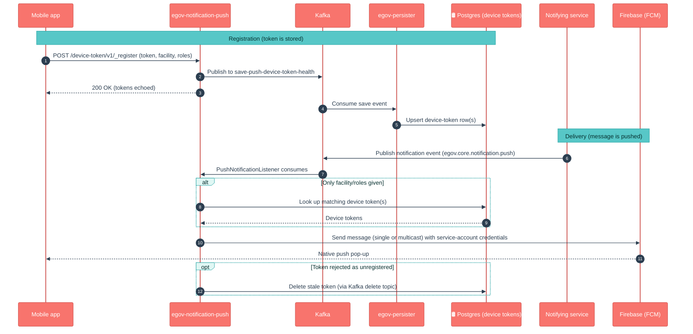

# egov-notification-push

## 1. Purpose

egov-notification-push is the **mobile push-notification sender** for the health campaign. Its job is to get a short message ("New stock arrived", "Your task is due") onto a field worker's phone as a native pop-up, using **Firebase Cloud Messaging (FCM)** — Google's delivery network for Android/iOS/web push.

To do that it has two responsibilities:

1. **Remember which device belongs to whom.** Phones register their FCM "device token" (a per-install address) with this service, optionally tagged with the user's facility and roles.
2. **Deliver messages.** When another service wants to notify someone, this service looks up the right device token(s) and hands the message to FCM, which does the actual delivery.

In short: *"who is on which phone, and push this message to them."*

## 2. Business Flow

- **On login / app start**, the mobile app registers its device token (linked to the user, their facility, and their roles). One token can be registered against several facilities.
- **During the campaign**, another service (for example health-notification-service, reacting to a stock or task event) decides "facility X needs to know Y" and drops a push-notification event on Kafka.
- **This service resolves the audience** — either explicit device tokens / user UUIDs in the request, or, if only a facility (and optionally roles) is given, it looks up every matching device token in its own store.
- **The message is sent to FCM**, which delivers the pop-up to each phone. Phones that have uninstalled the app (their token is "unregistered") are automatically cleaned out of the store.
- In environments where FCM is switched off, the message is instead **logged to the console** so flows can be tested without real delivery.

## 3. Key APIs / Entry Points

Base paths `/device-token/v1` (managing the phone↔user registry) and `/push/v1` (sending on demand). Context path is `/egov-notification-push`.

| Endpoint | Purpose |
|---|---|
| `POST /device-token/v1/_register` | Register a phone's FCM token for a user (with facility ids and roles). Persisted async via Kafka. |
| `POST /device-token/v1/_unregister` | Remove a token everywhere for a user (e.g. on logout), regardless of facility. |
| `POST /device-token/v1/_delete` | Delete a token, optionally scoped to specific facilities. |
| `POST /device-token/v1/_search` | Fetch the latest device token(s) for a set of user ids. |
| `POST /push/v1/_send` | Send a push **on demand**: resolves user UUIDs / device tokens, fires to FCM, returns how many devices were targeted. |

**Kafka entry point (async, the main path).** A notification event lands on the configured push topic (default `egov.core.notification.push`, tenant-prefixed in central-instance mode) and is consumed by `PushNotificationListener`, which resolves the audience and sends to FCM. Device-token writes are published to `save-push-device-token-health` / `delete-…` / `unregister-…` for **egov-persister** to write to Postgres.

_No published Swagger contract exists for this service yet._

### Kafka topics

| Topic | Dir | Purpose |
|---|---|---|
| `egov.core.notification.push` | in | Inbound push-notification requests (central-instance: `{tenantId}-` prefixed pattern) |
| `save-push-device-token-health` | out | Persist device-token registration |
| `delete-push-device-token-health` | out | Persist device-token deletion |
| `unregister-push-device-token-health` | out | Persist device-token unregistration |

## 4. Dependencies

- **Firebase Cloud Messaging (FCM)** — the external Google service that actually delivers the push. Authenticated with the FCM service-account credentials (supplied as an environment value, never checked into the repo).
- **Kafka** — both the inbound notification-event topic and the outbound device-token persister topics.
- **egov-persister** (deployed via the `configs/` repo) — turns the device-token Kafka events into rows in Postgres; the service does not write the registry directly.
- **Postgres** — stores the device-token registry (table `eg_push_device_tokens`). Flyway migrations under `db/migration/main` create and evolve this table on start.
- **tracer** (`2.9.2-SNAPSHOT`) — correlation-id propagation, error handling, OpenTelemetry/Jaeger tracing.
- **Upstream callers** — health-notification-service (and any service emitting push events) are the producers of the inbound notification events; the mobile app is the producer of device-token registrations.

## 5. Processing Flow

Registration and delivery are two separate, mostly-async flows. The service reads the device-token registry directly from Postgres but **writes** it through Kafka + egov-persister. Delivery itself is offloaded to FCM.

> No official LLD sequence diagram is published for this service yet; the flow above reflects the current code.

## 6. Failure / Retry Handling

- **Consumer is fail-soft.** `PushNotificationListener` wraps processing in a try/catch and logs errors — a bad message does not crash the consumer, but it is **not** automatically retried; check logs (`notification-push-deadletter` is configured as the tracer error topic).
- **No audience = no-op.** If no device tokens resolve (e.g. no phones registered for that facility/role), the send is skipped with a warning rather than erroring.
- **Stale-token cleanup.** When FCM reports a token as `UNREGISTERED` (app uninstalled), that token is deleted from the registry so it isn't tried again — keeps the store self-healing.
- **Multicast is batched.** Large audiences are split into FCM batches (default 500); a per-token failure inside a batch is logged and does not stop the rest of the batch.
- **FCM off → console fallback.** With `fcm.enabled=false` the `ConsolePushService` simply logs the notification; nothing is delivered but flows still complete. With FCM on but credentials missing/blank, the app **fails fast at startup** (Firebase init throws).
- **Async registry writes.** `_register/_delete/_unregister` return `200` before the row is persisted. If the persister config for these topics is missing/stale in an environment, tokens are accepted but never stored — a classic "it worked in QA" trap.

## 7. Recent Changes (v2.1 / nigeria-go-deep-2)

Changes between the `v2.0` baseline and the `master-nigeria-finalpull` release line, in plain language for product owners, QA and ops.

- **The whole service was merged into the v2.1 line.** Previously this folder held only resources and was deployed from elsewhere; in v2.1 the **full Java source (~34 files), `pom.xml`, `Dockerfile`, `start.sh`, tests and DB migrations** were merged in (single commit "Health-notification-service and egov-notification-push services merged"). It is now a real, buildable service in this repo — older "resources-only, don't build here" notes are stale.
- **Device-token registry.** Phones register/unregister/delete/search their FCM tokens via `/device-token/v1/*`. Registrations are stored in Postgres (`eg_push_device_tokens`) through Kafka + egov-persister.
- **FCM push delivery + console fallback.** Real delivery goes through Firebase (single or batched multicast); when FCM is disabled, notifications are logged to the console so non-prod environments can run the flow without sending anything.
- **Facility- and role-based targeting.** A notification can name just a facility (and optionally a list of recipient roles like `WAREHOUSE_MANAGER`, `DISTRIBUTOR`); the listener resolves the matching device tokens itself. Migrations added a `facilityid` column, then allowed one token across multiple facilities, then added a `userroles` column for role filtering.
- **On-demand send API.** `/push/v1/_send` lets a caller push immediately by user UUIDs and/or raw device tokens, returning the number of devices targeted.
- **Multi-tenant / central-instance aware.** In central-instance mode the inbound topic and persister topics are tenant-prefixed and the DB schema is derived from the tenantId.

## 8. Known Risks / Limitations

- **No retry / dead-letter replay on the consumer.** Failed push events are logged and dropped; there is no built-in re-processing, so a transient FCM outage means those notifications are simply missed.
- **Delivery is best-effort.** FCM accepting a message does not guarantee the phone shows it; this service has no read-receipt or delivery-confirmation back-channel.
- **Hard dependency on the FCM service-account credentials.** With FCM enabled, a missing or malformed credential value crashes the service at startup.
- **Registry writes depend on external persister config.** If the device-token persister mappings aren't deployed in an environment, registrations silently never persist.
- **Role filtering is substring-based.** Roles are stored as a comma-separated string and matched with `LIKE`, so role codes that are substrings of one another could over-match — worth a QA check if role names overlap.
- **No Swagger / formal API contract** is published yet; integrators work from this README and the controllers.

## 9. Release Version

| Field | Value |
|---|---|
| Release | **v2.1** (`master-nigeria-finalpull`) |
| Stack | Spring Boot 3.2.2 / Java 17 |
| Key deps | Firebase Admin SDK `9.2.0`, `tracer` `2.9.2-SNAPSHOT`, Flyway `9.22.3`, PostgreSQL driver `42.7.1` |
| Doc updated | 2026-06-12 |
| Maintainers | Health Campaign Services team |
