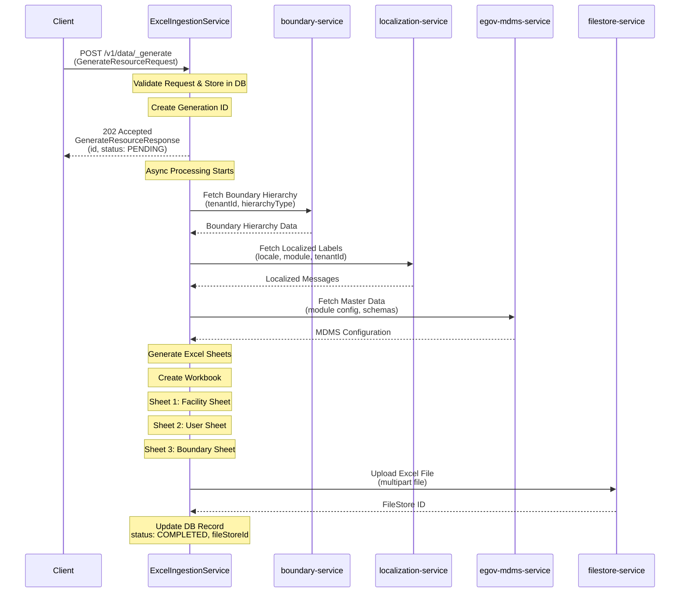
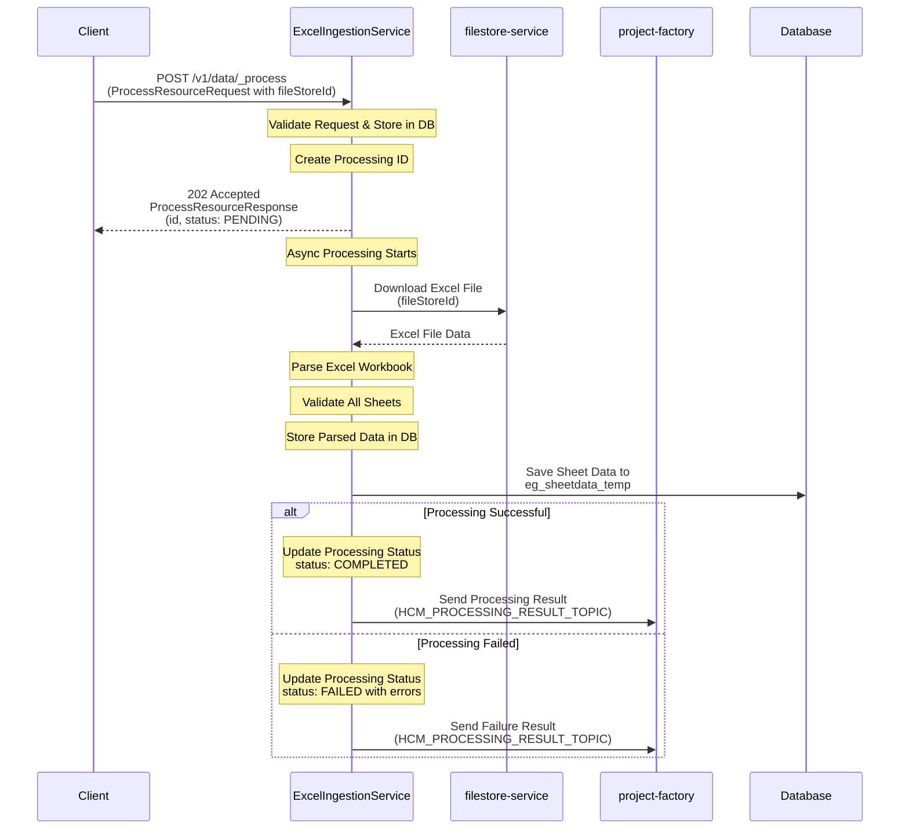
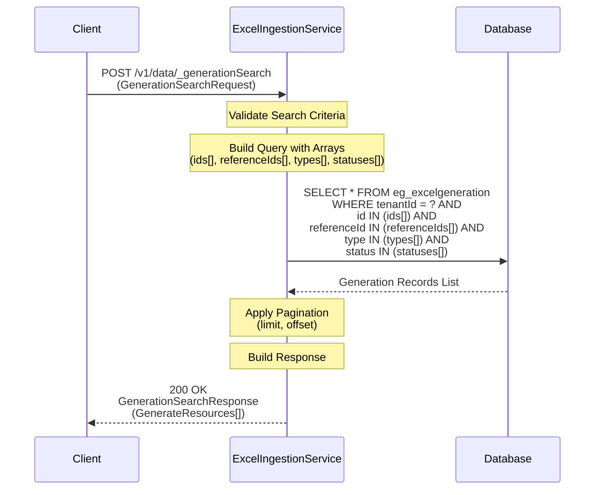
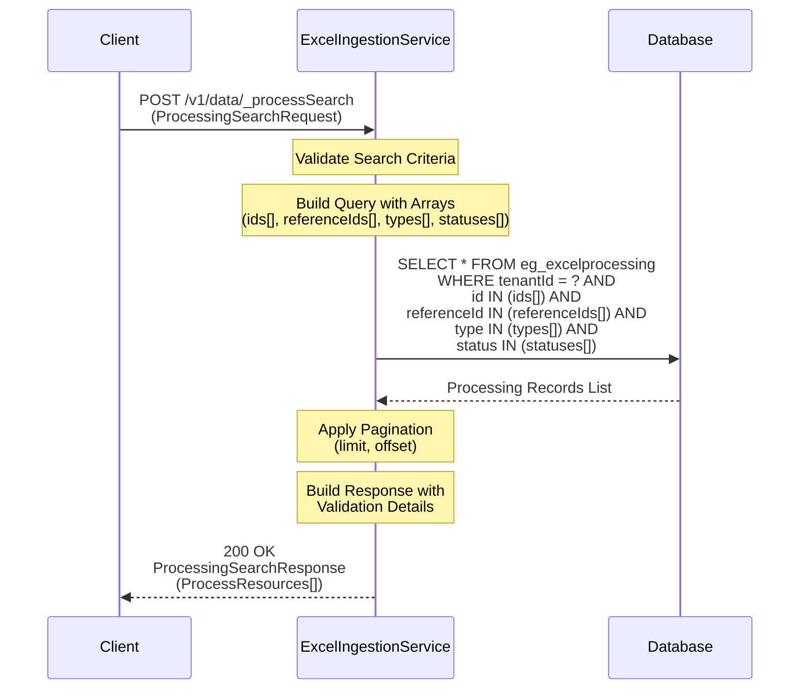
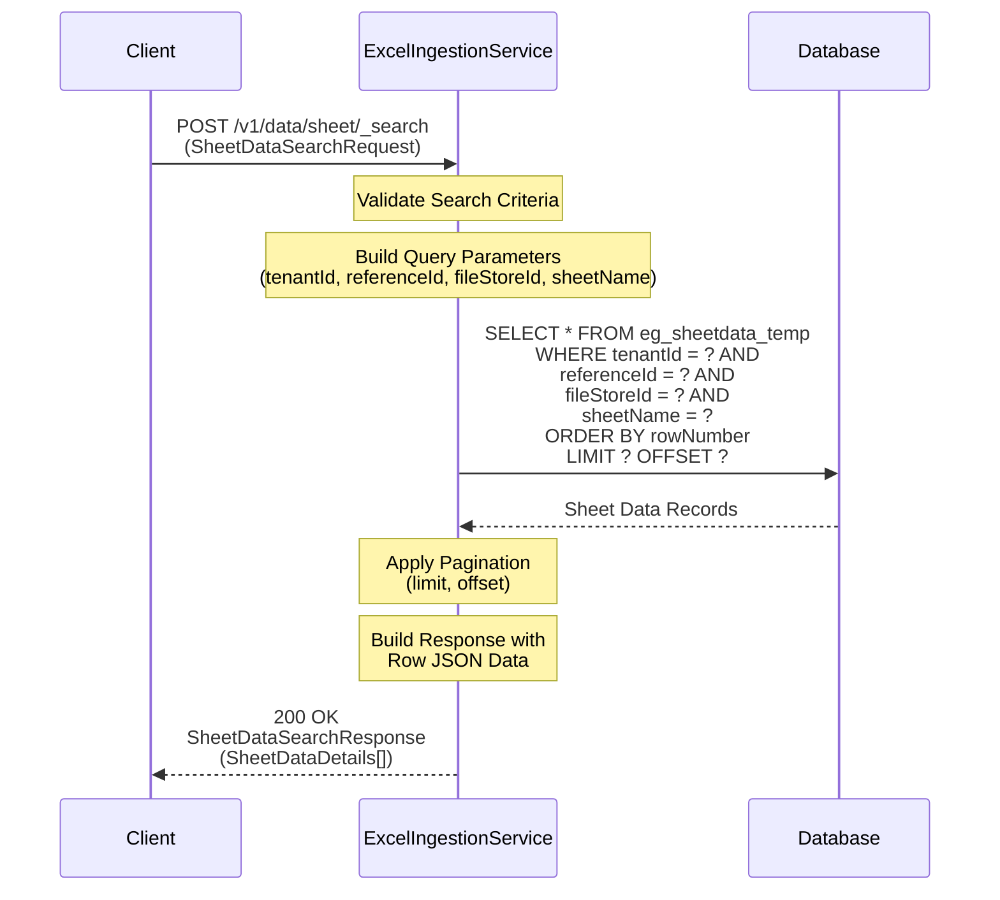
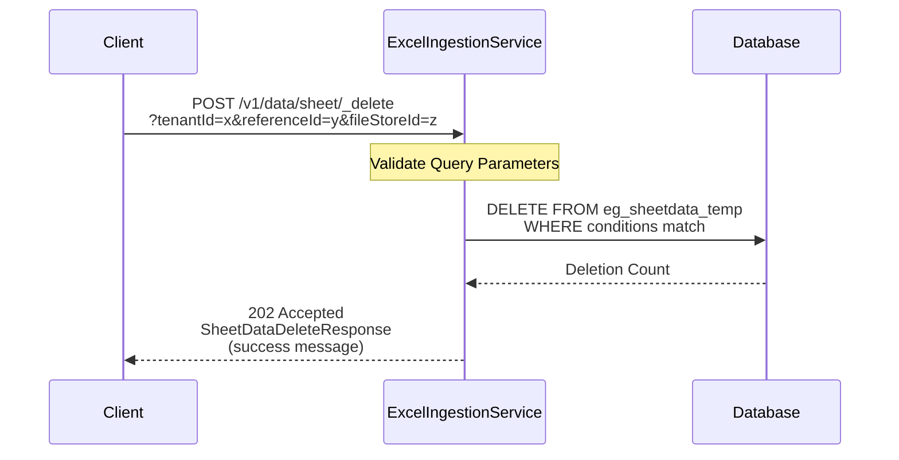
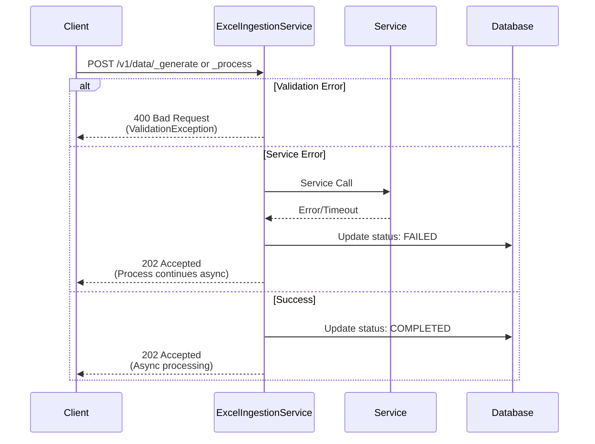
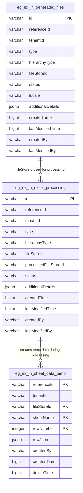

# Excel Ingestion Service

### Excel Ingestion Service
Excel Ingestion Service is a comprehensive Health Campaign Service that facilitates Excel template generation, processing, and sheet data management. The service supports full workflow including Excel template creation, file processing with validation, and temporary sheet data management. All functionality is exposed via REST APIs with async processing support.

### Service Architecture Diagrams

## 1. Excel Generation Flow (Async)



## 2. Excel Processing Flow (Async)



## 3. Generation Search Flow



## 4. Processing Search Flow



## 5. Sheet Data Search Flow



## 6. Sheet Data Delete Flow



## 7. Error Handling Flow



### DB UML Diagram



#### Table Details:
- **eg_ex_in_generated_files**: Tracks async Excel template generation requests
- **eg_ex_in_excel_processing**: Tracks async Excel file processing requests  
- **eg_ex_in_sheet_data_temp**: Stores parsed Excel data temporarily during validation

#### Key Relationships:
- Generated Excel (fileStoreId) can be used for processing
- Processing requests create temporary sheet data for validation
- Sheet temp data is cleaned up after processing completion

### Service Dependencies

#### Core Platform Services
- **egov-filestore**: Excel file upload/download management
- **egov-localization**: Multi-language support for labels and messages
- **egov-mdms**: Master data configuration and schemas
- **boundary-service**: Boundary hierarchy and relationships

#### Health Campaign Services  
- **project-factory**: Campaign data search and crypto operations
- **health-individual**: Individual/user data search and validation
- **facility**: Facility data search and validation

#### External Libraries
- Apache POI (Excel generation and parsing)
- Spring Boot
- Spring Web
- Spring Kafka (Producer integration)
- PostgreSQL (Database)
- Flyway (Database migrations)

### Swagger API Contract
Link to the swagger API contract yaml and editor link like below

https://editor.swagger.io/?url=https://raw.githubusercontent.com/egovernments/health-campaign-services/master/health-services/excel-ingestion/excel-ingestion-swagger.yml

For local reference, see [excel-ingestion-swagger.yml](./excel-ingestion-swagger.yml)

### Service Details

#### Functionality

1. **Excel Template Generation**: Generates Excel templates with boundary hierarchy data (Async)
2. **Excel File Processing**: Validates and processes uploaded Excel files with comprehensive error reporting (Async)
3. **Sheet Data Management**: Search and delete temporary sheet data stored during processing
4. **Generation/Processing Search**: Track and monitor async operations with detailed status
5. **Multi-sheet Support**: Creates multiple sheets including:
   - Facility Sheet  
   - User Sheet
   - Boundary Sheet
6. **Dynamic Column Generation**: Dynamically creates columns based on hierarchy levels
7. **File Upload**: Automatically uploads generated Excel files to egov-filestore
8. **Localization Support**: Integrates with localization service for multi-language support
9. **Data Validation**: Comprehensive validation rules for Excel data processing
10. **Error Reporting**: Detailed error reporting with line-by-line validation results

#### Features

1. **Configurable Templates**: Supports different template types based on hierarchy type
2. **Boundary Validation**: Validates boundary data before Excel generation
3. **Error Handling**: Comprehensive error handling with meaningful error messages
4. **Async Processing**: Supports asynchronous processing for large datasets
5. **Multi-tenant Support**: Full multi-tenant architecture support

#### API Details
BasePath `/excel-ingestion/v1/data`

Excel Ingestion service APIs - comprehensive suite for Excel workflow management

**Generation APIs:**
* POST `/v1/data/_generate` - Generate Excel Template (Async), generates Excel template and uploads to filestore
* POST `/v1/data/_generationSearch` - Search generation records with status tracking

**Processing APIs:**  
* POST `/v1/data/_process` - Process Excel File (Async), validates uploaded Excel files 
* POST `/v1/data/_processSearch` - Search processing records with detailed results

**Sheet Data Management APIs:**
* POST `/v1/data/sheet/_search` - Search temporary sheet data by various criteria
* POST `/v1/data/sheet/_delete` - Delete temporary sheet data for cleanup

##### Request Structure
```json
{
  "RequestInfo": {
    "apiId": "excel-ingestion",
    "ver": "1.0",
    "ts": 1690371438000,
    "msgId": "1234567890",
    "userInfo": {
      "uuid": "11b0e02b-0145-4de2-bc42-c97b96264807"
    }
  },
  "GenerateResource": {
    "tenantId": "pg.citya",
    "type": "boundary",
    "hierarchyType": "ADMIN",
    "referenceId": "REF-2023-001",
    "additionalDetails": {}
  }
}
```

##### Response Structure
```json
{
  "ResponseInfo": {
    "apiId": "egov-bff",
    "ver": "0.0.1",
    "ts": 1690371438000,
    "status": "successful"
  },
  "GenerateResource": {
    "id": "550e8400-e29b-41d4-a716-446655440000",
    "tenantId": "pg.citya",
    "type": "boundary",
    "hierarchyType": "ADMIN",
    "referenceId": "REF-2023-001",
    "status": "PENDING",
    "fileStoreId": null,
    "additionalDetails": {}
  }
}
```

### Configuration

### Kafka Consumers

- **NA** - This service does not consume from any Kafka topics

### Kafka Producers

This service produces to the following Kafka topics:

**Generation Service Topics:**
- **save-generated-file**: Initial generation request records
- **update-generated-file**: Updates to generation status (PENDING → COMPLETED/FAILED)

**Processing Service Topics:**
- **save-processing-file**: Initial processing request records  
- **update-processing-file**: Updates to processing status (PENDING → COMPLETED/FAILED)

**Sheet Data Topics:**
- **save-sheet-data-temp**: Saves parsed Excel data to temporary storage (chunks of 200 records)
- **delete-sheet-data-temp**: Deletes temporary sheet data after processing

**Result Topics:**
- **hcm-processing-result**: Sends processing results to project-factory service (configured dynamically)

## Excel Template Structure

### Sheet 1: Facility Sheet
Contains facility data with boundary columns for mapping facilities to geographical areas.

### Sheet 2: User Sheet
Contains user information with boundary columns for assigning users to specific areas.

### Sheet 3: Boundary Sheet
Contains the complete boundary hierarchy with dynamic columns based on hierarchy levels.

## Error Codes

| Error Code | Description |
|------------|-------------|
| INGEST_MISSING_TENANT_ID | Tenant ID is required |
| INGEST_INVALID_TENANT_ID_LENGTH | Tenant ID length must be between 2-50 characters |
| INGEST_MISSING_TYPE | Resource type is required |
| INGEST_INVALID_TYPE_LENGTH | Type length must be between 2-100 characters |
| INGEST_MISSING_HIERARCHY_TYPE | Hierarchy type is required |
| INGEST_INVALID_HIERARCHY_TYPE_LENGTH | Hierarchy type length must be between 2-100 characters |
| INGEST_MISSING_REFERENCE_ID | Reference ID is required |
| INGEST_INVALID_REFERENCE_ID_LENGTH | Reference ID length must be between 1-255 characters |

## Pre commit script

[commit-msg](https://gist.github.com/jayantp-egov/14f55deb344f1648503c6be7e580fa12)

## Usage

1. Start the service
2. Call the generate API with appropriate boundary data
3. Receive the fileStoreId in response
4. Use the fileStoreId to download the generated Excel template from filestore service

## Example cURL Commands

### Generate Excel Template
```bash
curl -X POST \
  http://localhost:8080/excel-ingestion/v1/data/_generate \
  -H 'Content-Type: application/json' \
  -d '{
    "RequestInfo": {
      "apiId": "excel-ingestion",
      "ver": "1.0",
      "ts": 1690371438000,
      "userInfo": {
        "uuid": "11b0e02b-0145-4de2-bc42-c97b96264807"
      }
    },
    "GenerateResource": {
      "tenantId": "pg.citya",
      "type": "boundary",
      "hierarchyType": "ADMIN",
      "referenceId": "REF-2023-001",
      "additionalDetails": {}
    }
  }'
```

### Process Excel File
```bash
curl -X POST \
  http://localhost:8080/excel-ingestion/v1/data/_process \
  -H 'Content-Type: application/json' \
  -d '{
    "RequestInfo": {
      "apiId": "excel-ingestion",
      "ver": "1.0",
      "ts": 1690371438000,
      "userInfo": {
        "uuid": "11b0e02b-0145-4de2-bc42-c97b96264807"
      }
    },
    "ResourceDetails": {
      "tenantId": "pg.citya",
      "type": "boundary",
      "hierarchyType": "ADMIN",
      "referenceId": "REF-2023-001",
      "fileStoreId": "f47ac10b-58cc-4372-a567-0e02b2c3d479",
      "additionalDetails": {}
    }
  }'
```

### Search Generation Records
```bash
curl -X POST \
  http://localhost:8080/excel-ingestion/v1/data/_generationSearch \
  -H 'Content-Type: application/json' \
  -d '{
    "RequestInfo": {
      "apiId": "excel-ingestion",
      "ver": "1.0",
      "ts": 1690371438000,
      "userInfo": {
        "uuid": "11b0e02b-0145-4de2-bc42-c97b96264807"
      }
    },
    "GenerationSearchCriteria": {
      "tenantId": "pg.citya",
      "ids": ["550e8400-e29b-41d4-a716-446655440000"],
      "referenceIds": ["REF-2023-001"],
      "types": ["boundary"],
      "statuses": ["COMPLETED"],
      "locale": "en_IN",
      "limit": 10,
      "offset": 0
    }
  }'
```

### Search Processing Records
```bash
curl -X POST \
  http://localhost:8080/excel-ingestion/v1/data/_processSearch \
  -H 'Content-Type: application/json' \
  -d '{
    "RequestInfo": {
      "apiId": "excel-ingestion",
      "ver": "1.0",
      "ts": 1690371438000,
      "userInfo": {
        "uuid": "11b0e02b-0145-4de2-bc42-c97b96264807"
      }
    },
    "ProcessingSearchCriteria": {
      "tenantId": "pg.citya",
      "ids": ["550e8400-e29b-41d4-a716-446655440001"],
      "referenceIds": ["REF-2023-001"],
      "types": ["boundary"],
      "statuses": ["COMPLETED", "FAILED"],
      "limit": 10,
      "offset": 0
    }
  }'
```

### Search Sheet Data
```bash
curl -X POST \
  http://localhost:8080/excel-ingestion/v1/data/sheet/_search \
  -H 'Content-Type: application/json' \
  -d '{
    "RequestInfo": {
      "apiId": "excel-ingestion",
      "ver": "1.0",
      "ts": 1690371438000,
      "userInfo": {
        "uuid": "11b0e02b-0145-4de2-bc42-c97b96264807"
      }
    },
    "SheetDataSearchCriteria": {
      "tenantId": "pg.citya",
      "referenceId": "REF-2023-001",
      "fileStoreId": "f47ac10b-58cc-4372-a567-0e02b2c3d479"
    }
  }'
```

### Delete Sheet Data
```bash
curl -X POST \
  'http://localhost:8080/excel-ingestion/v1/data/sheet/_delete?tenantId=pg.citya&referenceId=REF-2023-001&fileStoreId=f47ac10b-58cc-4372-a567-0e02b2c3d479' \
  -H 'Content-Type: application/json' \
  -d '{
    "apiId": "excel-ingestion",
    "ver": "1.0",
    "ts": 1690371438000,
    "userInfo": {
      "uuid": "11b0e02b-0145-4de2-bc42-c97b96264807"
    }
  }'
```