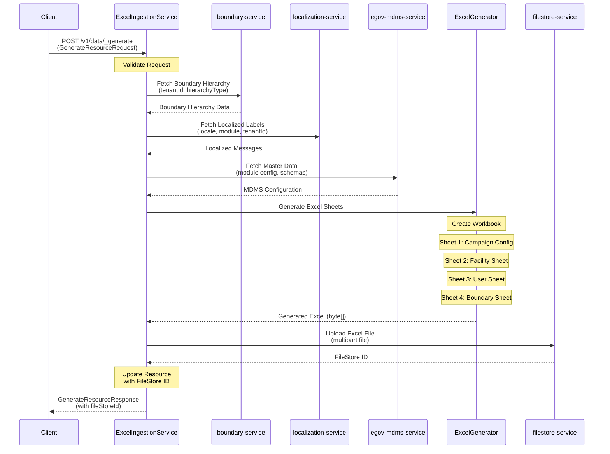

# Excel Ingestion Service

### Excel Ingestion Service
Excel Ingestion Service is a Health Campaign Service that facilitates the generation of Excel templates based on boundary hierarchies. The service generates structured Excel sheets with boundary data and uploads them to the file store. The functionality is exposed via REST API.

### Service Architecture Diagram



### DB UML Diagram

- NA (This service does not maintain its own database)

### Service Dependencies

#### Core Services
- egov-filestore
- egov-localization
- egov-mdms
- boundary-service

#### External Libraries
- Apache POI (Excel generation)
- Spring Boot
- Spring Web

### Swagger API Contract
Link to the swagger API contract yaml and editor link like below

https://editor.swagger.io/?url=https://raw.githubusercontent.com/egovernments/health-campaign-services/master/health-services/excel-ingestion/excel-ingestion-swagger.yml

For local reference, see [excel-ingestion-swagger.yml](./excel-ingestion-swagger.yml)

### Service Details

#### Functionality

1. **Excel Template Generation**: Generates Excel templates with boundary hierarchy data
2. **Multi-sheet Support**: Creates multiple sheets including:
   - Boundary Hierarchy Sheet
   - Campaign Config Sheet
   - Schema Definition Sheet
3. **Dynamic Column Generation**: Dynamically creates columns based on hierarchy levels
4. **File Upload**: Automatically uploads generated Excel files to egov-filestore
5. **Localization Support**: Integrates with localization service for multi-language support

#### Features

1. **Configurable Templates**: Supports different template types based on hierarchy type
2. **Boundary Validation**: Validates boundary data before Excel generation
3. **Error Handling**: Comprehensive error handling with meaningful error messages
4. **Async Processing**: Supports asynchronous processing for large datasets
5. **Multi-tenant Support**: Full multi-tenant architecture support

#### API Details
BasePath `/excel-ingestion/v1/data`

Excel Ingestion service APIs - contains Excel template generation endpoint

* POST `/v1/data/_generate` - Generate Excel Template, This API is used to generate an Excel template based on boundary hierarchy and upload it to filestore.

##### Request Structure
```json
{
  "RequestInfo": {
    "apiId": "excel-ingestion",
    "ver": "1.0",
    "ts": 1690371438000,
    "msgId": "1234567890",
    "userInfo": {
      "uuid": "11b0e02b-0145-4de2-bc42-c97b96264807"
    }
  },
  "GenerateResource": {
    "tenantId": "pg.citya",
    "type": "boundary",
    "hierarchyType": "ADMIN",
    "refernceId": "REF-2023-001",
    "boundaries": [
      {
        "code": "CITY001",
        "name": "City A",
        "type": "City",
        "isRoot": true,
        "includeAllChildren": true
      }
    ]
  }
}
```

##### Response Structure
```json
{
  "ResponseInfo": {
    "apiId": "egov-bff",
    "ver": "0.0.1",
    "ts": 1690371438000,
    "status": "successful"
  },
  "GenerateResource": {
    "id": "550e8400-e29b-41d4-a716-446655440000",
    "tenantId": "pg.citya",
    "type": "boundary",
    "hierarchyType": "ADMIN",
    "refernceId": "REF-2023-001",
    "status": "COMPLETED",
    "fileStoreId": "f47ac10b-58cc-4372-a567-0e02b2c3d479",
    "boundaries": [...]
  }
}
```

### Configuration

#### Application Properties
```properties
# Boundary Service
egov.boundary.service.host=http://localhost:8080
egov.boundary.service.search.endpoint=/boundary-service/boundary-hierarchy-definition/_search

# File Store Service  
egov.filestore.service.host=http://localhost:8080
egov.filestore.service.upload.endpoint=/filestore/v1/files

# Localization Service
egov.localization.service.host=http://localhost:8080
egov.localization.service.search.endpoint=/localization/messages/v1/_search

# MDMS Service
egov.mdms.service.host=http://localhost:8080
egov.mdms.service.search.endpoint=/egov-mdms-service/v1/_search
```

### Kafka Consumers

- NA (This service does not consume from Kafka topics)

### Kafka Producers

- NA (This service does not produce to Kafka topics)

## Excel Template Structure

### Sheet 1: Campaign Config
Contains campaign configuration parameters and metadata for the microplan.

### Sheet 2: Facility Sheet
Contains facility data with boundary columns for mapping facilities to geographical areas.

### Sheet 3: User Sheet
Contains user information with boundary columns for assigning users to specific areas.

### Sheet 4: Boundary Sheet
Contains the complete boundary hierarchy with dynamic columns based on hierarchy levels.

## Error Codes

| Error Code | Description |
|------------|-------------|
| INGEST_MISSING_TENANT_ID | Tenant ID is required |
| INGEST_INVALID_TENANT_ID_LENGTH | Tenant ID length must be between 2-50 characters |
| INGEST_MISSING_TYPE | Resource type is required |
| INGEST_INVALID_TYPE_LENGTH | Type length must be between 2-100 characters |
| INGEST_MISSING_HIERARCHY_TYPE | Hierarchy type is required |
| INGEST_INVALID_HIERARCHY_TYPE_LENGTH | Hierarchy type length must be between 2-100 characters |
| INGEST_MISSING_REFERENCE_ID | Reference ID is required |
| INGEST_INVALID_REFERENCE_ID_LENGTH | Reference ID length must be between 1-255 characters |

## Pre commit script

[commit-msg](https://gist.github.com/jayantp-egov/14f55deb344f1648503c6be7e580fa12)

## Usage

1. Start the service
2. Call the generate API with appropriate boundary data
3. Receive the fileStoreId in response
4. Use the fileStoreId to download the generated Excel template from filestore service

## Example cURL

```bash
curl -X POST \
  http://localhost:8080/excel-ingestion/v1/data/_generate \
  -H 'Content-Type: application/json' \
  -d '{
    "RequestInfo": {
      "apiId": "excel-ingestion",
      "ver": "1.0",
      "ts": 1690371438000,
      "userInfo": {
        "uuid": "11b0e02b-0145-4de2-bc42-c97b96264807"
      }
    },
    "GenerateResource": {
      "tenantId": "pg.citya",
      "type": "boundary",
      "hierarchyType": "ADMIN",
      "refernceId": "REF-2023-001",
      "boundaries": [
        {
          "code": "CITY001",
          "name": "City A",
          "type": "City",
          "isRoot": true,
          "includeAllChildren": true
        }
      ]
    }
  }'
```