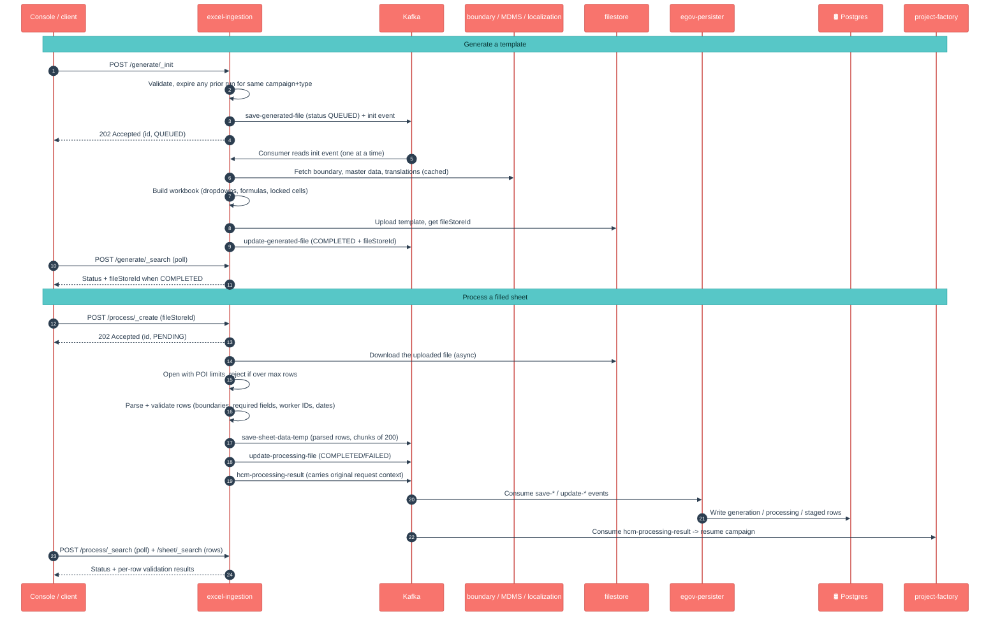
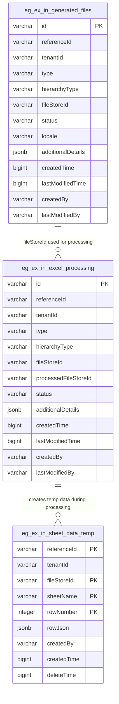

# Excel Ingestion

## Enhancements in HCM-v2.1

Changes from v2.0 to v2.1, for product owners, QA and ops.

- **Generation is now event-driven, with clean retry.** `generate/_init` no longer does the heavy work on the request thread — it validates, queues, and an internal Kafka consumer builds the template. Re-running for the same campaign + type **expires the previous run**, so a stuck, timed-out or stale generation can't shadow the new one and polling always reflects the latest attempt.
- **Large sheets: faster and safer.** A database search index was added for the staged sheet data (migration `V20260530120000`, applied automatically on start) so status/row searches stay fast on huge uploads; a configurable **max-row guardrail** (default 100,000) rejects oversized files with a clear error instead of hanging; and the Excel parser now runs with **Apache POI safety limits** against oversized/zip-bomb files.
- **CPU and memory optimised.** Reading formula cells no longer re-scans the whole sheet (removed a slowdown that grew with sheet size), regexes are cached, the formula evaluator is reused, multi-select values are computed lazily, and column-definition lookups are O(1). Template generation for large boundary datasets is faster, and the hidden helper column for multi-select fields was dropped — templates are smaller and quicker.
- **Bigger Kafka payloads supported.** The producer max request size was raised to ~3 MB so large parsed-row chunks and results go through cleanly.
- **Attendance registers (new capability).** The service can generate attendance-register and attendee templates and ingest the filled sheets — boundary dropdowns, an auto-filled Register ID derived from boundary **code** (not name), locked formula cells, dates accepted in numeric or text form and clamped to the register's window, and rejection of sheets that belong to another campaign or reuse a register ID. Register roles and attendee boundary rules are now MDMS-configured, not hard-coded.
- **Stronger user/worker validation.** A beneficiary-code field with validation; whitespace rejected in beneficiary code, bank account and bank code; all cell values trimmed consistently; payment fields conditionally required by payment-provider type (and highlighted red); worker IDs verified against the worker registry before a user sheet is accepted; and processing no longer crashes when the sheet has validation errors — they're reported row by row.
- **Boundary correctness.** Boundaries with the same display name at different levels no longer collide; facilities map to boundaries by id/code instead of name; multi-hierarchy and root-boundary processing are supported/fixed.
- **Search and ops.** `process/_search` and `generate/_search` now filter by `additionalDetails` key-value pairs; campaign search pagination was fixed; the original request context now travels with `hcm-processing-result` (fixing downstream campaign-creation failures); and publish logs show the actual tenant-prefixed topic names for easier log correlation.

## 1. Purpose

Excel Ingestion is the **shared Excel engine** for health campaigns. It does two jobs, kept deliberately simple:

1. **Generate** a ready-to-fill Excel template — pre-loaded with the campaign's boundary hierarchy, dropdowns, locked formula cells, localized column headers, and built-in validations — so a campaign manager downloads a sheet that is hard to fill in wrong.
2. **Process** a filled-in sheet that comes back — open it, parse every row, validate it (correct boundaries, required fields, no stray whitespace, worker IDs that actually exist, dates inside the campaign window …), flag bad rows, and hand the clean data on.

In short: *"give me a sheet that's easy to fill, then check what comes back before it touches the campaign."*

It is **reusable**: facility sheets, user/worker sheets, boundary-target sheets and attendance-register sheets all run through the same generate-and-process pipeline. The two layers — template-building and row-parsing — are intentionally separate so a new sheet type is a small, isolated addition rather than a rewrite.

## 2. Business Flow

- **During campaign setup**, the console (project-factory / admin UI) asks Excel Ingestion to **generate** a template for a campaign (`referenceId` = the campaign). The service pulls the boundary tree, master data and translations, builds the workbook, uploads it to filestore, and reports back a download link.
- **A campaign manager fills the sheet offline** (facilities, users/workers, targets, or attendance) and uploads it back through the console.
- The console hands the uploaded file to Excel Ingestion to **process**. The service parses and validates row by row, writes the clean rows to a short-lived staging table, and emits a **processing result** that project-factory listens for — that is how the loop closes and the campaign-creation flow continues.
- **Bad rows don't block good ones.** Validation errors are reported per row (and written back into an annotated sheet) so the user can fix only what failed.
- The whole exchange is **asynchronous with polling**: every long-running call returns immediately with an id and a `PENDING`/`QUEUED` status, and the caller **polls a `_search`** endpoint until the status turns `COMPLETED`/`FAILED`. There are no webhooks.

## 3. Key APIs / Entry Points

Base path `/excel-ingestion/v1/data`. Generation and processing are async (return `202` + an id to poll); the search and sheet endpoints are synchronous reads/cleanup.

| Endpoint | Purpose |
|---|---|
| `POST /generate/_init` | Kick off template generation. Returns `202` + a generation id with status `QUEUED`. |
| `POST /generate/_search` | Poll generation status; when `COMPLETED` it carries the `fileStoreId` of the finished template. |
| `POST /process/_validation` | Dry-run: validate an uploaded sheet and report errors **without** committing parsed data. |
| `POST /process/_create` | Validate **and** parse an uploaded sheet, stage the rows, and emit the processing result. Returns `202` + a processing id. |
| `POST /process/_search` | Poll processing status and read back per-row validation results. |
| `POST /sheet/_search` | Read the staged (temporary) parsed rows for a `referenceId` + `fileStoreId` + sheet. |
| `POST /sheet/_delete` | Clean up staged rows for a `referenceId` + `fileStoreId` (query params). |

**Kafka entry point (internal).** `generate/_init` does no heavy work on the HTTP thread: it publishes the request to the internal `excel-ingestion-generation-init` topic, and the service's **own consumer** (one record at a time, manual ack) does the actual generation. This is the only topic the service consumes.

**Kafka outputs.** `save-generated-file` / `update-generated-file` (generation row + status), `save-processing-file` / `update-processing-file` (processing row + status), `save-sheet-data-temp` / `delete-sheet-data-temp` (staged parsed rows, written in chunks of 200), and **`hcm-processing-result`** — the topic **project-factory** consumes to close the loop. The persister (in the `configs/` repo) turns the `save-*`/`update-*` events into Postgres rows.

**Swagger contract:** https://editor.swagger.io/?url=https://raw.githubusercontent.com/egovernments/health-campaign-services/master/health-services/excel-ingestion/excel-ingestion-swagger.yml — local copy: [`excel-ingestion-swagger.yml`](./excel-ingestion-swagger.yml).

### Kafka topics

| Topic | Dir | Purpose |
|---|---|---|
| `excel-ingestion-generation-init` | in | Template-generation requests (internal queue) |
| `save-generated-file` | out | Persist generation row |
| `update-generated-file` | out | Update generation status + fileStoreId |
| `save-processing-file` | out | Persist processing row |
| `update-processing-file` | out | Update processing status |
| `save-sheet-data-temp` | out | Persist staged parsed rows (chunked) |
| `delete-sheet-data-temp` | out | Clean up staged rows |
| `hcm-processing-result` | out | Notify project-factory of the processing result |

## 4. Dependencies

- **boundary-service** — boundary hierarchy + relationships that fill the template's geography columns and dropdowns.
- **egov-mdms** — schemas and per-environment config (which columns, which roles, attendance rules) so behaviour changes without a code release.
- **egov-localization** — translated column headers, dropdown values and error messages.
- **egov-filestore** — stores the generated template and supplies the uploaded file for processing.
- **project-factory** — campaign lookups + bulk decrypt; also the **consumer of `hcm-processing-result`** that resumes campaign creation.
- **facility / health-individual / worker-registry / egov-hrms / attendance** — looked up during validation (valid facility, valid worker ID, attendance register details, etc.).
- **Kafka** — the internal generation-init trigger plus all `save-*`/`update-*`/result outputs.
- **egov-persister** (deployed via the `configs/` repo) — actually writes the generation, processing and staged-row tables to Postgres off the `save-*`/`update-*` topics.
- **Postgres** — three tables: `eg_ex_in_generated_files`, `eg_ex_in_excel_processing`, and `eg_ex_in_sheet_data_temp` (staging, auto-expires ~24h after creation).
- **Caffeine (in-process cache)** — boundary, MDMS and localization lookups are cached so a large generate/process run doesn't re-fetch the same reference data.
- **health-services-common / -models** — shared producer, clients, validators, POJOs.

## 5. Processing Flow

Both generation and processing are **async with polling**. The HTTP call returns a `202` and an id; the work happens off-thread and the caller polls `_search`. Generation is **event-driven**: the API only validates and queues, then an internal Kafka consumer (one record at a time) drives boundary/MDMS/localization fetch → build workbook → upload → status update. Processing parses the uploaded file, stages rows in chunks, and emits the result project-factory waits for.

```mermaid
%%{init: {'theme':'base','themeVariables':{'actorBkg':'#F8746D','actorBorder':'#C9433E','actorTextColor':'#FFFFFF','actorLineColor':'#C9433E','signalColor':'#2C3E50','signalTextColor':'#2C3E50','noteBkgColor':'#57C7C7','noteTextColor':'#06302F','noteBorderColor':'#1B9E9E','labelBoxBkgColor':'#E0F7F4','labelBoxBorderColor':'#1B9E9E','labelTextColor':'#06302F','loopTextColor':'#06302F','sequenceNumberColor':'#FFFFFF'}}}%%
sequenceDiagram
    autonumber
    participant Console as Console / client
    participant Excel as excel-ingestion
    participant Kafka as Kafka
    participant Ref as boundary / MDMS / localization
    participant File as filestore
    participant Persister as egov-persister
    participant DB as 🛢️ Postgres
    participant PF as project-factory

    Note over Console,PF: Generate a template
    Console->>Excel: POST /generate/_init
    Excel->>Excel: Validate, expire any prior run for same campaign+type
    Excel->>Kafka: save-generated-file (status QUEUED) + init event
    Excel-->>Console: 202 Accepted (id, QUEUED)
    Kafka->>Excel: Consumer reads init event (one at a time)
    Excel->>Ref: Fetch boundary, master data, translations (cached)
    Excel->>Excel: Build workbook (dropdowns, formulas, locked cells)
    Excel->>File: Upload template, get fileStoreId
    Excel->>Kafka: update-generated-file (COMPLETED + fileStoreId)
    Console->>Excel: POST /generate/_search (poll)
    Excel-->>Console: Status + fileStoreId when COMPLETED

    Note over Console,PF: Process a filled sheet
    Console->>Excel: POST /process/_create (fileStoreId)
    Excel-->>Console: 202 Accepted (id, PENDING)
    Excel->>File: Download the uploaded file (async)
    Excel->>Excel: Open with POI limits, reject if over max rows
    Excel->>Excel: Parse + validate rows (boundaries, required fields, worker IDs, dates)
    Excel->>Kafka: save-sheet-data-temp (parsed rows, chunks of 200)
    Excel->>Kafka: update-processing-file (COMPLETED/FAILED)
    Excel->>Kafka: hcm-processing-result (carries original request context)
    Kafka->>Persister: Consume save-* / update-* events
    Persister->>DB: Write generation / processing / staged rows
    Kafka->>PF: Consume hcm-processing-result -> resume campaign
    Console->>Excel: POST /process/_search (poll) + /sheet/_search (rows)
    Excel-->>Console: Status + per-row validation results
```

> **Note on the official LLD diagrams** (`docs.digit.org/health/design/architecture/low-level-design/services/console-services/excel-ingestion`): the published generate/process/sheet sequence diagrams still describe the service correctly at a high level (validate → async work → poll via `_search`). The **event-driven `generate/_init`** (queue to Kafka, in-process consumer does the work) and the **`expired` retry semantics** below are **newer than the published diagrams** and are captured in the flow above.

### Data model (DB UML)

```mermaid
erDiagram
    eg_ex_in_generated_files {
        varchar id PK
        varchar referenceId
        varchar tenantId
        varchar type
        varchar hierarchyType
        varchar fileStoreId
        varchar status
        varchar locale
        jsonb additionalDetails
        bigint createdTime
        bigint lastModifiedTime
        varchar createdBy
        varchar lastModifiedBy
    }

    eg_ex_in_excel_processing {
        varchar id PK
        varchar referenceId
        varchar tenantId
        varchar type
        varchar hierarchyType
        varchar fileStoreId
        varchar processedFileStoreId
        varchar status
        jsonb additionalDetails
        bigint createdTime
        bigint lastModifiedTime
        varchar createdBy
        varchar lastModifiedBy
    }

    eg_ex_in_sheet_data_temp {
        varchar referenceId PK
        varchar tenantId
        varchar fileStoreId PK
        varchar sheetName PK
        integer rowNumber PK
        jsonb rowJson
        varchar createdBy
        bigint createdTime
        bigint deleteTime
    }

    eg_ex_in_generated_files ||--o{ eg_ex_in_excel_processing : "fileStoreId used for processing"
    eg_ex_in_excel_processing ||--o{ eg_ex_in_sheet_data_temp : "creates temp data during processing"
```

#### Table Details:
- **eg_ex_in_generated_files**: Tracks async Excel template generation requests
- **eg_ex_in_excel_processing**: Tracks async Excel file processing requests
- **eg_ex_in_sheet_data_temp**: Stores parsed Excel data temporarily during validation

#### Key Relationships:
- Generated Excel (fileStoreId) can be used for processing
- Processing requests create temporary sheet data for validation
- Sheet temp data is cleaned up after processing completion

## 6. Failure / Retry Handling

- **Async, status-driven.** A failed generation or processing run does not fail the HTTP call (which already returned `202`). The terminal status is written as `FAILED` with an error code/message in `additionalDetails`, surfaced through `_search`.
- **Retry is user-driven, not automatic.** The generation consumer deliberately does **not** redeliver on failure — re-submitting `generate/_init` for the same campaign + type starts a fresh run.
- **Retry supersedes the old run ("expired").** A new `generate/_init` for the same `(tenantId, referenceId, type)` marks every prior record for that key as `EXPIRED` (whether it was queued, in progress, completed, failed, or effectively stuck/timed-out) and becomes the single live record. So a stale or hung run can't linger and confuse a poll — the latest request always wins. Expiring old rows is best-effort and never blocks the new run.
- **Always reports back to project-factory.** The `hcm-processing-result` message is sent in a `finally` block, on success **and** failure, so the campaign flow is never left waiting silently.
- **Single-consumer assumption.** Generation runs one event at a time (`max-poll-records=1`, listener concurrency 1). The queued→in-progress transition has no DB lock, so raising either without first adding a compare-and-set would cause duplicate generation runs (called out in `application.properties`).
- **Staging data self-cleans.** Parsed rows in `eg_ex_in_sheet_data_temp` carry a `deleteTime` ~24h out, and `sheet/_delete` lets the caller clean up sooner.
- If the **persister config** for these topics is missing/stale in an environment, the API will accept and acknowledge work but rows will silently not appear in Postgres — a classic "it worked in QA" trap.

## 7. Known Risks / Limitations

- **Generation must stay single-threaded.** The queued→in-progress transition has no DB lock; raising `max-poll-records` or listener concurrency without adding a compare-and-set would cause duplicate generation runs.
- **`expired` is the latest-request-wins rule.** Re-submitting a generate for the same campaign + type silently expires the prior records (even a completed one). Intended, but a behavioural point QA should know — an in-flight run can be superseded mid-flight.
- **Retry is manual.** Failed runs are not auto-retried; the caller must re-submit. A consumer that crashes between dequeue and terminal status can leave a row that only a fresh init clears.
- **Staging table is temporary.** Parsed rows expire ~24h after creation; consumers must read or copy them out before then (or call `sheet/_delete`).
- **Validation is app-level.** Boundary, facility, worker and date checks live in code/MDMS, not DB constraints — correctness depends on those services and on the right MDMS data being present in the environment.
- **Big-file ceilings are configurable, not infinite.** The 100,000-row limit, POI byte/zip limits and ~3 MB Kafka message size are environment-tunable; an undersized environment can still reject genuinely large campaigns.
- **Persister dependency.** Like all DIGIT services here, writes go via Kafka → persister; missing/stale persister config means accepted-but-not-saved data.

## 8. Release Version

| Field | Value |
|---|---|
| Release | **v2.1** |
| Stack | Spring Boot 3.2.2 / Java 17 |
| Shared libs | `health-services-common` 1.1.4-SNAPSHOT, `health-services-models` 1.0.23-SNAPSHOT, Apache POI 5.4.1 |
| Doc updated | 2026-06-12 |
| Maintainers | Health Campaign Services team (`@jagankumar-egov`) |

## Pre-commit script

[commit-msg](https://gist.github.com/jayantp-egov/14f55deb344f1648503c6be7e580fa12)
