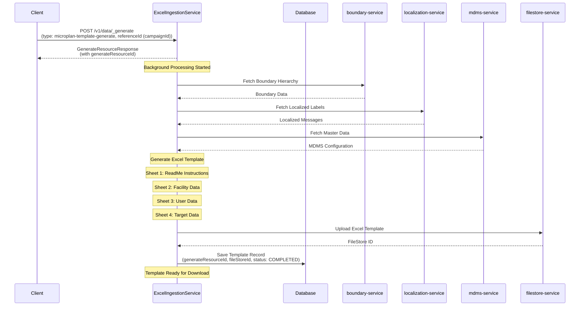
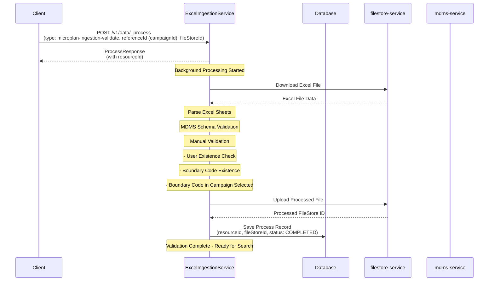
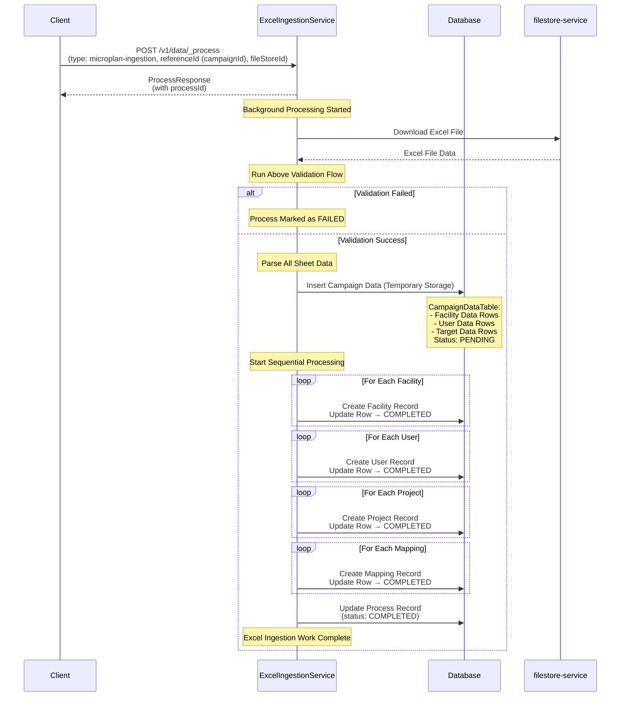
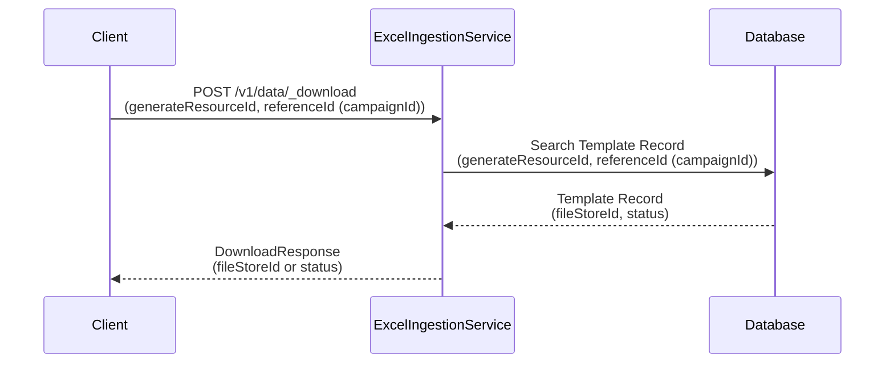
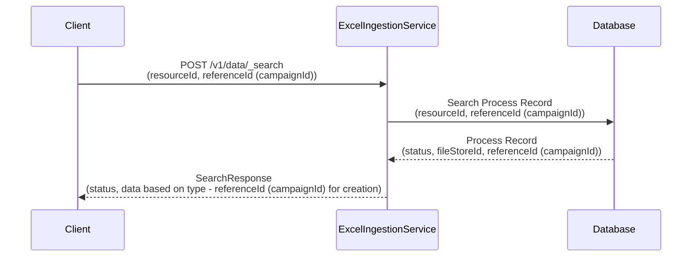
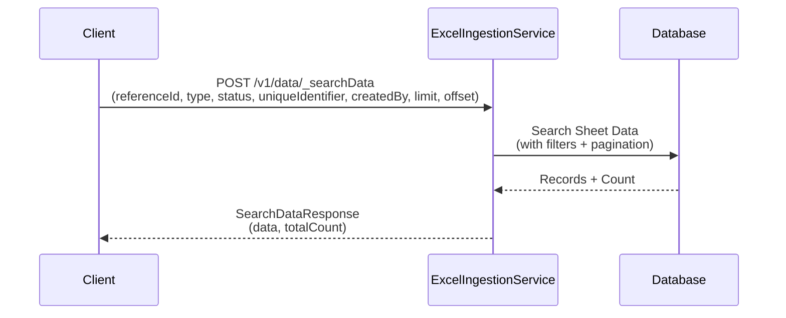
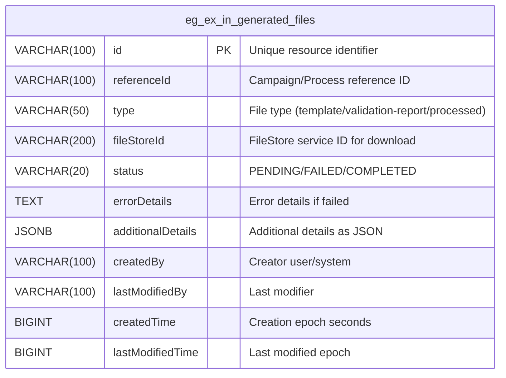
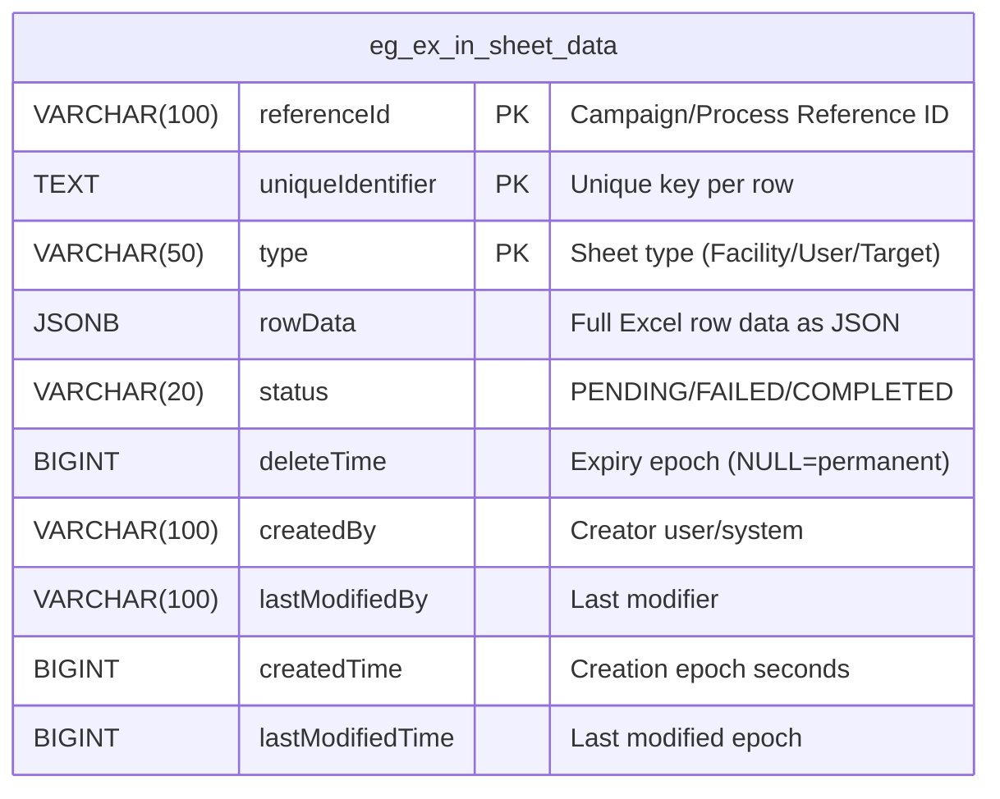

# Unified Microplan Workflow Design

## 1. Excel Template Generation
**Type:** `microplan-template-generate`  
**API:** `POST /v1/data/_generate` (Async - returns generateResourceId)
**Download API:** `POST /v1/data/_download` (returns fileStoreId)



## 2. Validation Process
**Type:** `microplan-ingestion-validate`  
**API:** `POST /v1/data/_process` (Async - returns resourceId)
**Search API:** `POST /v1/data/_search` (returns process status & fileStoreId if complete)



## 3. Data Storage & Campaign Creation
**Type:** `microplan-ingestion`  
**API:** `POST /v1/data/_process` (Async - returns processId)  
**Search API:** `POST /v1/data/_search` (returns process status & referenceId (campaignId) if complete)



## 4. Download API (For Template Generation)
**API:** `POST /v1/data/_download`



## 5. Search API (For Process Status)
**API:** `POST /v1/data/_search`



## 6. Sheet Data Search API
**API:** `POST /v1/data/_searchData`



## 7. Generated Files Table Documentation
**Table Name:** `eg_ex_in_generated_files`

This table stores metadata for all generated files (templates, validation reports, processed files) for download purposes.

### Database Schema Diagram


### Column Details
| Column | Type | Description |
|--------|------|-------------|
| id | VARCHAR(100) PRIMARY KEY | Unique identifier for the generated resource |
| referenceId | VARCHAR(100) NOT NULL | Campaign or process reference ID |
| type | VARCHAR(50) NOT NULL | Type of file (microplan-template/validation-report/processed-excel) |
| fileStoreId | VARCHAR(200) | FileStore service ID for downloading the file |
| status | VARCHAR(20) NOT NULL | Generation status → PENDING, FAILED, COMPLETED |
| errorDetails | TEXT | Error details if generation failed |
| additionalDetails | JSONB | Additional details (file size, sheets count, validation summary) |
| createdBy | VARCHAR(100) | User/system who initiated generation |
| lastModifiedBy | VARCHAR(100) | User/system who last modified |
| createdTime | BIGINT | Creation timestamp in epoch seconds |
| lastModifiedTime | BIGINT | Last modification timestamp in epoch seconds |

### Purpose & Usage
- **File Tracking:** Track all generated files (templates, validation reports)
- **Download Management:** Store fileStoreId for download API
- **Status Monitoring:** Track generation status for async operations
- **Error Handling:** Store error details for failed generations
- **Audit Trail:** Maintain complete audit details for compliance

### Example: SQL Create Table Script
```sql
CREATE TABLE eg_ex_in_generated_files (
    id VARCHAR(100) PRIMARY KEY,
    referenceId VARCHAR(100) NOT NULL,
    type VARCHAR(50) NOT NULL,
    fileStoreId VARCHAR(200),
    status VARCHAR(20) NOT NULL,
    errorDetails TEXT,
    additionalDetails JSONB,
    createdBy VARCHAR(100),
    lastModifiedBy VARCHAR(100),
    createdTime BIGINT,
    lastModifiedTime BIGINT
);

-- Index for faster lookups
CREATE INDEX idx_generated_files_reference ON eg_ex_in_generated_files(referenceId);
CREATE INDEX idx_generated_files_type ON eg_ex_in_generated_files(type);
CREATE INDEX idx_generated_files_status ON eg_ex_in_generated_files(status);
```


## 8. Sheet Data Table Documentation
**Table Name:** `eg_ex_in_sheet_data`

This table provides row-wise temporary storage for the Excel ingestion workflow.
Each row represents a record from an Excel sheet, linked to a campaign/process.

### Database Schema Diagram


### Column Details
| Column | Type | Description |
|--------|------|-------------|
| referenceId | VARCHAR(100) NOT NULL | Campaign or process reference ID (scope of ingestion). |
| uniqueIdentifier | TEXT NOT NULL | Unique key per row (single/composite/custom). |
| type | VARCHAR(50) NOT NULL | Sheet type (e.g., Facility, User, Target). |
| rowData | JSONB NOT NULL | Full row data from Excel sheet, stored as JSON. |
| status | VARCHAR(20) NOT NULL | Row processing status → PENDING, FAILED, COMPLETED. |
| deleteTime | BIGINT | Expiry timestamp in epoch seconds. NULL = permanent row. |
| createdBy | VARCHAR(100) | User/system who created the row. |
| lastModifiedBy | VARCHAR(100) | User/system who last modified the row. |
| createdTime | BIGINT | Row creation timestamp in epoch seconds, set by application. |
| lastModifiedTime | BIGINT | Last modification timestamp in epoch seconds, set by application. |

### Keys
**Primary Key:** (referenceId, uniqueIdentifier, type)
- Ensures uniqueness of rows per campaign/process per sheet type.

### Purpose & Usage
- **Staging Table:** Temporary storage of Excel sheet rows before final ingestion.
- **Validation & Tracking:**
  - Each row has a status → track validation or processing result.
- **Temporary vs Permanent Rows:**
  - deleteTime = NULL → row is permanent.
  - deleteTime = epoch → row can be purged after that time.
- **Row Data Flexibility:**
  - rowData as JSONB allows storing arbitrary columns from Excel without altering table schema.

### Example: SQL Create Table Script
```sql
CREATE TABLE eg_ex_in_sheet_data (
    referenceId VARCHAR(100) NOT NULL,
    uniqueIdentifier TEXT NOT NULL,
    type VARCHAR(50) NOT NULL,
    rowData JSONB NOT NULL,
    status VARCHAR(20) NOT NULL,
    deleteTime BIGINT,            -- NULL = permanent
    createdBy VARCHAR(100),
    lastModifiedBy VARCHAR(100),
    createdTime BIGINT,           -- epoch seconds, set by application
    lastModifiedTime BIGINT,      -- epoch seconds, set by application
    PRIMARY KEY (referenceId, uniqueIdentifier, type)
);
```


### Process Steps:
1. **Process Sheet**: Extract all data from unified sheet
2. **Add Facilities**: Add new facilities (PENDING, UniqueId: Facility Name)
3. **Add Facility-Mappings**: Add facility-boundary mappings (PENDING, UniqueId: Facility Name + Boundary Code)
4. **Add Users**: Add users (PENDING, UniqueId: Mobile Number)  
5. **Add Projects**: Add projects (PENDING, UniqueId: Boundary Code)
6. **Add Project-Mappings**: Add project-boundary mappings (PENDING, UniqueId: Boundary Code + Resource ID)
7. **Create All**: Parallel creation - facilities + users + projects (together), then mappings (together) (PENDING → COMPLETED/FAILED)
8. **Complete/Retry**: If all COMPLETED = success, if any FAILED = retry from PENDING items

## Update Flow - Addition Only

For campaign updates via Excel ingestion, **only addition of new data is supported**:

- ✅ **Add new facilities** to existing campaign
- ✅ **Add new users** to existing campaign  
- ✅ **Add new projects** to existing campaign
- ✅ **Add new mappings** (facility-boundary, user-boundary, project-resource)

### Removal/Demapping Operations

For **removal or demapping** operations, **UI-based approach is required**:

- ❌ **Remove facility** from campaign → Use UI + Facility Demapping API
- ❌ **Remove user** from campaign → Use UI + Staff Demapping API
- ❌ **Remove project** from campaign → Use UI + Project Update API to make project inactive and parent null
- ❌ **Demap resource** from campaign → Use UI + Resource Demapping API

**Reason**: Demapping and removal operations require specific API calls that are better handled through UI workflows rather than bulk Excel processing.

**Note**: To know campaign data for UI display, use **Excel Ingestion Search API** (`POST /v1/data/_searchData`) to fetch and show existing facilities, users, projects, and mappings in the UI.

