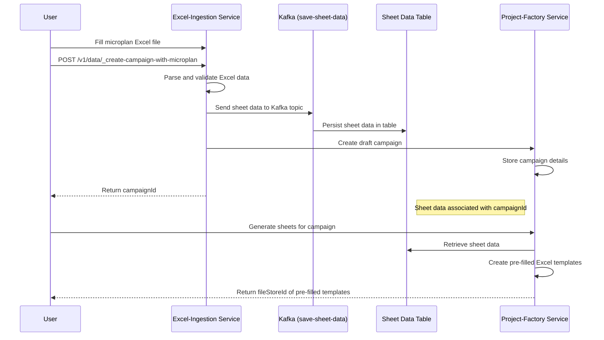

# Project-Factory Integration Design

## Overview
This document describes the simple integration between Excel-Ingestion Service and Project-Factory Service to enable seamless campaign creation with pre-filled microplan data.

## Integration Flow

### 1. New API Endpoint in Excel-Ingestion Service
```
POST /v1/data/_create-campaign-with-microplan
```

### 2. Simple Integration Flow

#### Step 1: User fills microplan Excel file
- User downloads microplan template from Excel-Ingestion Service
- User fills facility, user, and target data in the Excel sheets
- User saves the filled Excel file

#### Step 2: User submits filled Excel file to Excel-Ingestion Service
- User calls `/v1/data/_create-campaign-with-microplan` endpoint
- Request includes:
  - Filled microplan Excel file (fileStoreId)
  - Basic campaign details (name, dates, etc.)
  - Tenant information
  - Hierarchy type
  - RequestInfo

#### Step 3: Excel-Ingestion Service processes the file
- Parse Excel file to extract:
  - Facility data
  - User data
  - Target data
  - Campaign configuration (dates, boundaries, etc.)
- Validate extracted data

#### Step 4: Excel-Ingestion Service persists data and creates draft campaign
- Format data according to Project-Factory requirements
- Send data to Project-Factory's `save-sheet-data` Kafka topic
- Data gets saved directly to sheet data table for later processing
- Create a draft campaign in Project-Factory with basic campaign details
- Associate the sheet data with the newly created draft campaign

#### Step 5: Campaign is ready with pre-filled data
- Sheet data exists in database table associated with the campaign
- When users generate sheets in Project-Factory, templates are pre-filled with the sheet data

## Mermaid Flow Chart



## How Pre-filling Works in Project-Factory

### Sheet Data Storage
- When data is sent to the `save-sheet-data` Kafka topic, it gets stored in the sheet data table
- The sheet data table contains all the microplan information (facility, user, target data)
- This data is associated with the campaign ID and resource type (facility, user, target)

### Sheet Generation with Pre-filled Data
- When users generate sheets via Project-Factory's `/v1/data/_generate` endpoint, the service:
  1. Checks if the campaign has existing sheet data in the sheet data table
  2. If data exists, it retrieves the data from the sheet data table
  3. Creates Excel templates with the retrieved data pre-filled in the appropriate sheets
  4. Returns the fileStoreId of the pre-filled template

### Key Functions Involved
- `getDataFromSheet`: Retrieves data from sheet data table
- `getSheetData`: Extracts data from Excel sheets
- `generateResource`: Creates templates with pre-filled data when available

## Benefits

1. **Single Step Campaign Creation**: Create draft campaigns with all data in one API call
2. **Pre-filled Templates**: Generated sheets automatically contain user's data
3. **Data Consistency**: No manual data entry reduces errors
4. **Faster Workflow**: Eliminates back-and-forth between services

## API Contract

### Request: POST /v1/data/_create-campaign-with-microplan

```json
{
  "RequestInfo": {
    "userInfo": {
      "uuid": "user-uuid"
    }
  },
  "tenantId": "tenant-id",
  "hierarchyType": "ADMIN",
  "fileStoreId": "file-store-id-of-filled-excel",
  "additionalDetails": {
    "campaignDetails": {
      "campaignName": "Sample Campaign",
      "startDate": 1624523434000,
      "endDate": 1627211434000,
      "projectType": "immunization"
    },
    "boundaries": [
        {
          "code": "boundary-code"
        }
      ]
  }
}
```

### Response

```json
{
  "responseInfo": {
    "status": "successful"
  },
  "campaignId": "created-campaign-id",
  "status": "draft"
}
```

## Kafka Topic Used
- **Topic Name**: `save-sheet-data`
- **Purpose**: Stores sheet data directly in the sheet data table for later processing
- **Data Flow**: Excel-Ingestion Service → Kafka Topic → Sheet Data Table