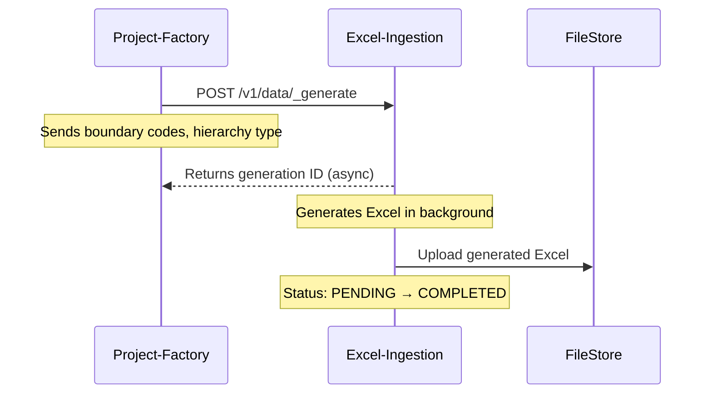
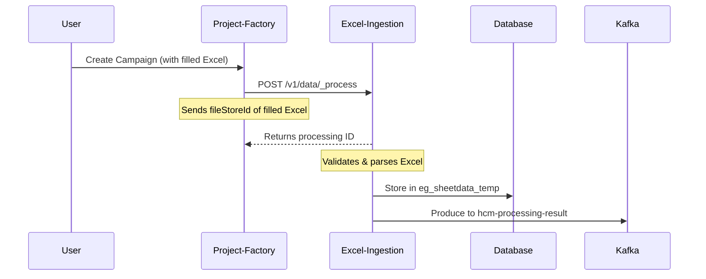
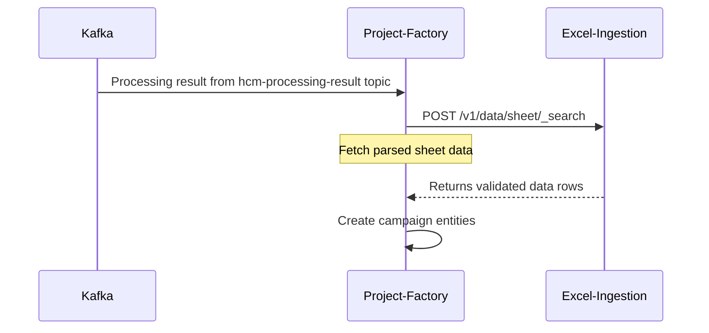
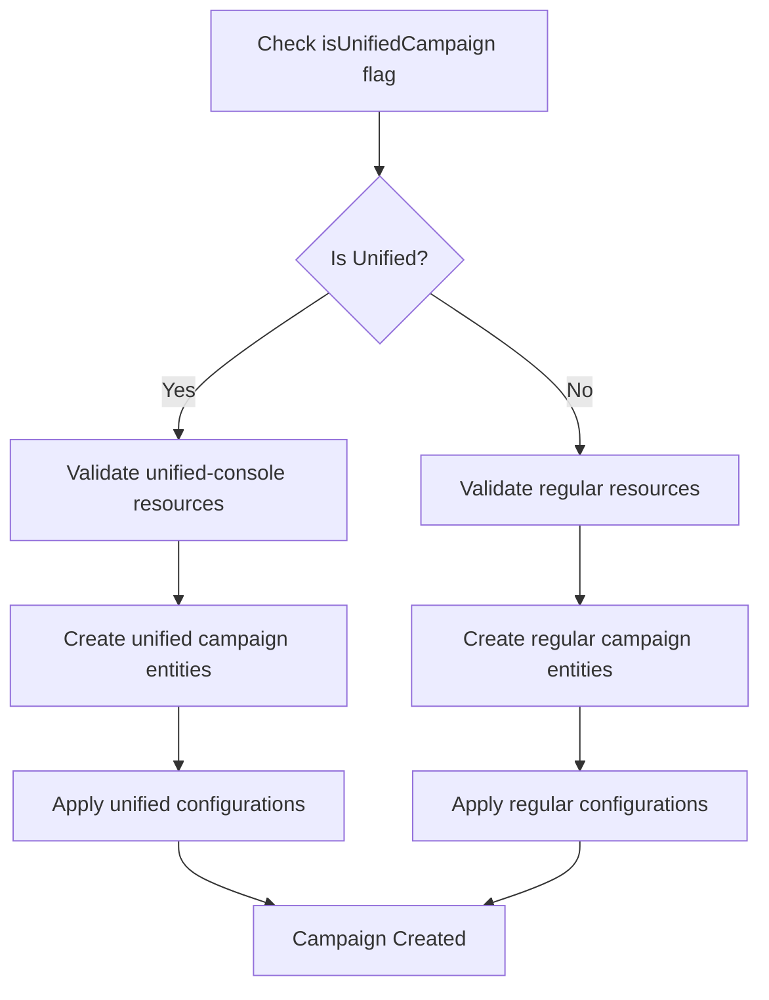
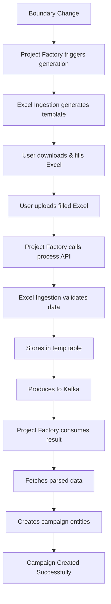

# Excel Ingestion & Project Factory Integration Flow

## Overview
This document explains how Excel Ingestion and Project Factory services work together to handle campaign creation with boundary changes.

---

## 1. Boundary Change Detection & Excel Generation

### Step 1: Boundary Change Trigger
```
User updates boundary in system
    ↓
Project Factory detects boundary change
    ↓
Triggers Excel regeneration
```

### Step 2: Project Factory Calls Excel Generation


**API Call:**
```json
POST /excel-ingestion/v1/data/_generate
{
  "GenerateResource": {
    "tenantId": "pb.amritsar",
    "type": "boundary",
    "hierarchyType": "ADMIN",
    "referenceId": "CAMP-2024-001"
  }
}
```

---

## 2. User Fills Excel & Campaign Creation

### Step 4: User Actions
```
1. User downloads generated Excel template
2. Fills data (facilities, users, targets)
3. Uploads filled Excel
4. Clicks "Create Campaign" in Project Factory
```

### Step 5: Project Factory Processes Excel


**API Call:**
```json
POST /excel-ingestion/v1/data/_process
{
  "ResourceDetails": {
    "tenantId": "pb.amritsar",
    "type": "boundary",
    "hierarchyType": "ADMIN",
    "referenceId": "CAMP-2024-001",
    "fileStoreId": "filled-excel-file-id"
  }
}
```

---

## 3. Excel Processing & Validation

### Step 6: Excel Ingestion Processing Flow
```
Excel-Ingestion downloads filled Excel
    ↓
Parses each sheet (Facility, User, Boundary)
    ↓
Validates data:
  - Boundary codes exist
  - User formats correct
  - Facility mappings valid
    ↓
Stores parsed data in eg_sheetdata_temp table
    ↓
Produces result to Kafka topic
```

**Validation Process:**
- ✅ Check mandatory fields
- ✅ Validate boundary hierarchy
- ✅ Check user credentials format
- ✅ Validate facility-boundary mapping
- ✅ **isUnifiedCampaign**: Validate unified campaign type
- ✅ **unified-console resource**: Check if resource exists only in unified console
- ✅ Mark errors with row numbers

**Unified Campaign Validation:**
- If `isUnifiedCampaign=true`, validates unified campaign structure
- Checks if resources exist only in unified-console (not in individual consoles)
- Validates unified campaign specific configurations and mappings

---

## 4. Project Factory Creates Campaign

### Step 7: Project Factory Listens to Kafka


### Step 8: Campaign Data Creation
```
Project-Factory receives processing result
    ↓
Searches sheet data from Excel-Ingestion
    ↓
Creates campaign entities:
  1. Create Project (main campaign)
     - If `isUnifiedCampaign=true`: Create unified campaign
     - If `isUnifiedCampaign=false`: Create regular campaign
  2. Create Staff (from User sheet)
     - Validate against unified-console resources if unified campaign
  3. Create Facilities (from Facility sheet)
     - Check unified console mapping for unified campaigns
  4. Create Targets (from Boundary sheet)
  5. Create Project-Staff mapping
  6. Create Project-Facility mapping
  7. Apply unified campaign specific configurations
    ↓
Campaign ready for execution (unified or regular)
```

---

## 5. Unified Campaign Handling

### What is Unified Campaign?
- `isUnifiedCampaign=true`: Campaign managed centrally across multiple boundaries
- Resources exist only in **unified-console** (not individual boundary consoles)
- Requires special validation and entity creation logic

### Unified Campaign Flow:


### Key Differences:
| Aspect | Regular Campaign | Unified Campaign |
|--------|------------------|------------------|
| Resource Location | Individual consoles | Unified-console only |
| Validation | Per boundary | Cross-boundary unified |
| Entity Creation | Standard | Unified with special config |
| Management | Decentralized | Centralized |

---

## 6. Complete Integration Flow



---

## 7. API Flow Summary

| Step | Service | API Endpoint | Purpose |
|------|---------|-------------|---------|
| 1 | Excel Ingestion | POST /v1/data/_generate | Generate Excel template |
| 2 | Excel Ingestion | POST /v1/data/_process | Process filled Excel |
| 3 | Kafka | hcm-processing-result topic | Send processing result |
| 4 | Excel Ingestion | POST /v1/data/sheet/_search | Get parsed data |
| 5 | Excel Ingestion | POST /v1/data/sheet/_delete | Cleanup temp data |

**Note**: Polling endpoints (_generationSearch, _processSearch) removed as per updated flow.

---

## 8. Data Flow

### Generation Flow:
```
Boundary Data → Excel Template → FileStore → User Download
```

### Processing Flow:
```
Filled Excel → Validation → Temp Storage → Kafka → Project Factory → Campaign Creation
```

### Cleanup Flow:
```
Campaign Created → Delete temp data → Free up storage
```

---

## 9. Error Handling

### Generation Errors:
- Boundary service unavailable → Retry with exponential backoff
- Invalid hierarchy type → Return 400 Bad Request

### Processing Errors:
- Invalid Excel format → Mark status FAILED with errors
- Validation failures → Return error details with row numbers
- Database errors → Retry and mark FAILED if persistent

### Integration Errors:
- Kafka unavailable → Store in dead letter queue
- Project Factory timeout → Manual intervention required

---

## 10. Key Integration Points

1. **Async Processing**: Both generation and processing are async
2. **Event-Driven**: No polling required, uses Kafka events
3. **Kafka Integration**: Results sent via Kafka for reliability
4. **Temp Data**: Sheet data stored temporarily, cleaned after use
5. **Error Recovery**: Each service handles its own errors

---

## 11. Configuration

### Project Factory Config:
```properties
excel.ingestion.host=http://excel-ingestion:8080/
excel.generation.endpoint=excel-ingestion/v1/data/_generate
excel.processing.endpoint=excel-ingestion/v1/data/_process
kafka.consumer.topic=hcm-processing-result
```

### Excel Ingestion Config:
```properties
project.factory.result.topic=hcm-processing-result
sheet.data.retention.days=7
processing.timeout.minutes=30
```

---

## Summary

The integration enables:
- ✅ **Automatic Excel generation** when boundaries change
- ✅ **Validated data import** from Excel files
- ✅ **Async processing** for large files
- ✅ **Error tracking** with row-level details
- ✅ **Automatic cleanup** of temporary data
- ✅ **Reliable communication** via Kafka

This flow ensures campaigns are created with validated data while maintaining system performance and reliability.