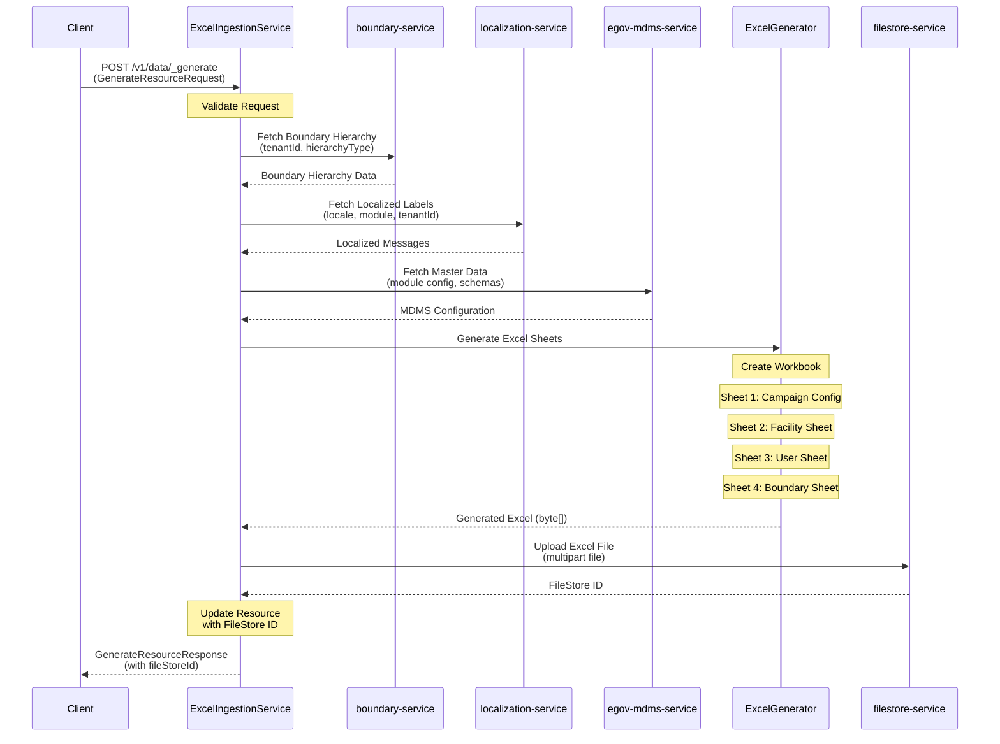
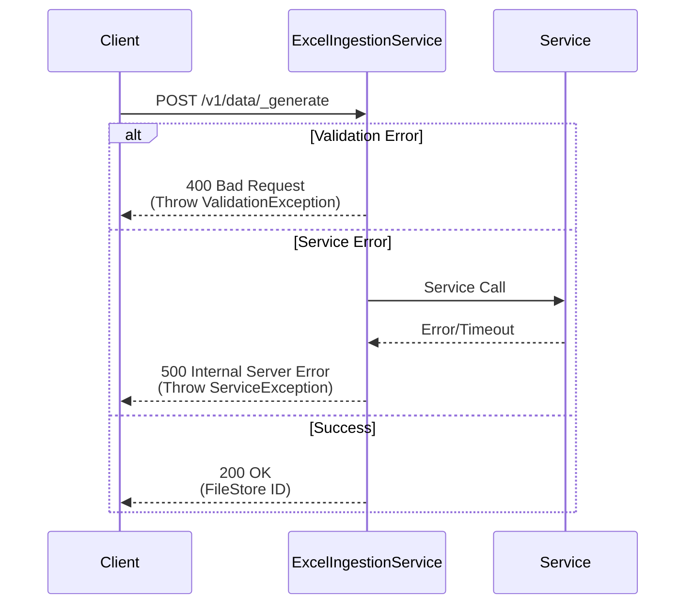

# Excel Ingestion Service - Sequence Diagram

## Excel Generation Flow

## Error Handling Flow

## Key Components

1. **GenerateController**: REST endpoint handler
2. **ExcelGenerationService**: Core business logic and error handling
3. **BoundaryService**: Integration with boundary-service
4. **LocalizationService**: Integration with localization-service
5. **MDMSService**: Integration with egov-mdms-service
6. **FileStoreService**: Integration with filestore-service
7. **Sheet Creators**: 
   - BoundaryHierarchySheetCreator
   - CampaignConfigSheetCreator
   - ExcelSchemaSheetCreator

## Data Flow Summary

1. **Input**: Tenant ID, Hierarchy Type, Reference ID, Boundary filters
2. **Processing**: Fetch data → Generate Excel → Upload file
3. **Output**: File Store ID for download

## Service Endpoints Used

- **boundary-service**: `/boundary-service/boundary-hierarchy-definition/_search`
- **localization-service**: `/localization/messages/v1/_search`
- **egov-mdms-service**: `/egov-mdms-service/v1/_search`
- **filestore-service**: `/filestore/v1/files`