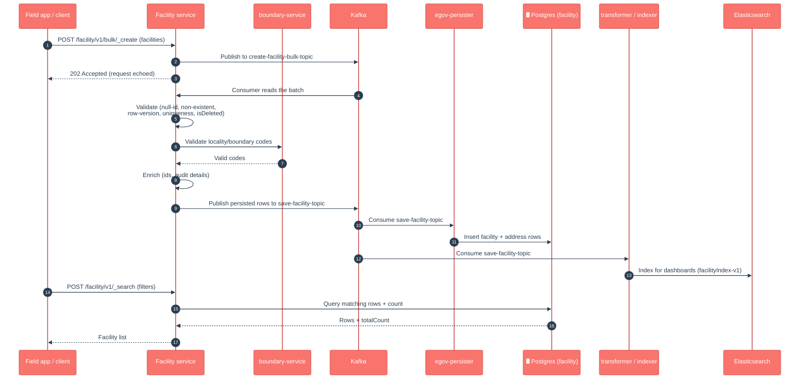

# Facility

## Enhancements in v2.1

Changes from v2.0 to v2.1, in plain language for product owners, QA and ops.

For the facility service specifically, **v2.1 is a maintenance / dependency release — no new APIs, search filters, columns or business behaviour were added.** The git diff against `v2.0` touches only `pom.xml`, `application.properties`, `CHANGELOG.md` and a test config:

- **Tracer / error-handling upgrade.** Bumped the shared `health-services-common` (which carries tracer `2.9.2`) so that database errors are now handled uniformly by tracer's `ExceptionAdvise` — clients get a consistent error shape instead of a raw 500 on a `DataAccessException`.
- **OpenTelemetry plumbing added.** OpenTelemetry BOM + instrumentation BOM were added to `pom.xml` for version alignment, and the OTEL exporters were explicitly turned off in `application.properties` (`otel.traces/logs/metrics.exporter=none`) so tracing is opt-in per environment, not on by default.
- **Shared-library version bumps** (`health-services-common`, `health-services-models`) propagated across the health services in lockstep; the facility module version moved to **1.2.1**.

> Scope note for QA/leads: feature branches exist for richer facility search (search by project/boundary, a task-status enum, and an "updated by others" / `lastModifiedByFilter` sync filter — the `featurefacilitysearch*` branches). **None of those are merged into this release**, so the `_search` filters today remain `isPermanent` / `usage` / `storageCapacity` / `boundaryCode` plus the standard sync/pagination params. Don't document or test the project / updated-by-others filters against this build.

## 1. Purpose

Facility is the **registry of physical places** in a health campaign — warehouses, health posts, clinics, storage points, distribution centres. Each facility row records what the place is (name, type/usage, permanent or temporary), how much it can hold (storage capacity), and where it sits on the map (a shared **address** with GPS coordinates and a boundary/locality code).

In short: *"which places exist in this campaign, what are they for, and where are they?"*

Other services point at these places: Stock records movements **into and out of** a facility, and Project links facilities to a campaign's plan. Facility is the single source of truth they all validate against.

## 2. Business Flow

- **During campaign setup**, the facilities a campaign will use (central store, district warehouses, health posts) are created — usually in bulk — each tied to a boundary/locality so it has a known place on the map.
- **During the campaign (runtime)**, facilities are looked up by other services: Stock checks the facility exists before recording a movement, the mobile/field app searches facilities by area, and Project associates facilities with campaign tasks.
- **As things change**, a facility's details (name, capacity, address) can be updated, or a facility can be soft-deleted if it is no longer in use.
- The facility records flow to the **dashboards** (via the transformer → Elasticsearch) and are cached in-memory by the transformer so other events (e.g. stock movements) can be enriched with facility names and locations.

## 3. Key APIs / Entry Points

Base path `/facility/v1`. The entity has single + bulk create/update/delete and a search.

| Endpoint | Purpose |
|---|---|
| `POST /facility/v1/_create` | Register one facility (synchronous validate + enrich, then async persist). |
| `POST /facility/v1/bulk/_create` | Register many facilities at once (fully async via Kafka). |
| `POST /facility/v1/_update`, `/bulk/_update` | Correct a facility's details. |
| `POST /facility/v1/_delete`, `/bulk/_delete` | Soft-delete a facility. |
| `POST /facility/v1/_search` | Find facilities by `isPermanent`, `usage`, `storageCapacity`, `boundaryCode` (locality), id, plus `tenantId` / `limit` / `offset` / `lastChangedSince` / `includeDeleted` URL params. |

**Kafka entry points (async).** Bulk requests land on `create-facility-bulk-topic` / `update-facility-bulk-topic` / `delete-facility-bulk-topic` and are picked up by the service's own consumer. Persisted results go out on `save-facility-topic` / `update-facility-topic` / `delete-facility-topic` for the persister, indexer and transformer.

**Swagger contract:** https://editor.swagger.io/?url=https://raw.githubusercontent.com/egovernments/health-campaign-services/master/docs/health-api-specs/contracts/registries/facility.yml

### Kafka topics

| Topic | Dir | Purpose |
|---|---|---|
| `create-facility-bulk-topic` | in | Bulk facility create requests |
| `update-facility-bulk-topic` | in | Bulk facility update requests |
| `delete-facility-bulk-topic` | in | Bulk facility delete requests |
| `save-facility-topic` | out | Persist new facilities |
| `update-facility-topic` | out | Persist facility updates |
| `delete-facility-topic` | out | Persist facility soft-deletes |

## 4. Dependencies

- **idgen** — generates facility IDs (address IDs are UUIDs generated locally).
- **boundary-service** — validates that each facility's locality/boundary code actually exists, so a facility can't be placed at an unknown location.
- **health-services-common / -models** — shared clients (IdGen, producer, query builder), validators, and the `Facility` / `Address` POJOs.
- **Kafka** — async create/update/delete pipeline (bulk in, persist out).
- **egov-persister** (deployed via the `configs/` repo) — actually writes the `facility` and `address` rows to Postgres off the `save-*` / `update-*` / `delete-*` topics.
- **egov-indexer / transformer → Elasticsearch** — build the dashboard read-model (`facilityIndex-v1`) from the same `save-facility-topic`; the transformer also keeps facilities in an in-memory cache to enrich other events.
- **Redis** — caching used by the shared repository layer (search-by-id is served from cache first).
- **Postgres** — system of record (`facility` + shared `address` tables; tenant-aware schema resolution).

## 5. Processing Flow

Writes are **asynchronous**: the API validates, enriches and acknowledges, then a Kafka consumer persists. The service does not write Postgres directly — it emits a `save-facility-topic` event that **egov-persister** turns into rows, while the **transformer/indexer** index the same event into Elasticsearch for dashboards. Search reads straight from Postgres (search-by-id checks Redis first).

> Note on the official LLD diagrams (`docs.digit.org/health/design/architecture/low-level-design/registries/facility`): the published Create/Update/Search/Delete diagrams are images and match the current code at a high level (validate → boundary check → async persist → search-from-DB). They do not show the in-memory transformer cache or the Redis-first search-by-id path captured above.

### Data model (DB UML)

## 6. Failure / Retry Handling

- **Async, no batch rollback.** A bulk request returns `202` before persistence. If one record in the batch fails validation in the consumer, it does not roll back the others — check consumer logs and the record's status. The consumer catches its own errors and logs them rather than re-throwing.
- **Boundary check is hard-stop.** If a facility's locality code is unknown, that record is flagged `NON_EXISTENT_ENTITY`; if the boundary-service call itself fails, the whole batch errors with `BOUNDARY_SERVICE_SEARCH_ERROR` (so a flaky boundary-service blocks creation — a common environment gotcha).
- **Idempotency** is via `clientReferenceId` — re-submitting the same one should not create a duplicate row.
- **Optimistic locking** via `rowVersion` protects against concurrent edits on update.
- **Soft delete** (`isDeleted`) everywhere — nothing is hard-deleted; the search default excludes deleted rows unless `includeDeleted=true`.
- If the **persister config** for the facility topics is missing/stale in an environment, the API will accept writes but rows will silently not appear in Postgres — a classic "it worked in QA" trap.

## 7. Known Risks / Limitations

- **Search filters are basic.** Only `isPermanent`, `usage`, `storageCapacity` and `boundaryCode` (exact-match locality) are real query columns; there is no name search, no project filter, and no "updated by others" sync filter on this branch (see the v2.1 scope note).
- **`usage` is a free string** — convention is values like warehouse / health post, but the DB won't stop other values.
- **Boundary-service is a hard dependency for create/update.** A boundary lookup failure aborts the batch; an environment with a misconfigured or down boundary-service cannot register facilities.
- **Address is denormalised per facility** — each facility owns its own address row (joined on `addressId`); there is no shared/reused address record, so the same physical place created twice yields two addresses.
- **Search-by-id reads Redis first.** Stale cache entries can in theory be returned for id lookups; the filtered (non-id) search always hits Postgres.
- **No batch rollback** — partial success in a bulk request is normal; downstream consumers must reconcile from per-record status, not from the `202`.

## 8. Release Version

| Field | Value |
|---|---|
| Release | **v2.1** |
| Stack | Spring Boot 3.2.2 / Java 17 (module version `1.2.1`) |
| Shared libs | `health-services-common` 1.1.3-SNAPSHOT, `health-services-models` 1.0.30-SNAPSHOT |
| Doc updated | 2026-06-12 |
| Maintainers | Health Campaign Services team (CODEOWNERS: `@kavi-egov`, `@sathishp-eGov`) |

## Pre-commit script

[commit-msg](https://gist.github.com/jayantp-egov/14f55deb344f1648503c6be7e580fa12)
