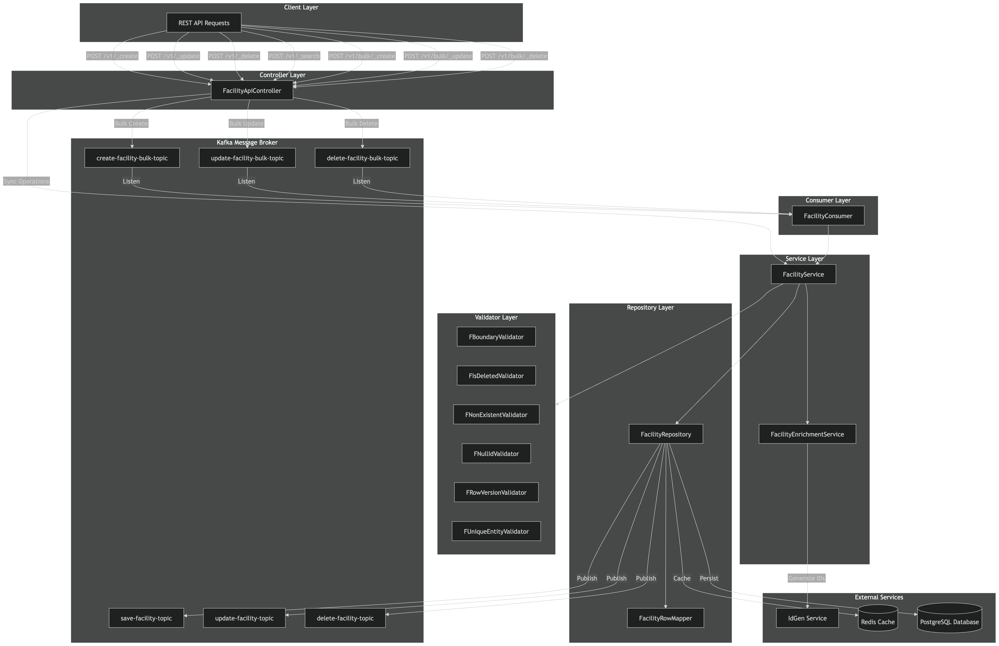

 Based on my analysis, here's a 
  comprehensive architecture diagram in Mermaid format:                                                    
                                                                                                           
  Facility Service Architecture Diagram                                                                    
                                                                                                           
  flowchart TB                                                                                             
      subgraph Client["Client Layer"]                                                                      
          API[REST API Requests]                                                                           
      end                                                                                                  
                                                                                                           
      subgraph Controller["Controller Layer"]                                                              
          FC[FacilityApiController]                                                                        
      end                                                                                                  
                                                                                                           
      subgraph Kafka["Kafka Message Broker"]                                                               
          direction TB                                                                                     
          KC_CREATE[create-facility-bulk-topic]                                                            
          KC_UPDATE[update-facility-bulk-topic]                                                            
          KC_DELETE[delete-facility-bulk-topic]                                                            
          KP_SAVE[save-facility-topic]                                                                     
          KP_UPDATE[update-facility-topic]                                                                 
          KP_DELETE[delete-facility-topic]                                                                 
      end                                                                                                  
                                                                                                           
      subgraph Consumer["Consumer Layer"]                                                                  
          FCON[FacilityConsumer]                                                                           
      end                                                                                                  
                                                                                                           
      subgraph Service["Service Layer"]                                                                    
          FS[FacilityService]                                                                              
          FES[FacilityEnrichmentService]                                                                   
      end                                                                                                  
                                                                                                           
      subgraph Validators["Validator Layer"]                                                               
          FBV[FBoundaryValidator]                                                                          
          FIDV[FIsDeletedValidator]                                                                        
          FNEV[FNonExistentValidator]                                                                      
          FNIV[FNullIdValidator]                                                                           
          FRVV[FRowVersionValidator]                                                                       
          FUEV[FUniqueEntityValidator]                                                                     
      end                                                                                                  
                                                                                                           
      subgraph Repository["Repository Layer"]                                                              
          FR[FacilityRepository]                                                                           
          FRM[FacilityRowMapper]                                                                           
      end                                                                                                  
                                                                                                           
      subgraph External["External Services"]                                                               
          IDGEN[IdGen Service]                                                                             
          REDIS[(Redis Cache)]                                                                             
          DB[(PostgreSQL Database)]                                                                        
      end                                                                                                  
                                                                                                           
      %% Sync API Flow                                                                                     
      API -->|POST /v1/_create| FC                                                                         
      API -->|POST /v1/_update| FC                                                                         
      API -->|POST /v1/_delete| FC                                                                         
      API -->|POST /v1/_search| FC                                                                         
                                                                                                           
      %% Bulk API Flow - Async via Kafka                                                                   
      API -->|POST /v1/bulk/_create| FC                                                                    
      API -->|POST /v1/bulk/_update| FC                                                                    
      API -->|POST /v1/bulk/_delete| FC                                                                    
                                                                                                           
      FC -->|Sync Operations| FS                                                                           
      FC -->|Bulk Create| KC_CREATE                                                                        
      FC -->|Bulk Update| KC_UPDATE                                                                        
      FC -->|Bulk Delete| KC_DELETE                                                                        
                                                                                                           
      %% Consumer Flow                                                                                     
      KC_CREATE -->|Listen| FCON                                                                           
      KC_UPDATE -->|Listen| FCON                                                                           
      KC_DELETE -->|Listen| FCON                                                                           
      FCON --> FS                                                                                          
                                                                                                           
      %% Service Flow                                                                                      
      FS --> Validators                                                                                    
      FS --> FES                                                                                           
      FS --> FR                                                                                            
                                                                                                           
      %% Enrichment                                                                                        
      FES -->|Generate IDs| IDGEN                                                                          
                                                                                                           
      %% Repository Flow                                                                                   
      FR --> FRM                                                                                           
      FR -->|Cache| REDIS                                                                                  
      FR -->|Persist| DB                                                                                   
      FR -->|Publish| KP_SAVE                                                                              
      FR -->|Publish| KP_UPDATE                                                                            
      FR -->|Publish| KP_DELETE                                                                            
                                                                                                           
  Sequence Diagram for Create Operation                                                                    
                                                                                                           
  sequenceDiagram                                                                                          
      participant C as Client                                                                              
      participant FC as FacilityApiController                                                              
      participant FS as FacilityService                                                                    
      participant V as Validators                                                                          
      participant FES as FacilityEnrichmentService                                                         
      participant IDGEN as IdGen Service                                                                   
      participant FR as FacilityRepository                                                                 
      participant K as Kafka                                                                               
      participant DB as Database                                                                           
      participant R as Redis                                                                               
                                                                                                           
      C->>FC: POST /v1/_create                                                                             
      FC->>FS: create(FacilityRequest)                                                                     
      FS->>V: validate(FBoundaryValidator)                                                                 
      V-->>FS: validEntities, errorMap                                                                     
      FS->>FES: create(validEntities, request)                                                             
      FES->>IDGEN: getIdList()                                                                             
      IDGEN-->>FES: Generated IDs                                                                          
      FES-->>FS: Enriched entities                                                                         
      FS->>FR: save(entities, topic)                                                                       
      FR->>K: push(save-facility-topic)                                                                    
      FR->>R: putInCache(entities)                                                                         
      FR-->>FS: Saved entities                                                                             
      FS-->>FC: Facility                                                                                   
      FC-->>C: FacilityResponse                                                                            
                                                                                                           
  Component Summary                                                                                        
  Layer: Controller                                                                                        
  Component: FacilityApiController                                                                         
  Responsibility: Handles REST endpoints, routes sync/async operations                                     
  ────────────────────────────────────────                                                                 
  Layer: Consumer                                                                                          
  Component: FacilityConsumer                                                                              
  Responsibility: Listens to Kafka topics for bulk operations                                              
  ────────────────────────────────────────                                                                 
  Layer: Service                                                                                           
  Component: FacilityService                                                                               
  Responsibility: Core business logic, orchestrates validation & enrichment                                
  ────────────────────────────────────────                                                                 
  Layer: Enrichment                                                                                        
  Component: FacilityEnrichmentService                                                                     
  Responsibility: ID generation, audit fields enrichment                                                   
  ────────────────────────────────────────                                                                 
  Layer: Validators                                                                                        
  Component: 6 validators                                                                                  
  Responsibility: Boundary, IsDeleted, NonExistent, NullId, RowVersion, UniqueEntity                       
  ────────────────────────────────────────                                                                 
  Layer: Repository                                                                                        
  Component: FacilityRepository                                                                            
  Responsibility: Data access, caching, Kafka publishing                                                   
  ────────────────────────────────────────                                                                 
  Layer: External                                                                                          
  Component: IdGen, Redis, PostgreSQL, Kafka                                                               
  Responsibility: ID generation, caching, persistence, messaging                                           
  API Endpoints                                                                                            
  ┌────────┬──────────────────┬───────┬─────────────────────────────┐                                      
  │ Method │     Endpoint     │ Type  │         Description         │                                      
  ├────────┼──────────────────┼───────┼─────────────────────────────┤                                      
  │ POST   │ /v1/_create      │ Sync  │ Create single facility      │                                      
  ├────────┼──────────────────┼───────┼─────────────────────────────┤                                      
  │ POST   │ /v1/_update      │ Sync  │ Update single facility      │                                      
  ├────────┼──────────────────┼───────┼─────────────────────────────┤                                      
  │ POST   │ /v1/_delete      │ Sync  │ Soft delete single facility │                                      
  ├────────┼──────────────────┼───────┼─────────────────────────────┤                                      
  │ POST   │ /v1/_search      │ Sync  │ Search facilities           │                                      
  ├────────┼──────────────────┼───────┼─────────────────────────────┤                                      
  │ POST   │ /v1/bulk/_create │ Async │ Bulk create via Kafka       │                                      
  ├────────┼──────────────────┼───────┼─────────────────────────────┤                                      
  │ POST   │ /v1/bulk/_update │ Async │ Bulk update via Kafka       │                                      
  ├────────┼──────────────────┼───────┼─────────────────────────────┤                                      
  │ POST   │ /v1/bulk/_delete │ Async │ Bulk delete via Kafka       │                                      
  └────────┴──────────────────┴───────┴─────────────────────────────┘     

  .png>) 
  
  
  
