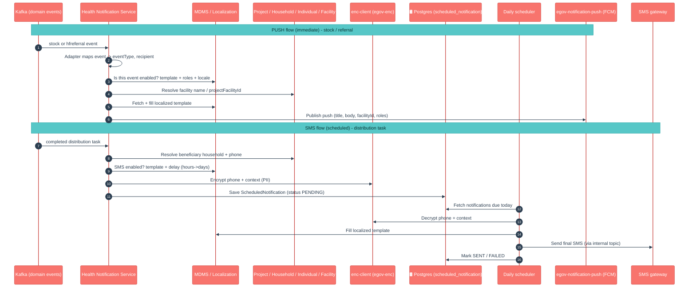

# Health Notification Service

## 1. Purpose

Health Notification Service is the **messaging brain** of a health campaign — it decides *who should be told what, when, and over which channel*. It listens to things happening elsewhere in the platform (stock moving between facilities, a referral being raised, a household being served during distribution) and turns each of those into a human-readable message.

It does two jobs:

- **Push notifications (immediate)** — when a stock transfer or a referral happens, it sends an in-app push alert (via the **egov-notification-push** service → FCM) to the right facility's field staff.
- **SMS reminders (scheduled)** — when a beneficiary household is served, it schedules one or more SMS messages (e.g. a follow-up reminder 2 or 3 days later) and a daily job sends them out.

Along the way it **looks up the recipient's details**, **picks the correct localized template** (English/French, etc.), **fills in the blanks** (names, quantities, dates), and **encrypts personal data** (phone numbers) before storing it.

In short: *"something happened — figure out who to message, in their language, and send it now or later."*

## 2. Business Flow

- **During the campaign (runtime)**, two kinds of triggers arrive on Kafka:
  - A **stock movement** (issued / returned / accepted / rejected) or a **health-facility referral** → an **immediate push** alert to the facility staff who need to act (e.g. "stock is on its way, please confirm receipt").
  - A **distribution task** completing successfully (a beneficiary was administered a commodity) → one or more **scheduled SMS** follow-ups to the beneficiary household.
- **Which messages fire, to whom, and in what language** is not hard-coded — it is read from **MDMS** campaign configuration (`HCM-NOTIFICATION-CONFIG`). Programme owners switch event types on/off, set recipient roles, set template codes, and set how many hours/days after the event each SMS should go out.
- **Personal data is protected** — beneficiary phone numbers and message context are encrypted before being stored, and only decrypted at send time.
- **A daily scheduler** wakes up, finds every SMS that is now due, builds the final localized text, and hands it to the SMS gateway.

## 3. Key APIs / Entry Points

This service is **driven almost entirely by Kafka events**, not by public REST calls. There is no beneficiary-facing or client-facing API. The HTTP endpoints that do exist are **operational/diagnostic only**.

**REST entry points (operational):**

| Endpoint | Purpose |
|---|---|
| `POST /health-notification-service/notification/v1/_cache/refresh` | Reloads the MDMS notification config and localization templates into the in-memory cache without a restart (`CacheController`). |
| `POST /health-notification-service/test/v1/stock/_notify` | Test-only — replays a raw stock Kafka payload through the push flow. Active only under the `hns-local` profile (`TestNotificationController`); not enabled in deployed environments. |

**Kafka entry points (the real work):**

| Topic listened to | Consumer | What it does |
|---|---|---|
| `save-stock-topic`, `update-stock-topic` | `NotificationConsumer` | Stock movement → routes by schema to `StockNotificationAdapter` → **immediate push**. |
| `save-hfreferral-topic`, `update-hfreferral-topic` | `NotificationConsumer` | Referral → `HFReferralNotificationAdapter` → **immediate push** (only on create). |
| `save-project-task-topic` | `ProjectTaskConsumer` | A completed distribution task → `PostDistributionService` → **schedules SMS** rows. |
| `save-final-sms-message` (internal) | `SaveFinalSmsMessageConsumer` | The fully-built SMS message → marks the notification **SENT** in the DB. |

**Topics it publishes to:** `egov.core.notification.push` (to egov-notification-push / FCM), `save-final-sms-message` (its own internal hand-off), `save-scheduled-notification-topic-health` / `update-scheduled-notification-topic-health` (to egov-persister + indexer).

> A `kafka.tenant.id.pattern` prefix (e.g. `ba-`) lets the same listeners work in both single-tenant and central-instance (multi-state) deployments.

### Kafka topics

| Topic | Dir | Purpose |
|---|---|---|
| `save-project-task-topic` | in | Project task events that trigger notifications |
| `save-stock-topic` | in | Stock create events (notification triggers) |
| `update-stock-topic` | in | Stock update events (notification triggers) |
| `save-hfreferral-topic` | in | HF-referral create events (notification triggers) |
| `update-hfreferral-topic` | in | HF-referral update events (notification triggers) |
| `save-final-sms-message` | in/out | Queue + self-consume the final SMS to dispatch |
| `save-scheduled-notification-topic-health` | out | Persist a scheduled notification |
| `update-scheduled-notification-topic-health` | out | Update a scheduled notification |
| `egov.core.notification.sms` | out | Outbound SMS |
| `egov.core.notification.push` | out | Outbound push |

## 4. Dependencies

- **MDMS (`egov-mdms-service`)** — the source of truth for which notifications are enabled, recipient roles, template codes, locales, and SMS delay timing (modules `HCM-NOTIFICATION-CONFIG`, `HCM-PROJECT-TYPES`).
- **Localization (`egov-localization`)** — supplies the message templates per locale; the service fills in placeholders.
- **egov-notification-push** — the downstream service that resolves device tokens from a facility id and sends the actual **push (FCM)** notification.
- **SMS gateway** — final SMS messages are emitted on the SMS topic (`egov.core.notification.sms`) for delivery.
- **Project / Project-Facility** — looks up project type and beneficiary type, and resolves a `projectFacilityId` to a real `facilityId`.
- **Household & Individual** — resolves the beneficiary's name and phone number for scheduled SMS.
- **Facility** — resolves facility names used in push message placeholders.
- **enc-client (egov-enc-service)** — encrypts/decrypts the PII (mobile number, message context) on the scheduled-notification path.
- **health-services-common / -models** — shared clients, models and utilities.
- **Kafka** — every trigger and every hand-off is a Kafka message.
- **PostgreSQL + Flyway** — stores the `scheduled_notification` table (migration applied on boot).
- **egov-persister** (deployed via the `configs/` repo) — actually writes the `save/update-scheduled-notification` events to Postgres.
- **egov-indexer → Elasticsearch** — indexes the same events for dashboards/audit.
- **Redis** — caching used by the shared repository layer.

## 5. Processing Flow

There are two distinct flows. The **push** flow is immediate; the **SMS** flow is deferred — events are first stored as scheduled rows, then a daily job sends them.

> No official LLD sequence diagram is published for this service yet; the flow above reflects the current code.

## 6. Failure / Retry Handling

- **One bad record doesn't sink the batch.** Consumers and the processor handle each record/task independently — a failure is logged and counted, the rest continue (`processAndSendBatch`, `processDistributionTasks`, `dispatchBatch`).
- **Scheduled SMS have explicit status tracking.** Each `scheduled_notification` row moves `PENDING → IN_PROGRESS → SENT` (or `FAILED`), with an `attempts` counter, `lastAttemptAt`, and a truncated `errorMessage`. Rows are marked `IN_PROGRESS` before dispatch so the next scheduler run won't pick them up twice.
- **Errors are classified recoverable vs non-recoverable.** Transient problems (timeouts, send failures) are flagged recoverable; bad data / missing template is non-recoverable — useful when triaging the `FAILED` rows.
- **Missing template = graceful fallback (push) / hard fail (SMS).** On the push path, if the localization template is missing the service still sends with a fallback body; on the SMS path a missing template marks the notification `FAILED`.
- **No automatic retry loop today.** The scheduler processes the rows it finds in a run; failed rows are not automatically re-attempted on a back-off — they stay `FAILED` and need operational follow-up. The scheduler caps how many rows it fetches per run (default 10,000) to avoid memory blow-ups on a large backlog; the remainder is picked up next run.
- **Skips are silent-by-design.** No mobile number, SMS disabled in MDMS, event type not enabled, unknown schema, or unresolvable facility → the event is logged and skipped, not errored. Check the logs when an expected notification "didn't fire".
- **Config drift is a classic trap.** If the MDMS notification config or the deployed persister config for the scheduled-notification topics is missing/stale in an environment, events are accepted but nothing is sent / nothing lands in Postgres.

## 7. Recent Changes (v2.1 / nigeria-go-deep-2)

The headline change for v2.1 is simple: **this service is new to the release line.** It (together with `egov-notification-push`) was merged into `master-nigeria-finalpull` in a single commit — *"Health-notification-service and egov-notification-push services merged into master-nigeria-finalpull"* — so everything below ships for the first time in v2.1.

What the service brings to v2.1, in plain language:

- **In-app push alerts for stock and referrals.** Stock movements (issued/returned, and their accepted/rejected outcomes) and new health-facility referrals now generate push notifications to the right facility staff, routed by role.
- **Scheduled SMS to beneficiaries after distribution.** When a household is served, the service schedules follow-up SMS (e.g. day-2 / day-3 reminders) based on delay timing read from MDMS, and a daily job sends them.
- **Config-driven, not code-driven.** Which events fire, to whom, in which language, with which template, and after how long — all come from MDMS campaign config, so programme owners can tune notifications without code changes.
- **PII is encrypted at rest.** Beneficiary phone numbers and message context are encrypted (via enc-client) before storage and only decrypted at send time.
- **Localized templates (multi-locale).** Messages are built from localization templates per locale (e.g. `en_NG`, `fr_NG`) with placeholders filled at send time.
- **Multi-tenant / central-instance aware.** Kafka listeners and persister topics support both single-tenant and central-instance (multi-state) deployments via a tenant-id topic prefix.
- **Operational cache refresh.** A `_cache/refresh` endpoint reloads MDMS + localization without a restart.

## 8. Known Risks / Limitations

- **No automatic retry / dead-letter for failed sends.** A `FAILED` scheduled SMS is not automatically re-attempted; it needs manual/operational intervention. There is no back-off queue.
- **Heavy dependence on MDMS + localization correctness.** A missing or mis-keyed MDMS event entry or template silently suppresses notifications (logged-and-skipped). This is the most common "why didn't it send?" cause.
- **Recipient resolution can be brittle.** Push recipients are resolved from stock sender/receiver facility ids (with a legacy `primaryRole` fallback); SMS recipients depend on the household/individual having a usable phone number — no phone means a silent skip.
- **SMS delay is day-granular.** MDMS `delayHours` is converted to whole days (`delayHours / 24`), and the scheduler runs on a daily cron — sub-day timing is effectively rounded.
- **Push path is push-only.** `NotificationProcessorService` currently only sends the `PUSH` channel in the immediate flow; an SMS channel on that path is logged as unsupported.
- **Timezone is configuration-critical.** All "today"/scheduling date math uses `notification.timezone`; a wrong value shifts which SMS are considered "due".
- **HFReferral notifications are create-only.** Referral updates do not trigger notifications by design.
- **DAMAGED stock entries produce no push** currently (no event-type mapping).

## 9. Release Version

| Field | Value |
|---|---|
| Release | **v2.1** (`master-nigeria-finalpull`) — service first introduced in this line |
| Stack | Spring Boot 3.2.2 / Java 17 |
| Shared libs | `health-services-common` 1.1.2-SNAPSHOT, `health-services-models` 1.0.30-SNAPSHOT, `tracer` 2.9.2-SNAPSHOT, `enc-client` 2.9.0 |
| Doc updated | 2026-06-12 |
| Maintainers | Health Campaign Services team |
