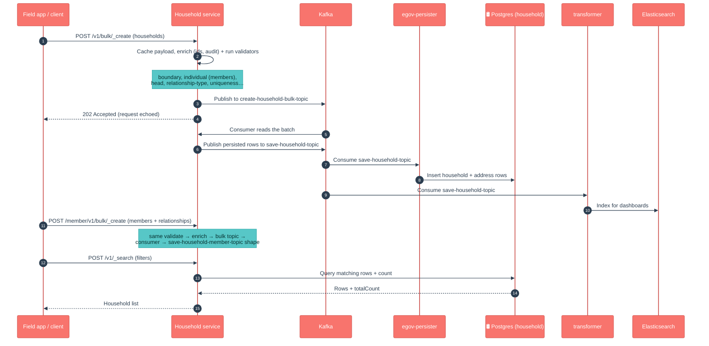

# Household

## Enhancements in HCM-v2.1

Changes from v2.0 to v2.1, in plain language for product owners, QA and ops.

- **No functional change in this service.** No household API, business logic or database schema changed here between v2.0 and v2.1. The household service jumped `1.2.1` → `1.2.2` purely on library/build housekeeping.
- **Dependency bumps.** Rebuilt against `health-services-models` `1.0.30-SNAPSHOT` (from 1.0.29) and `health-services-common` `1.1.3-SNAPSHOT` (from 1.1.1). The models bump carries shared-model changes made for other services (e.g. a new `projectId` on the Referral model) — household just picks them up.
- **Tracer 2.9.2, now transitive.** The direct `tracer` dependency was removed; tracer (2.9.2, with `DataAccessException` handling via its `ExceptionAdvise`) is now inherited through `health-services-common`. OpenTelemetry BOMs were added to pin versions and OTEL exporters are set to `none` by default.
- **Faster downsync (change lives in referralmanagement, not here).** v2.1 adds a `household_address_mv` **materialized view** (migration `V20260426140000` in *referralmanagement*) that pre-joins this service's `household` and `address` tables, with indexes on `localitycode`, `clientreferenceid` and `id`. It speeds up the bulk downsync of households to devices. Household writes are unaffected, but the view **reads** household-owned data, so ops should be aware the MV must be refreshed to stay current.

## 1. Purpose

Household is the **registry of homes** a health campaign visits. Each record is one household — where it is (a shared address, optionally with GPS), how many people live there, what type of household it is (e.g. family vs community), and who its members are. Members are linked to people in the **Individual** registry, one member can be flagged as the **head**, and members can be tied to each other by **relationships** (spouse, child, parent…).

In short: *"which homes exist, where are they, who lives in each, and how are those people related?"*

## 2. Business Flow

- **During registration/enumeration**, field workers walk an area and register each household (location, head, member count). Each person added becomes a **household member** linked to an Individual record.
- **During the campaign (runtime)**, the household and its members are the unit a beneficiary visit is recorded against — service delivery, eligibility and reporting all hang off "this household / this member".
- **As things change** (a member moves in/out, the head changes, a household splits), workers update or soft-delete records; mobile devices sync these edits back and forth.
- The data feeds **dashboards** (via the transformer → Elasticsearch) and is **bulk-read by downsync** (referral-management) so a device can pull every household in its assigned area for offline work.

## 3. Key APIs / Entry Points

Two entities under context path `/household`: the household itself (`/v1`) and its members (`/member/v1`). Each has single + bulk create/update/delete and a search. Relationships ride along on the member payload.

| Endpoint | Purpose |
|---|---|
| `POST /v1/_create`, `/v1/bulk/_create` | Register a household (single or bulk). |
| `POST /v1/_update`, `/v1/bulk/_update` | Correct/change a household. |
| `POST /v1/_delete`, `/v1/bulk/_delete` | Soft-delete a household. |
| `POST /v1/_search` | Find households (by id, boundary/locality, lat-long radius, since-time…). |
| `POST /member/v1/_create` … `/member/v1/bulk/_delete` | Same shape for household members (carries relationships). |
| `POST /member/v1/_search` | Find members (by `householdId`, `individualId`, client-reference ids — each accepts a **list**). |

**Kafka entry points (async).** Bulk requests land on `create-household-bulk-topic` / `update-…` / `delete-…` (and the `household-member-consumer-bulk-*` equivalents) and are processed by the service's own consumer. Persisted results go out on `save-household-topic` / `update-household-topic` / `delete-household-topic` (+ the `*-household-member-topic` set) for the persister and transformer.

**Swagger contract:** https://editor.swagger.io/?url=https://raw.githubusercontent.com/egovernments/health-campaign-services/master/docs/health-api-specs/contracts/registries/household.yml

### Kafka topics

| Topic | Dir | Purpose |
|---|---|---|
| `create-household-bulk-topic` | in | Bulk household create requests |
| `update-household-bulk-topic` | in | Bulk household update requests |
| `delete-household-bulk-topic` | in | Bulk household delete requests |
| `household-member-consumer-bulk-create-topic` | in | Bulk member create requests |
| `household-member-consumer-bulk-update-topic` | in | Bulk member update requests |
| `household-member-consumer-bulk-delete-topic` | in | Bulk member delete requests |
| `save-household-topic` | out | Persist new households |
| `update-household-topic` | out | Persist household updates |
| `delete-household-topic` | out | Persist household soft-deletes |
| `save-household-member-topic` | out | Persist new household members |
| `update-household-member-topic` | out | Persist member updates |
| `delete-household-member-topic` | out | Persist member soft-deletes |

## 4. Dependencies

- **idgen** — generates household record IDs.
- **individual** — validates the person each household member points to.
- **boundary-service** — validates the household's boundary/locality code.
- **health-services-common / -models** — shared clients, validators, POJOs (also brings in `tracer`).
- **Kafka** — async create/update/delete pipeline.
- **egov-persister** (deployed via the `configs/` repo) — actually writes the rows to Postgres off the `save-*` topics.
- **transformer → Elasticsearch** — builds the dashboard read-model from the same topics.
- **Redis** — caches in-flight records (the API pre-loads bulk payloads into cache before handing off to the consumer).
- **referralmanagement (downsync)** — a downstream **reader** of household + address data (see v2.1 note).

## 5. Processing Flow

Writes are **asynchronous**: the API validates, enriches and acknowledges, then a Kafka consumer persists. The service does not write Postgres directly — it emits a `save-*` event that **egov-persister** turns into a row, while the **transformer** indexes the same event into Elasticsearch for dashboards. Member create/update/delete follow the same shape on the member topics. Searches read straight from Postgres.

> **Note on the official LLD diagrams** (`docs.digit.org/health/design/architecture/low-level-design/registries/household`): the published Household/member create, bulk-create, update, search and delete sequence diagrams (images) still match the current code at a high level (validate → enrich → async persist → search-from-DB). The mermaid above adds the topic-level detail (bulk-consumer → `save-*` → persister + transformer) that the published images do not spell out.

### Data model (DB UML)

## 6. Failure / Retry Handling

- **Async, no batch rollback.** A bulk request returns `202` before persistence. If a record fails in the consumer it is logged and the batch continues; failed records do not roll back the rest — check consumer logs and the record's status.
- **Single (non-bulk) calls fail fast.** `/v1/_create` etc. validate synchronously and return a `400`/validation error on the spot.
- **Idempotency** is via `clientReferenceId` — re-submitting the same one should not create a duplicate row (unique constraints include it).
- **Optimistic locking** via `rowVersion` protects against concurrent edits on update/delete.
- **Soft delete** (`isDeleted`) everywhere — nothing is hard-deleted.
- **Cross-service dependency failures** (idgen, individual, boundary down/misconfigured) surface as validation/enrichment errors; the household is rejected rather than partially saved.
- If the **persister config** for the household topics is missing/stale in an environment, the API will accept writes but rows will silently not appear in Postgres — a classic "it worked in QA" trap.

## 7. Known Risks / Limitations

- **Member ↔ Individual link is app-validated, not a DB foreign key.** Pointing a member at a non-existent or wrong individual is caught only by the `individual`-service lookup at write time.
- **The `household_address_mv` is a snapshot.** Because downsync now reads a materialized view (in referralmanagement) rather than the live tables, households created/updated after the last MV refresh won't appear in a downsync until the view is refreshed — a freshness/ops concern, not a household-write bug.
- **Async persistence hides write failures.** Bulk writes are accepted (`202`) before they hit Postgres; a stale/missing persister config means data is silently not stored. Verify the deployed persister config matches the build.
- **`householdType` and relationship type are convention-driven.** They are stored as strings/codes validated at the app layer (and via MDMS/role rules for community households), not constrained by the DB.
- **Search semantics differ by mode.** Search-by-id, boundary, since-time and lat-long radius take different code paths; QA should cover each rather than assuming one filter behaves like another.

## 8. Release Version

| Field | Value |
|---|---|
| Release | **v2.1** |
| Stack | Spring Boot 3.2.2 / Java 17 |
| Shared libs | `health-services-common` 1.1.3-SNAPSHOT, `health-services-models` 1.0.30-SNAPSHOT, `tracer` 2.9.2 (transitive) |
| Doc updated | 2026-06-12 |
| Maintainers | Health Campaign Services team (CODEOWNERS: `@kavi-egov`, `@sathishp-eGov`) |

## Pre-commit script

[commit-msg](https://gist.github.com/jayantp-egov/14f55deb344f1648503c6be7e580fa12)
