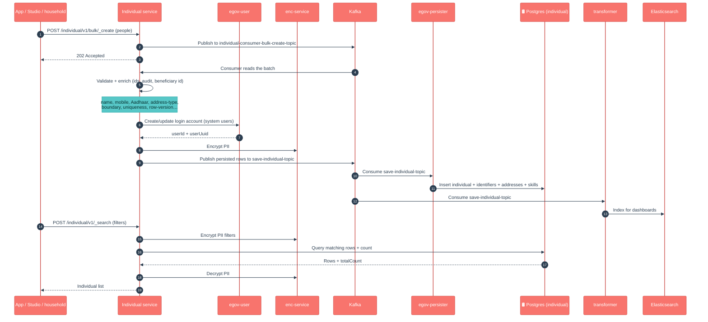

# Individual

## Enhancements in v2.1

Changes from v2.0 to v2.1, in plain language for product owners, QA and ops.

- **Citizens can self-register from Studio.** A new `POST /individual/v1/_register` endpoint lets a citizen sign up with their name, tenant and a mobile number **or** email (at least one contact is mandatory). The service creates the individual plus a citizen login account and **sends an OTP** to the given contact to finish sign-up.
- **OTP-based login, no password.** Sending `requestType = "Login"` with the received OTP validates it (via the OTP service) and activates the existing person's account. Wrong/expired OTPs are rejected with `INVALID_OTP`. There is no password anywhere in this flow.
- **Plaintext password removed from the database.** A migration drops the `password` column from the `individual` table (`V20250303122000`), and login now resolves through egov-user via the stored `userUuid` rather than any locally held credential — hardening credential handling.
- **Registered citizens get the `STUDIO_CITIZEN` role** (configurable via `register.individual.role`), created as active citizen users; real mobile/email is used as the username, skipping the older dummy-mobile-number behavior (existing `_create`/`_update` flows are unchanged).
- **No duplicate accounts** — if the contact is already registered, `_register` returns the existing individual instead of creating a second record; if OTP sending fails *after* creation, the API returns `OTP_SEND_FAILED` so the client knows the account exists and the OTP must be retried.
- **Boundary validation is more forgiving** — addresses with a missing/blank locality code no longer fail boundary validation, and ward/boundary search no longer errors on records lacking ward/locality data (null-pointer guards added).
- **Platform/library bumps (artifact 1.2.2)** — tracer upgraded to 2.9.2 (database errors handled centrally via tracer's exception advice) and now inherited transitively through `health-services-common`; OpenTelemetry BOMs + OTEL exporter config added; Lombok 1.18.30 for Java 17. These are plumbing changes with no API impact.

### Flow: citizen register + OTP login (v2.1)

```mermaid
%%{init: {'theme':'base','themeVariables':{'actorBkg':'#F8746D','actorBorder':'#C9433E','actorTextColor':'#FFFFFF','actorLineColor':'#C9433E','signalColor':'#2C3E50','signalTextColor':'#2C3E50','noteBkgColor':'#57C7C7','noteTextColor':'#06302F','noteBorderColor':'#1B9E9E','labelBoxBkgColor':'#E0F7F4','labelBoxBorderColor':'#1B9E9E','labelTextColor':'#06302F','loopTextColor':'#06302F','sequenceNumberColor':'#FFFFFF'}}}%%
sequenceDiagram
    autonumber
    participant Citizen as Citizen (Studio)
    participant Ind as Individual service
    participant OTP as OTP service
    participant User as egov-user
    participant DB as 🛢️ Postgres / Kafka

    Citizen->>Ind: POST /individual/v1/_register (name + mobile/email)
    Ind->>Ind: Require mobile OR email; search for existing person
    alt New person
        Ind->>User: Create citizen login (STUDIO_CITIZEN role, active)
        Ind->>DB: Create individual (PII encrypted, async)
        Ind->>OTP: Send OTP
        Ind-->>Citizen: 202 Accepted (OTP sent)
    else Login (requestType = "Login")
        Ind->>OTP: Validate OTP
        OTP-->>Ind: Valid / invalid
        Ind->>DB: Activate login account (isSystemUserActive = true)
        Ind-->>Citizen: 202 Accepted (logged in) / INVALID_OTP
    else Existing person, other requestType
        Ind-->>Citizen: 202 Accepted (existing person returned, no duplicate)
    end
```

## 1. Purpose

Individual is the **registry of people** in a health campaign — every person the system needs to know about, whether a beneficiary, a field worker, or a self-registered citizen. One Individual record holds a person's name, gender, date of birth, contact details, plus their:

- **Identifiers** — ID documents that identify the person (e.g. a system beneficiary ID, Aadhaar number, mobile number).
- **Addresses** — one or more places linked to the person (home, permanent, correspondence), tied to campaign boundaries.
- **Skills** — for workers, what they are trained or qualified to do.

Sensitive personal data (PII) such as Aadhaar, mobile number and name is **encrypted at rest**. When a person also needs to log in (a worker, or a citizen), Individual links the record to a login account in the platform's **egov-user** service.

In short: *"who is this person, how do we identify and reach them, and can they sign in?"*

## 2. Business Flow

- **During campaign setup**, field workers and supervisors are registered as Individuals (often with a login account and roles), so they can use the mobile app.
- **During the campaign (runtime)**, beneficiaries are registered as Individuals — usually by the household service while registering a household — and tagged with a unique beneficiary ID.
- **Self-service (v2.1)**, a citizen can register themselves from the DIGIT **Studio** web app and then **log in with an OTP** — no password is stored anywhere.
- **Throughout**, other services (household, project, referral, stock hand-outs) reference these Individual records to know who received what.
- Individual records feed the **dashboards** (via the transformer → Elasticsearch) and other registries that need beneficiary/worker counts.

## 3. Key APIs / Entry Points

Base path `/individual/v1`. Each write has a single and a bulk form; bulk writes are processed asynchronously over Kafka.

| Endpoint | Purpose |
|---|---|
| `POST /individual/v1/_create`, `/bulk/_create` | Register a person (single or bulk). |
| `POST /individual/v1/_update`, `/bulk/_update` | Update a person's details. |
| `POST /individual/v1/_delete`, `/bulk/_delete` | Soft-delete a person. |
| `POST /individual/v1/_search` | Find people (by id, name, mobile, identifier, boundary/ward, since-time …). PII filters are encrypted before querying. |
| `POST /individual/v1/_register` | **New in v2.1** — citizen self-registration and OTP login from Studio (see the Enhancements in v2.1 section above). |

**Kafka entry points (async).** Bulk create/update/delete requests land on `individual-consumer-bulk-create-topic` / `…-update-topic` / `…-delete-topic` and are processed by the service's own consumer. Persisted results go out on `save-individual-topic` / `update-individual-topic` / `delete-individual-topic` (plus `update-user-id-topic`) for the persister and transformer.

**Swagger contract:** https://editor.swagger.io/?url=https://raw.githubusercontent.com/egovernments/health-campaign-services/master/docs/health-api-specs/contracts/registries/individual.yml

### Kafka topics

| Topic | Dir | Purpose |
|---|---|---|
| `individual-consumer-bulk-create-topic` | in | Bulk person create requests |
| `individual-consumer-bulk-update-topic` | in | Bulk person update requests |
| `individual-consumer-bulk-delete-topic` | in | Bulk person delete requests |
| `save-individual-topic` | out | Persist new individuals |
| `update-individual-topic` | out | Persist individual updates |
| `delete-individual-topic` | out | Persist individual soft-deletes |
| `update-user-id-topic` | out | Link individual to its egov-user account id |
| `egov.core.notification.sms` | out | Outbound SMS notifications |

## 4. Dependencies

- **egov-user** — creates/updates the login account for people who are system users; login resolves by `userUuid` (no password held in Individual).
- **idgen** — generates individual record IDs.
- **beneficiary-idgen** — supplies and marks-used the unique beneficiary IDs handed to the mobile app.
- **egov-enc-service** (via `enc-client`) — encrypts/decrypts PII (Aadhaar, mobile, name). Needs MDMS `DataSecurity.SecurityPolicy` data for the tenant or the service fails to start.
- **boundary-service** — validates the campaign boundary/ward on an address.
- **MDMS** — tenant-scoped master data and the security policy used by encryption.
- **user-otp / egov-otp** — send and validate OTPs for the Studio register/login flow (v2.1).
- **Localization** + **SMS notification** (`egov.core.notification.sms` topic) on create/update where enabled.
- **health-services-common / -models** — shared clients, validators, POJOs.
- **Kafka** — async create/update/delete pipeline.
- **egov-persister** (deployed via the `configs/` repo) — actually writes the rows to Postgres off the `save-*`/`update-*`/`delete-*` topics.
- **transformer → Elasticsearch** — builds the dashboard read-model from the same topics.
- **Redis** — caching used by the shared repository layer.

## 5. Processing Flow

Bulk writes are **asynchronous**: the API validates and acknowledges, then a Kafka consumer enriches, syncs the login account, encrypts PII and persists. The service does not write Postgres directly — it emits a `save-*` event that **egov-persister** turns into a row, while the **transformer** indexes the same event into Elasticsearch for dashboards. Single create/update/delete run the same steps inline. Search reads (encrypted) from the database and decrypts before returning.



> **Note on the official LLD diagrams** (`docs.digit.org/health/design/architecture/low-level-design/registries/individual`): the published Create/BulkCreate/Update/BulkUpdate/Search/Delete/BulkDelete diagrams still match the current code at a high level (validate → encrypt → async persist → search-from-DB-and-decrypt). The **`_register` OTP/Studio self-registration flow and the password-less login** (v2.1) are **newer than the published diagrams** and are described in the Enhancements in v2.1 section above.

### Data model (DB UML)


## 6. Failure / Retry Handling

- **Async, no batch rollback.** A bulk request returns `202` before persistence. In the consumer each record is validated individually; invalid records are dropped with an error and the rest proceed — check consumer logs and the record's status.
- **Idempotency** is via `clientReferenceId` — re-submitting the same one should not create a duplicate person.
- **Optimistic locking** via `rowVersion` protects against concurrent edits on update.
- **Soft delete** (`isDeleted`) everywhere — nothing is hard-deleted; unique constraints include the delete flag.
- **User-service failures are per-record.** If creating/updating the egov-user login account fails for a person, that person is removed from the valid set with a `USER_SERVICE_ERROR`; the others still persist.
- **Encryption start-up dependency.** If MDMS `DataSecurity.SecurityPolicy` is missing for the tenant, the service crashes at boot (enc-client) — the most common environment trap for this service.
- If the **persister config** for the individual topics is missing/stale in an environment, the API accepts writes but rows silently don't appear in Postgres.

## 7. Known Risks / Limitations

- **Encryption is a hard boot dependency** — missing MDMS `DataSecurity.SecurityPolicy` for the tenant (the `Individual*` models) crashes the service at start-up; enc-client loads the policy once at boot, so a fix requires a restart.
- **PII search is exact-match on encrypted values** — mobile/Aadhaar/identifier searches encrypt the filter and match the ciphertext, so partial or fuzzy matching on PII is not possible.
- **User-service coupling.** People marked as system users must sync to egov-user; if that service is down those records are rejected (others still save). Login depends on `userUuid` being correctly linked.
- **`_register` is partly synchronous.** It creates the person and sends the OTP inline; a created-but-OTP-failed state is possible and surfaces as `OTP_SEND_FAILED` — the client must retry the OTP, not the whole registration.
- **`identifierType` / address types are convention-driven** — validators enforce known types, but the DB does not constrain free-text values.
- **A persister gap is silent** — writes are accepted (`202`) even if no environment consumer is writing the rows.

## 8. Release Version

| Field | Value |
|---|---|
| Release | **v2.1** |
| Stack | Spring Boot 3.2.2 / Java 17 (service artifact `1.2.2`) |
| Shared libs | `health-services-common` 1.1.3-SNAPSHOT, `health-services-models` 1.0.30-SNAPSHOT |
| Doc updated | 2026-06-12 |
| Maintainers | Health Campaign Services team (CODEOWNERS: `@kavi-egov`, `@sathishp-eGov`) |

## Pre-commit script

[commit-msg](https://gist.github.com/jayantp-egov/14f55deb344f1648503c6be7e580fa12)
