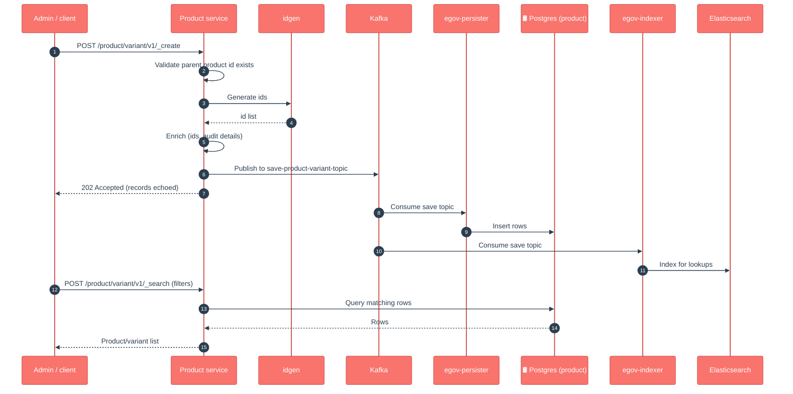

# Product

## Enhancements in v2.1

Changes from v2.0 to v2.1.

- **No functional changes — dependency/config-only rebuild.** Product was rebuilt against newer shared libraries with no change to its APIs, entities, Kafka topics or database schema. The git history for this service since `v2.0` is limited to version bumps and the items below.
- **Tracer 2.9.2 upgrade for consistent `DataAccessException` handling.** The direct `tracer` dependency was removed; tracer now comes in transitively via `health-services-common`, so database-error responses are handled uniformly via tracer's shared `ExceptionAdvise`.
- **OpenTelemetry wiring added.** OTEL BOMs were added to dependency management (for version resolution) and the OTEL exporters are configured off by default (`otel.*.exporter=none`) in `application.properties`.
- **Shared-library version bumps.** `health-services-common` to `1.1.3-SNAPSHOT`; service version bumped to `1.2.1`.

## 1. Purpose

Product is the **catalogue of commodities** used in a health campaign — the master list of things the campaign hands out or moves around (a vaccine, a bed net, a deworming tablet). It holds two simple registries:

- **Product** — the base item ("Albendazole tablet", with type, name, manufacturer).
- **Product Variant** — a specific packaged form of a product ("Albendazole 400mg, blister of 10", identified by an SKU and a variation label).

In short: *"what commodities exist in this campaign, and in what packaged forms?"* Other services (Stock, Project, Transformer) point at a product variant rather than re-describing the commodity each time.

## 2. Business Flow

- **During campaign setup**, the products and variants for the campaign are registered here once. This is a small, mostly one-time reference list — products are **created/edited deliberately by an admin**, not bulk-imported by field workers.
- **During the campaign (runtime)**, the service is mostly **read**: Stock validates that the commodity being moved is a real product variant; dashboards and pickers look up product/variant names by id.
- The registry is the single source of truth for commodity identity, so a vaccine renamed here is renamed everywhere it is referenced.

## 3. Key APIs / Entry Points

Base path `/product`. Products live under `/product/v1`; variants under `/product/variant/v1`. Each entity has create, update and search (update also serves soft-delete via the `apiOperation` flag).

| Endpoint | Purpose |
|---|---|
| `POST /product/v1/_create` | Register a product (single or list). |
| `POST /product/v1/_update` | Edit or soft-delete a product. |
| `POST /product/v1/_search` | Find products (by id, name, type…) with paging. |
| `POST /product/variant/v1/_create` | Register a product variant (validates its parent product exists). |
| `POST /product/variant/v1/_update` | Edit or soft-delete a variant. |
| `POST /product/variant/v1/_search` | Find variants (by id, product id, SKU…) with paging. |

**Kafka topics are output-only.** There is **no inbound/bulk Kafka entry point** — every write enters through the REST API above. After the API validates and enriches a write, it publishes the result to `save-product-topic` / `update-product-topic` (and `save-product-variant-topic` / `update-product-variant-topic`) for the persister and indexer to consume. Searches read straight from Postgres.

**Swagger contract:** https://editor.swagger.io/?url=https://raw.githubusercontent.com/egovernments/health-campaign-services/master/docs/health-api-specs/contracts/registries/product.yml

### Kafka topics

_The API validates/enriches synchronously and consumes no topics — it only produces for the persister/transformer._

| Topic | Dir | Purpose |
|---|---|---|
| `save-product-topic` | out | Persist new products |
| `update-product-topic` | out | Persist product updates |
| `save-product-variant-topic` | out | Persist new product variants |
| `update-product-variant-topic` | out | Persist variant updates |

## 4. Dependencies

- **idgen** — generates the unique ids for new products (`product.id`) and variants (`product.variant.id`).
- **product (self)** — variant create/update validates that the referenced **parent product id** already exists.
- **health-services-common / -models** — shared `IdGenService`, generic repository, enrichment/validation helpers (`enrichForCreate`, `checkRowVersion`, …) and the Product/ProductVariant POJOs.
- **Kafka** — async write pipeline (output topics only).
- **egov-persister** (deployed via the `configs/` repo; config bundled at `product-persister.yml`) — actually writes the rows to Postgres off the `save-*` / `update-*` topics.
- **egov-indexer → Elasticsearch** (config bundled at `product-indexer.yml`) — indexes products and variants for fast lookups/dashboards.
- **Redis** — caching used by the shared repository layer.
- **MDMS** — config points at a `product` master (`product_master`); used for reference/config lookups.

## 5. Processing Flow

Writes are **asynchronous on the persistence step**: the API validates, enriches and acknowledges with `202`, then emits a `save-*` event that **egov-persister** turns into a Postgres row, while **egov-indexer** indexes the same event into Elasticsearch. The service does not write Postgres directly on create/update. Searches, by contrast, read straight from Postgres.

> Note on the official LLD diagrams (`docs.digit.org/health/design/architecture/low-level-design/registries/product`): the published create/update/search sequence diagrams (images) still match the current code — validate → enrich → async persist via Kafka/persister, search-from-DB. No newer behaviour diverges from them.

### Data model (DB UML)

## 6. Failure / Retry Handling

- **Async persistence, no batch rollback.** Create/update return `202` before the row is written. If one record in a list fails downstream, it does not roll back the others — check persister/consumer logs and whether the record appears in Postgres.
- **Optimistic locking** via `rowVersion` on update — a stale version is rejected, protecting against concurrent edits. (Product applies this on every update path; there is no relaxed path as in Stock.)
- **Parent-product validation** on variant create/update — a variant pointing at a non-existent product id is rejected up front.
- **Soft delete only** (`isDeleted`) — nothing is hard-deleted; deletes flow through the update path with an `apiOperation` flag.
- If the **persister config** for the product topics is missing/stale in an environment, the API will accept writes but rows will silently not appear in Postgres — a classic "it worked in QA" trap. Because Product is mostly read at runtime, this can stay hidden until a downstream variant lookup fails.

## 7. Known Risks / Limitations

- **No inbound bulk import.** Products and variants are created one request at a time through the REST API; there is no Kafka/file bulk-load path. Large catalogues must be loaded by an external script calling `_create` (the request body does accept a list).
- **`type`, `name`, `manufacturer`, `sku`, `variation` are free strings** — there is no DB-level enum or catalogue constraint; data quality is an app/validation concern.
- **Parent product is validated, but referential integrity is app-level** — there is no Postgres foreign key from variant to product; a product soft-deleted after variants exist is not blocked here.
- **`_search` reads Postgres, not Elasticsearch** — the ES index feeds dashboards/lookups, so a stale indexer affects dashboards, not the service's own search results.
- **Mostly-read at runtime hides persister gaps** — see the "it worked in QA" trap in section 6.

## 8. Release Version

| Field | Value |
|---|---|
| Release | **v2.1** |
| Stack | Spring Boot 3.2.2 / Java 17 |
| Shared libs | `health-services-common` 1.1.3-SNAPSHOT, `health-services-models` 1.0.29-SNAPSHOT, `services-common` 2.9.0-SNAPSHOT |
| Doc updated | 2026-06-12 |
| Maintainers | Health Campaign Services team (CODEOWNERS: `@kavi-egov`, `@sathishp-eGov`) |

## Pre-commit script

[commit-msg](https://gist.github.com/jayantp-egov/14f55deb344f1648503c6be7e580fa12)
