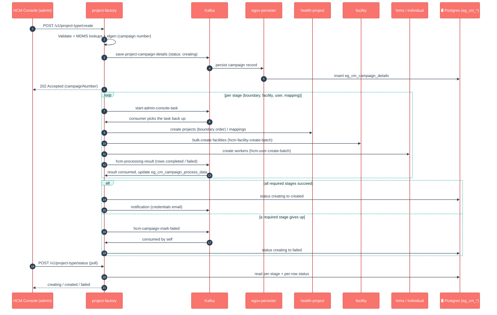

# Project Factory

## Enhancements in HCM-v2.1

Changes from v2.0 to v2.1, in plain language for product owners, QA and ops.

- **Campaigns no longer get stuck or fail to start because of message-channel issues.** At startup the service now reliably creates and connects to all the Kafka topics it needs (including per-state prefixed topics in shared "central instance" deployments) before it begins working. Previously, for some states a campaign could sit doing nothing because a topic wasn't ready.
- **Big campaigns no longer choke on large data.** Campaign messages are now GZIP-compressed and the consumer is allowed to read much larger messages (topics configured for 4 MB). Campaigns with tens of thousands of boundaries, facilities or users now process without running out of memory or hitting message-size limits.
- **Workers map to the correct area.** Facility-to-boundary mapping is now keyed on facility **id / boundary code** instead of name. This fixes cases where two areas shared a display name and facilities (and therefore workers) ended up mapped to the wrong boundary.
- **Multi-level / multi-hierarchy boundaries are supported,** including boundaries that share the same display name at different levels — important for country structures that aren't a simple single tree.
- **Batch sizes are now configurable.** Every batch/chunk size (project creation, facility/user batches, search page sizes, etc.) can be tuned per environment instead of being hard-coded — useful for balancing speed against load on large campaigns.
- **Failed campaigns are resumable, and user creation is retry-safe.** A failed campaign can be corrected and re-run; already-completed rows are skipped and only pending/failed rows are retried. User creation specifically now skips workers already in HRMS, tolerates partial-batch failures without failing the whole campaign, and keeps a per-row error history (see [`USER_RETRY_IMPLEMENTATION.md`](./USER_RETRY_IMPLEMENTATION.md)).
- **More resilient creation overall.** Numerous fixes for large user batches, child-campaign resource copying, attendance-register re-upload, credential-sheet accuracy, and clearer per-request logging (tenant + correlation id), reducing the "campaign reached a dead end with only a generic 500" class of incidents.

## 1. Purpose

Project Factory turns an admin clicking **"Create Campaign"** into a fully set-up campaign — boundaries, projects, facilities, workers, and products all created and linked, in the right order, behind the scenes. It is a **Node.js / TypeScript** service (not a Java/Maven service) and is the **orchestrator** of the health vertical: it owns the campaign lifecycle, validates the Excel files the admin uploads, calls every other registry to create records, and tracks status until the campaign is ready.

In short: *"the admin describes the campaign in spreadsheets; project-factory builds it for real and tells you if anything went wrong."*

Because it touches nearly every other service, **this is the biggest and most-connected service in the repo — and where most campaign-creation problems first surface.** When the orchestra sounds wrong, the conductor's logs tell you which instrument is off, but the fix is usually in the instrument (downstream service).

## 2. Business Flow

A campaign is time-bound, geography-bound, product-bound, and people-bound. Setting one up is like organising a wedding — book the venue, finalise the guest list, brief the staff — and only then does the event happen:

- **Pick the geography (boundaries).** The admin ticks the administrative areas (State → LGA → Ward → Settlement) the campaign will cover.
- **Add the products.** Commodities to distribute (bed nets, vaccine doses, deworming tablets) are picked from the Product Registry.
- **Upload facilities and workers.** The admin downloads Excel templates, fills them in, and uploads them. project-factory validates every row and writes errors back into the sheet for the admin to fix.
- **Create the campaign.** Once validation passes, the admin clicks **Create**. project-factory saves the campaign as `creating` and kicks off background work — one project per boundary (top-down), facilities, worker accounts, the mappings that tie a worker to their facility and area, and the products. When everything succeeds the campaign becomes `created` and the admin gets an email with a downloadable worker-credentials sheet.
- **Field workers start.** Each worker logs into the Frontline Workers App, sees only their assigned area, and begins registering households.

A small campaign finishes in seconds; a country-wide one (thousands of facilities and workers) can take many minutes — the admin doesn't have to keep the browser open.

## 3. Key APIs / Entry Points

Base path `/project-factory`. The HTTP layer only **triggers** work — all heavy lifting runs asynchronously over Kafka.

| Endpoint | Purpose |
|---|---|
| `POST /v1/project-type/create` | Create a campaign (status `drafted` → `creating`); returns immediately, work continues in the background. |
| `POST /v1/project-type/update` | Update a campaign; also the way to **re-run/resume** a failed campaign with a corrected sheet. |
| `POST /v1/project-type/search` | Find campaigns (returns full detail incl. error info). |
| `POST /v1/project-type/status` | Poll campaign progress — per-stage and per-row counts (the UI's main poll). |
| `POST /v1/project-type/cancel-campaign` | Cancel a campaign before it reaches `created`. |
| `POST /v1/project-type/fetch-from-microplan` | Import boundary/facility/staff estimates from plan-service (Microplanning). |
| `POST /v2/data/_generate` | Generate a pre-filled Excel template for download. |
| `POST /v2/data/_process` | Validate an uploaded Excel and write row-level errors back. |
| `POST /v1/data/_create` / `_search` | Persist / search the parsed boundary, facility and user rows. |

**Kafka entry points (async).** project-factory both produces and consumes its own work topics: `start-admin-console-task` / `start-admin-console-mapping-task` (kick off a stage), the batch topics `hcm-facility-create-batch` / `hcm-user-create-batch` / `hcm-mapping-batch`, the result topic `hcm-processing-result` (closes the loop, marking rows completed/failed), and `hcm-campaign-mark-failed` (raised when a stage gives up). The campaign record itself is published on `save-project-campaign-details`, which an **external egov-persister** writes to the database — project-factory does not write that table itself.

### Kafka topics

> In central-instance mode these base names carry a `{tenantId}-` prefix (see the service's multi-tenancy rules). The orchestration topics (`start-admin-console-*`, `hcm-*`) are both emitted and consumed by this service to drive async campaign steps.

| Topic | Dir | Purpose |
|---|---|---|
| `start-admin-console-task` | in/out | Campaign resource-creation task trigger |
| `start-admin-console-mapping-task` | in/out | Mapping task trigger |
| `hcm-processing-result` | in/out | Excel-ingestion processing result |
| `hcm-facility-create-batch` | in/out | Facility-creation batch |
| `hcm-user-create-batch` | in/out | User-creation batch |
| `hcm-mapping-batch` | in/out | Mapping batch |
| `hcm-campaign-mark-failed` | in/out | Mark a campaign failed |
| `save-project-campaign-details` / `update-project-campaign-details` | out | Persist campaign details |
| `create-resource-details` / `update-resource-details` | out | Persist resource details |
| `create-resource-activity` | out | Persist resource activity |
| `create-generated-resource-details` / `update-generated-resource-details` | out | Persist generated resource |
| `project-factory-save-plan-facility` | out | Persist microplan facility |
| `save-sheet-data` / `update-sheet-data` | out | Persist sheet data |
| `save-mapping-data` / `update-mapping-data` / `delete-mapping-data` | out | Persist mapping data |
| `save-process-data` / `update-process-data` | out | Persist process data |
| `egov.core.notification.email` | out | Outbound email notifications |

## 4. Dependencies

project-factory is the hub; nearly everything else is a spoke.

- **boundary-management / boundary-service** — the geographic hierarchy; validated and read during create.
- **health-project** — creates one project per boundary, plus the project↔facility, project↔staff and project↔resource mappings.
- **facility** — bulk-creates the campaign's facilities.
- **egov-hrms / individual / egov-user** — create worker login accounts and identities.
- **product** — validates the product variants attached to the campaign.
- **MDMS** — master data: campaign type, validation schemas, the boundary hierarchy, and the **process registry** that defines which stages to run.
- **egov-idgen** — generates campaign numbers and usernames.
- **filestore** — stores the Excel templates and processed/status files.
- **localization** — translations for template headers and error messages (no hard-coded English).
- **excel-ingestion** — sibling service that helps parse/generate large Excel sheets.
- **plan-service / census-service** — optional Microplanning inputs.
- **worker-registry** — links worker payroll data to an individual.
- **attendance** — optional training-register creation.
- **Kafka** — all async job triggering and result handling.
- **egov-persister** (via the `configs/` / `health-campaign-config/` repos) — actually writes campaign rows to Postgres off the `save-*` topics.
- **transformer → Elasticsearch** — indexes project/facility/user events for the dashboards (off the critical path).
- **egov-notification-push** — the post-create credentials email.
- **Redis** — caches MDMS, localization and search results.
- **PostgreSQL** — owns the `eg_cm_*` tables (see below).

**Its own data (Postgres, `eg_cm_` = eGov Campaign Management):** `eg_cm_campaign_details` (master record + status), `eg_cm_campaign_process_data` (one row per stage — tells you exactly which stage failed), `eg_cm_campaign_data` (per-row parsed Excel data + per-row status), `eg_cm_resource_details` (uploaded files), `eg_cm_generated_resource_details` (pre-filled sheets for download), `eg_cm_campaign_mapping_data` (worker↔facility↔boundary mappings).

## 5. Processing Flow

`POST /v1/project-type/create` returns `202` almost immediately. project-factory then drives the campaign forward stage-by-stage over Kafka, picking up its own messages, calling each registry, and recording per-stage and per-row status in the database. Status is tracked in `eg_cm_campaign_process_data`; the campaign reaches `created` only when all required stages succeed.

```mermaid
%%{init: {'theme':'base','themeVariables':{'actorBkg':'#F8746D','actorBorder':'#C9433E','actorTextColor':'#FFFFFF','actorLineColor':'#C9433E','signalColor':'#2C3E50','signalTextColor':'#2C3E50','noteBkgColor':'#57C7C7','noteTextColor':'#06302F','noteBorderColor':'#1B9E9E','labelBoxBkgColor':'#E0F7F4','labelBoxBorderColor':'#1B9E9E','labelTextColor':'#06302F','loopTextColor':'#06302F','sequenceNumberColor':'#FFFFFF'}}}%%
sequenceDiagram
    autonumber
    participant Console as HCM Console (admin)
    participant PF as project-factory
    participant Kafka as Kafka
    participant Persister as egov-persister
    participant Project as health-project
    participant Facility as facility
    participant User as hrms / individual
    participant DB as 🛢️ Postgres (eg_cm_*)

    Console->>PF: POST /v1/project-type/create
    PF->>PF: Validate + MDMS lookups + idgen (campaign number)
    PF->>Kafka: save-project-campaign-details (status: creating)
    Kafka->>Persister: persist campaign record
    Persister->>DB: insert eg_cm_campaign_details
    PF-->>Console: 202 Accepted (campaignNumber)

    loop per stage (boundary, facility, user, mapping)
        PF->>Kafka: start-admin-console-task
        Kafka->>PF: consumer picks the task back up
        PF->>Project: create projects (boundary order) / mappings
        PF->>Facility: bulk-create facilities (hcm-facility-create-batch)
        PF->>User: create workers (hcm-user-create-batch)
        PF->>Kafka: hcm-processing-result (rows completed / failed)
        Kafka->>PF: result consumed, update eg_cm_campaign_process_data
    end

    alt all required stages succeed
        PF->>DB: status creating to created
        PF->>Kafka: notification (credentials email)
    else a required stage gives up
        PF->>Kafka: hcm-campaign-mark-failed
        Kafka->>PF: consumed by self
        PF->>DB: status creating to failed
    end

    Console->>PF: POST /v1/project-type/status (poll)
    PF->>DB: read per-stage + per-row status
    PF-->>Console: creating / created / failed
```

> Note on the official LLD diagrams (`docs.digit.org/.../project-factory-campaign-manager/.../campaign-process-flow`): the published process-flow page has no sequence image and describes the high-level parent/child create-cancel-fail states. The v2.1 reliability work (startup topic creation, GZIP/large-payload handling, multi-hierarchy boundaries, id/code-based facility mapping, and resumable user retry) is **newer than the published documentation** and is captured in the flow above, the Enhancements in v2.1 section, and §6.

### Data model (DB UML)

## 6. Failure / Retry Handling

- **`_create` returns 202 long before success is known.** A `creating` status does not mean progress — check `eg_cm_campaign_process_data` to see which stage is `pending` or `failed`, then look at that stage's downstream service.
- **Failures are signalled by a Kafka event, not an exception.** When a required stage gives up retrying, project-factory publishes `hcm-campaign-mark-failed`, consumes it itself, and sets the campaign to `failed`.
- **Not every stage failure blocks the campaign.** Boundary/project creation and user-credential generation are blocking; **user batches, facility batches, skipped mappings, and attendance registers are non-blocking by policy** — the campaign can reach `created` while some rows are `failed`. Reconciliation of those rows is then expected.
- **Per-row status is the source of truth for resume.** Each Excel row carries `pending` / `completed` / `failed` (with the downstream entity ID stored on success). On a re-run, stages skip `completed` rows and only re-attempt `{pending, failed}` ones — so a corrected re-upload converges without recreating what already worked.
- **User creation is safely retryable (v2.1).** Before sending a worker to HRMS, project-factory checks whether the phone already exists; if so it reuses that account instead of failing. A partial batch no longer aborts the whole run, and each failed row keeps a short attempt history so operators can tell a transient blip apart from a real data problem.
- **Idempotency caveat.** Bulk creates are not uniformly idempotent — a network blip after a downstream commit but before the response can cause a duplicate attempt on retry. The persister deduplicates on `campaignNumber`; verify per-stage when adding new orchestration.
- **Common "stuck in creating" causes:** Kafka consumer lag, a downstream registry returning 5xx, idgen overload, or — classically — **persister/MDMS config drift in another repo**, where the API accepts the work but rows never appear in Postgres.

## 7. Known Risks / Limitations

- **Most failures originate downstream, not here.** project-factory is the alarm bell; the actual fault is usually in health-project, facility, individual/HRMS, MDMS config, or the broker. Always confirm the failing stage in `eg_cm_campaign_process_data` first.
- **Config lives in other repos.** Campaign behaviour depends on MDMS masters (`HCM-ADMIN-CONSOLE` schemas and the **process registry**) in `health-campaign-config/` and persister YAMLs in `configs/`. A campaign that works locally but fails in QA/UAT is very often a config-drift problem there, not a code problem here.
- **Partial success is real.** A `created` campaign can still contain `failed` facility/user rows (non-blocking by policy). The error worksheet / row status is the only signal today — `/status` does not yet surface a per-stage failure summary, so QA must check the rows.
- **Two parallel Excel pipelines** (project-factory's internal `processFlowClasses` and the standalone excel-ingestion service) coexist; which one runs depends on env config. Trace `excelIngestionUtils.ts` before assuming.
- **Facility and HRMS records are effectively immutable** (no `_update` API). A genuine name change post-create cannot be patched surgically; current policy is to block such changes with a clear error rather than silently recreate.
- **Retries are currently unbounded** — a hopeless row is retried on every re-run. Attempt history exists in the row JSON but is not yet a first-class backoff signal.
- **Topological order matters.** Boundary→project creation is top-down; any change to the sort logic can silently break hierarchical campaigns.

## 8. Release Version

| Field | Value |
|---|---|
| Release | **v2.1** |
| Stack | Node.js / TypeScript (TypeScript 5.4.2; built and run on Node 20) |
| Key libs | Express 4, KafkaJS 2.2, ExcelJS 4.4 / xlsx 0.18, ioredis 5.4, pg 8.12, Zod 3.24, AJV 8.16 |
| Doc updated | 2026-06-12 |
| Maintainers | `@jagankumar-egov` |

## Configuration

- **Persister Config**: [Link](https://github.com/egovernments/configs/blob/UNIFIED-UAT/health/egov-persister/project-factory-persister.yml)
- **Helm Chart Details**: [Link](https://github.com/egovernments/DIGIT-DevOps/blob/unified-env/deploy-as-code/helm/charts/health-services/project-factory/values.yaml)

## Redis Caching

- **Purpose**: Enhances performance by caching frequently accessed data and reducing the load on the database.
- **Usage**: Commonly used to store temporary data like search results, and other frequently accessed resources.
