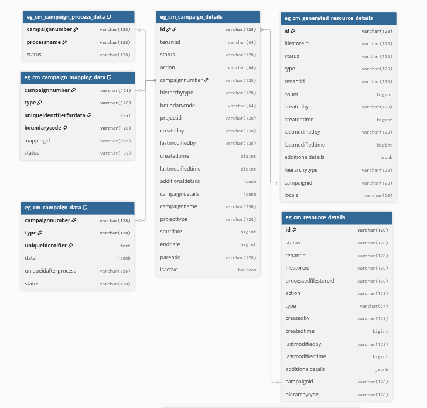

# ProjectFactory Service

The **ProjectFactory Service** is responsible for managing project-type campaigns, including creating, updating, searching, and generating campaign data.

## DB UML Diagram

## Service Dependencies

### Core Services

- `egov-localization`
- `egov-filestore`
- `egov-persister`
- `egov-mdms`
- `egov-idgen`
- `egov-boundaryservice-v2`

### Health Services

- `health-project`
- `health-hrms`
- `health-facility`

### Caching

- `Redis` is now used to store cache for frequently accessed data to improve performance.

## Swagger API Contract

For the structure and visualization of APIs, refer to the [Swagger API contract](https://editor.swagger.io/?url=https://raw.githubusercontent.com/jagankumar-egov/DIGIT-Specs/hcm-workbench/Domain%20Services/Health/project-factory.yaml).

## Service Details

### Functionality

1. **Campaign Management**: Manages project-type campaigns, including creation, updating, searching, and data generation.
2. **Project Mapping**: Completes full project mapping with staff, facility, and resources along with proper target values during campaign creation.
3. **Data Creation**: Validates and creates resource details of types `facility`, `user`, and `boundary`.
4. **Data Generation**: Generates sheet data of types `facility`, `user`, and `boundary`.
5. **Validation**: Validates boundaries and resources during campaign creation and updating.

### Features

1. **Easy Campaign Creation**: Facilitates easy creation of campaigns.
2. **File Storage**: Uploads generated data sheets to `egov-filestore` and returns the file store ID for easy access.
3. **Localization Support**: Supports localization for multi-language adaptability.
4. **Customizable Delivery Rules**: Allows defining delivery rules for projects based on specific criteria.
5. **Search and Filtering**: Enables searching and filtering campaigns based on parameters like status, date, and creator.
6. **Batch Processing**: Supports batch processing for creating and updating multiple campaigns simultaneously.
7. **Caching with Redis**: Improves performance by caching frequently accessed data.

### External Libraries Used

- **[xlsx](https://github.com/SheetJS/sheetjs)**: For reading and writing Excel files.
- **[ajv](https://github.com/ajv-validator/ajv)**: For JSON schema validation.
- **[lodash](https://github.com/lodash/lodash)**: For utility functions like data manipulation and object iteration.

## Configuration

- **Persister Config**: [Link](https://github.com/egovernments/configs/blob/UNIFIED-UAT/health/egov-persister/project-factory-persister.yml)
- **Helm Chart Details**: [Link](https://github.com/egovernments/DIGIT-DevOps/blob/unified-env/deploy-as-code/helm/charts/health-services/project-factory/values.yaml)

## API Endpoints

- **`POST /project-factory/v1/project-type/create`**: Creates a new project-type campaign.
- **`PUT /project-factory/v1/project-type/update`**: Updates an existing project-type campaign.
- **`POST /project-factory/v1/project-type/search`**: Searches for project-type campaigns based on specified criteria.
- **`POST /project-factory/v1/data/_create`**: Creates or validates resource data (e.g., facility, user, boundary).
- **`POST /project-factory/v1/data/_search`**: Searches for resource data based on specified criteria.
- **`POST /project-factory/v1/data/_generate`**: Initiates the generation of new data based on provided parameters.
- **`GET /project-factory/v1/data/_download`**: Downloads resource data based on specified criteria.

## Kafka Consumers

- **`start-campaign-mapping`**: Initiates the mapping process for campaigns.

## Kafka Producers

- **`save-project-campaign-details`**: Saves project campaign details after creation.
- **`update-project-campaign-details`**: Updates project campaign details.
- **`create-resource-details`**: Creates resource details.
- **`update-resource-details`**: Updates resource details.
- **`create-resource-activity`**: Creates resource activity.
- **`create-generated-resource-details`**: Saves details for generated resources.
- **`update-generated-resource-details`**: Updates details for generated resources.

## Redis Caching

- **Purpose**: Enhances performance by caching frequently accessed data and reducing the load on the database.
- **Usage**: Commonly used to store temporary data like search results, and other frequently accessed resources.
