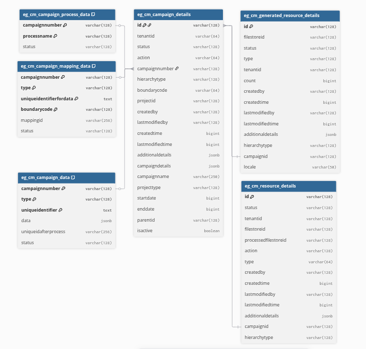

```dbml
Table eg_cm_campaign_details {
  id varchar(128) [pk]
  tenantid varchar(64)
  status varchar(128)
  action varchar(64)
  campaignnumber varchar(128) [unique]
  hierarchytype varchar(128)
  boundarycode varchar(64)
  projectid varchar(128)
  createdby varchar(128)
  lastmodifiedby varchar(128)
  createdtime bigint
  lastmodifiedtime bigint
  additionaldetails jsonb
  campaigndetails jsonb
  campaignname varchar(250)
  projecttype varchar(128)
  startdate bigint
  enddate bigint
  parentid varchar(128)
  isactive boolean
}

Table eg_cm_campaign_data {
  campaignnumber varchar(128) [pk]
  type varchar(128) [pk]
  uniqueidentifier text [pk]
  data jsonb
  uniqueidafterprocess varchar(256)
  status varchar(128)
}

Table eg_cm_campaign_mapping_data {
  campaignnumber varchar(128) [pk]
  type varchar(128) [pk]
  uniqueidentifierfordata text [pk]
  boundarycode varchar(128) [pk]
  mappingid varchar(256)
  status varchar(128)
}

Table eg_cm_campaign_process_data {
  campaignnumber varchar(128) [pk]
  processname varchar(128) [pk]
  status varchar(128)
}

Table eg_cm_generated_resource_details {
  id varchar(128) [pk]
  filestoreid varchar(128)
  status varchar(128)
  type varchar(128)
  tenantid varchar(128)
  count bigint
  createdby varchar(128)
  createdtime bigint
  lastmodifiedby varchar(128)
  lastmodifiedtime bigint
  additionaldetails jsonb
  hierarchytype varchar(128)
  campaignid varchar(128)
  locale varchar(50)
}

Table eg_cm_resource_details {
  id varchar(128) [pk]
  status varchar(128)
  tenantid varchar(128)
  filestoreid varchar(128)
  processedfilestoreid varchar(128)
  action varchar(128)
  type varchar(64)
  createdby varchar(128)
  createdtime bigint
  lastmodifiedby varchar(128)
  lastmodifiedtime bigint
  additionaldetails jsonb
  campaignid varchar(128)
  hierarchytype varchar(128)
}

// Relationships
Ref: eg_cm_campaign_details.campaignnumber > eg_cm_campaign_data.campaignnumber
Ref: eg_cm_campaign_details.campaignnumber > eg_cm_campaign_mapping_data.campaignnumber
Ref: eg_cm_campaign_details.campaignnumber > eg_cm_campaign_process_data.campaignnumber
Ref: eg_cm_campaign_details.id > eg_cm_generated_resource_details.campaignid
Ref: eg_cm_campaign_details.id > eg_cm_resource_details.campaignid
```

Run above dbml code in https://dbdiagram.io/ to get db

