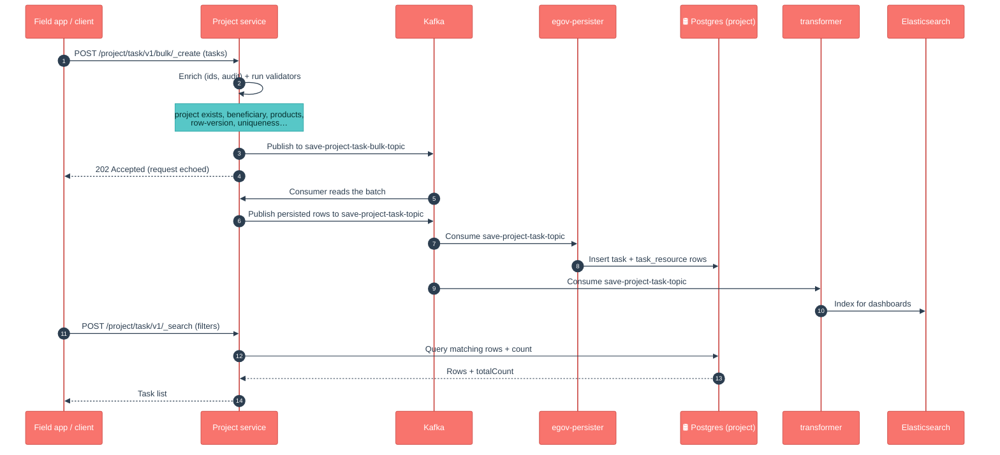
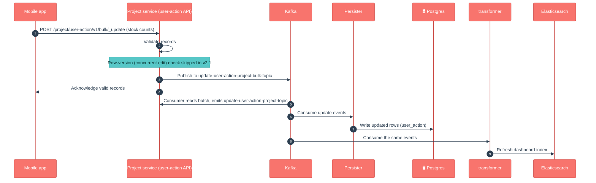

# Project (Health Project)

## 1. Purpose

Project is the **operational backbone** of a health campaign. A "project" is the on-the-ground unit of work — for example "Measles vaccination round in District X". Around that unit, the service keeps track of everything needed to run it and everything that actually happened:

- **who** is working on it (staff),
- **who** it is for (beneficiaries — the households or individuals being served),
- **where** it operates (facilities and boundaries),
- **what** supplies are tied to it (resources), and
- **what was done** in the field — every visit, delivery or service event (tasks), plus the commodities each task consumed (task resources).

It also records lighter-weight field signals: a worker's **location trail** and **user actions** (what a field user did on their device, including stock-count submissions).

In short: *"what is the campaign, who runs it, who is it for, and what happened on the ground?"*

## 2. Business Flow

- **During campaign setup**, project-factory creates the projects, attaches staff, links facilities, and registers the target beneficiaries. Project is the registry that all of this lands in.
- **During the campaign (runtime)**, the field/mobile app reads its assigned project and then writes back **tasks** — each beneficiary visit or service delivery becomes a task, and the commodities used become **task resources**. The app also streams a worker's **location** and **user actions** as they move through the day.
- **Beneficiary tagging** links a household/individual to the project so the app knows who is eligible and what they have already received.
- The data feeds the **dashboards** (via the transformer → Elasticsearch) so programme managers can see coverage, staff activity and consumption per area.

## 3. Key APIs / Entry Points

Base path `/project`. Each sub-entity follows the same DIGIT shape: single + bulk create/update/delete and a search. The list below is the important set, not every endpoint.

| Endpoint | Purpose |
|---|---|
| `POST /project/v1/_create`, `/v1/_update`, `/v1/_search`, `/v2/_search` | Manage the project itself (the campaign unit). `v2` search returns richer linked data. |
| `POST /project/task/v1/_create`, `/bulk/_create` … `_search` | Record field work — visits, deliveries, service events (the highest-volume path). |
| `POST /project/beneficiary/v1/_create` … `_search` | Tag households/individuals as targets of a project. |
| `POST /project/staff/v1/_create` … `_search` | Assign / unassign workers to a project. |
| `POST /project/facility/v1/_create` … `_search` | Link facilities (and their boundaries) to a project. |
| `POST /project/resource/v1/_create` … `_search` | Link products/supplies to a project. |
| `POST /project/user-action/v1/bulk/_create`, `/bulk/_update`, `/_search` | Capture field-user actions, **including bulk stock-count updates** (see v2.1). |
| `POST /project/user-location/...`, `/check/bandwidth` | Worker location trail and a connectivity check used by the mobile app. |

**Kafka entry points (async).** Bulk writes land on the service's own consumer topics (e.g. `save-project-task-bulk-topic`, `save-user-action-project-bulk-topic`, the beneficiary/staff/facility/resource equivalents). After processing, persisted rows go out on `save-*` / `update-*` / `delete-*` topics (e.g. `save-project-task-topic`, `update-user-action-project-topic`) for the persister and transformer.

**Swagger contract:** https://editor.swagger.io/?url=https://raw.githubusercontent.com/egovernments/health-campaign-services/master/docs/health-api-specs/contracts/project.yml

### Kafka topics

| Topic | Dir | Purpose |
|---|---|---|
| `save-project-task-bulk-topic` | in | Bulk task create requests |
| `update-project-task-bulk-topic` | in | Bulk task update requests |
| `delete-project-task-bulk-topic` | in | Bulk task delete requests |
| `save-project-staff-bulk-topic` | in | Bulk staff create requests |
| `update-project-staff-bulk-topic` | in | Bulk staff update requests |
| `delete-project-staff-bulk-topic` | in | Bulk staff delete requests |
| `save-project-facility-bulk-topic` | in | Bulk project-facility create requests |
| `update-project-facility-bulk-topic` | in | Bulk project-facility update requests |
| `delete-project-facility-bulk-topic` | in | Bulk project-facility delete requests |
| `save-project-resource-bulk-topic` | in | Bulk resource create requests |
| `update-project-resource-bulk-topic` | in | Bulk resource update requests |
| `delete-project-resource-bulk-topic` | in | Bulk resource delete requests |
| `project-beneficiary-consumer-bulk-create-topic` | in | Bulk beneficiary create requests |
| `project-beneficiary-consumer-bulk-update-topic` | in | Bulk beneficiary update requests |
| `project-beneficiary-consumer-bulk-delete-topic` | in | Bulk beneficiary delete requests |
| `save-user-action-project-bulk-topic` | in | Bulk user-action create requests |
| `update-user-action-project-bulk-topic` | in | Bulk user-action update requests |
| `save-location-capture-project-bulk-topic` | in | Bulk location-capture create requests |
| `save-project` / `update-project` / `update-project-date` | out | Persist project + date changes |
| `save-project-task-topic` / `update-project-task-topic` / `delete-project-task-topic` | out | Persist task create / update / delete |
| `save-project-staff-topic` / `update-project-staff-topic` / `delete-project-staff-topic` | out | Persist staff create / update / delete |
| `save-project-facility-topic` / `update-project-facility-topic` / `delete-project-facility-topic` | out | Persist project-facility create / update / delete |
| `save-project-resource-topic` / `update-project-resource-topic` / `delete-project-resource-topic` | out | Persist resource create / update / delete |
| `save-project-beneficiary-topic` / `update-project-beneficiary-topic` / `delete-project-beneficiary-topic` | out | Persist beneficiary create / update / delete |
| `save-user-action-project-topic` / `update-user-action-project-topic` | out | Persist user-action create / update |
| `save-location-capture-project-topic` | out | Persist location-capture |
| `project-staff-attendance-health-topic` | out | Emit staff attendance event |

## 4. Dependencies

- **idgen** — generates project / task / beneficiary record IDs.
- **household & individual** — the registries a beneficiary points at (validation of who is being served).
- **facility** — validates facilities linked to a project.
- **product** — validates products linked as project resources / task resources.
- **boundary** — administrative boundaries a project and its facilities operate in.
- **egov-mdms** — master data (project types, task statuses, tenant config).
- **health-services-common / -models** — shared clients, validators, POJOs.
- **Kafka** — async create/update/delete pipeline for every entity.
- **egov-persister** (deployed via the `configs/` repo) — actually writes the rows to Postgres off the `save-*` topics.
- **transformer → Elasticsearch** — builds the dashboard read-model from the same topics.
- **Redis** — caching used by the shared repository layer.

## 5. Processing Flow

Writes are **asynchronous**: the API validates, enriches and acknowledges, then a Kafka consumer persists. The service does not write Postgres directly — it emits a `save-*` event that **egov-persister** turns into a row, while the **transformer** indexes the same event into Elasticsearch for dashboards. The diagram shows the highest-volume path — bulk task create.

> **Note on the official LLD diagrams** (`docs.digit.org/health/design/architecture/low-level-design/services/project`): the published create/update/search sequence diagrams still match the current code at a high level (validate → async persist → search-from-DB). The `user_action` / `user_location` entities and the relaxed row-version check on the user-action path (v2.1) are **newer than the published diagrams** and are captured in the flows here.

### Data model (DB UML)

## 6. Failure / Retry Handling

- **Async, no batch rollback.** A bulk request returns `202` before persistence. If one record in the batch fails validation in the consumer, it does not roll back the others — check consumer logs and the record's status.
- **Idempotency** is via `clientReferenceId` — re-submitting the same one should not create a duplicate row.
- **Optimistic locking** via `rowVersion` protects against concurrent edits on the normal entity-update paths (task, beneficiary, etc.). (See the v2.1 note for the one place this is now relaxed — the user-action path.)
- **Soft delete** (`isDeleted`) everywhere — nothing is hard-deleted; unique constraints include the delete flag.
- If the **persister config** for the project topics is missing/stale in an environment, the API will accept writes but rows will silently not appear in Postgres — a classic "it worked in QA" trap.

## 7. Recent Changes (v2.1 / nigeria-go-deep-2)

Changes between the `v2.0` baseline and the `master-nigeria-finalpull` release line, in plain language for product owners, QA and ops.

- **Bulk stock-count updates enabled — concurrent-update protection relaxed (QA note).** The user-action API is the path field apps use to submit stock counts. To allow submitting many counts at once: the row-version (concurrent-edit) check is now **skipped for user-action updates** — simultaneous updates no longer fail with a version conflict; last write wins. The companion change in the stock search (page-size cap lifted) lets a facility's full stock list come back in one call. QA should explicitly cover concurrent-edit scenarios on the user-action path. Other update paths (task, beneficiary, staff, facility, resource) still enforce the row-version check.
- **Facility search by boundary type.** Project-facility search can now return facilities grouped by boundary type (a map of boundary type → facility ids), with a performance-tuned query — useful for "which facilities sit under this area?" lookups by the app and dashboards.
- **New task statuses for referrals and no-resource tasks.** The set of task statuses was extended (e.g. referral handling and tasks that consumed no resources) so the field flow can record outcomes that previously had no status.
- **Fixed missing request info on project update.** A project update message was being published without its request/correlation context; this is now carried through, so downstream consumers and audit trails are complete.
- **Project-facility now returned in responses.** Project search responses can include the linked project-facility object, saving the client a second lookup.
- **NPE guarding and cleanup** on the new code paths (facility-by-boundary search), plus a tracer 2.9.2 / OpenTelemetry dependency upgrade shared across the health services.

### Flow: bulk stock-count update (v2.1)

## 8. Known Risks / Limitations

- **Large surface area.** Project bundles seven core entities (project, task, beneficiary, staff, facility, resource, task-resource) plus the `user_action` / `user_location` audit tables. A change to shared validation or enrichment can ripple across all of them — test the whole set, not just the entity you touched.
- **Relaxed concurrency on the user-action path** (v2.1) means simultaneous stock-count submissions are accepted with last-write-wins — acceptable for counts, but a behavioural change QA must be aware of. Other paths are unaffected.
- **Task is the highest-volume entity.** Field rounds generate huge task / task-resource volumes; search and persister throughput here drive overall campaign performance.
- **Cross-registry references are validated app-side.** Beneficiary → household/individual and resource → product links are checked by service calls, not DB foreign keys — a stale or unreachable dependency surfaces as a validation failure, not a constraint error.
- **Persister/transformer config drift.** Because writes are async, a missing or stale persister/transformer config in an environment lets the API accept writes that never land in Postgres or Elasticsearch.

## 9. Release Version

| Field | Value |
|---|---|
| Release | **v2.1** (`master-nigeria-finalpull`) |
| Stack | Spring Boot 3.2.2 / Java 17 |
| Shared libs | `health-services-common` 1.1.3-SNAPSHOT, `health-services-models` 1.0.35-SNAPSHOT |
| Doc updated | 2026-06-12 |
| Maintainers | Health Campaign Services team (CODEOWNERS: `@kavi-egov`, `@sathishp-eGov`) |

## Pre-commit script

[commit-msg](https://gist.github.com/jayantp-egov/14f55deb344f1648503c6be7e580fa12)
