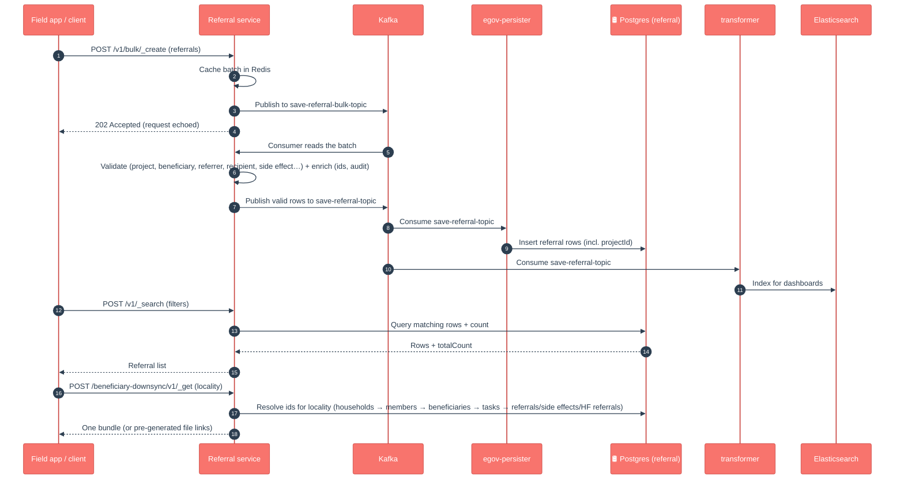

# Referral Management

## Enhancements in v2.1

Changes from v2.0 to v2.1, in plain language for product owners, QA and ops.

- **Device sync can skip its own edits.** Referral search now supports `includeOnlyUpdatedByOthers=true`; combined with a "changed since" time, results exclude records the calling user last modified, so a syncing device doesn't re-download what it just uploaded (PR #1991). Only takes effect when a since-time is provided.
- **Referrals are now linked to a project.** A `projectId` field was added to the shared Referral model and stored in a new column (migrations `V20260211164600` + index `V20260223150400`, applied automatically on start) and written by the updated persister config. This lets HF referrals and downsync be scoped directly to a project.
- **Big downsync overhaul for offline scale.** Added a pre-generation pipeline: `/downsync/v1/_generate` builds per-locality / per-project files in the background and stores them in S3, while `/beneficiary-downsync/v1/_get` serves a fresh on-device bundle for recent syncs and falls back to those pre-generated file links for cold/stale syncs. New audit tables track every job, locality and file (`V20260423100000`), and a materialized view speeds up locality scoping (`V20260426140000`).
- **Downsync jobs are safe to retry and resume.** Single-flight locks per tenant and per project prevent duplicate runs, interrupted jobs resume on startup, and partially-failed jobs report exactly which localities/files failed.
- **Persisted data includes projectId.** The deployed persister config for the referral topics was updated to write `projectId`. Environments must pick up the updated persister config alongside the new build, or the field is accepted but not saved.

> **Note on the official LLD diagrams** (`docs.digit.org/health/design/architecture/low-level-design/services/referral`): the published create/update/delete/search sequence diagrams (images) still match the current code at a high level (validate → async persist → search-from-DB) for Referral, Side Effect and HF Referral. The `projectId` field, the `includeOnlyUpdatedByOthers` sync filter, and the pre-generated **downsync** pipeline are **newer than the published diagrams** and are captured in the flow above.

## 1. Purpose

Referral Management is the **"this person needs follow-up care" ledger** for a health campaign. When a field worker meets a beneficiary who can't be treated on the spot — a sick child, a suspected case, an adverse reaction to a drug — the worker records a **referral** so the right facility or worker picks them up next. It tracks three related things:

- **Referral** — a beneficiary was sent on for further care (who referred, who receives, why, and any side effect that triggered it).
- **Side Effect** — an adverse reaction observed after a campaign task (e.g. a vaccine dose), so safety signals are captured.
- **HF Referral (Health Facility referral)** — a referral raised directly at/for a health facility, often by a distributor, summarising symptoms and a referral code.

It also powers the **offline-first mobile app**: it can bulk-pull everything a device needs for a locality in one call (the **downsync** endpoint), so workers can keep operating with no network.

In short: *"who got sent for follow-up, why, and what does the offline app need to carry with it?"*

## 2. Business Flow

- **During the campaign (runtime)**, field workers register referrals and side effects from the mobile app — usually offline, queued, and pushed up when connectivity returns.
- **Health-facility staff / distributors** raise HF referrals tied to a project facility and locality.
- Every record links back to the **campaign context** — the project, the project beneficiary, and (for referrals) the originating side effect — so follow-up is traceable to the right person and campaign.
- The mobile app periodically **downsyncs** a locality's data (households, members, beneficiaries, tasks, referrals, side effects, HF referrals) so a worker has the full picture on-device.
- The records feed the **dashboards** (via the transformer/indexer → Elasticsearch) so programme managers can see referral and adverse-event volumes.

## 3. Key APIs / Entry Points

Context path `/referralmanagement`. Three entities, each with single + bulk create/update/delete and a search, plus the offline-sync endpoints.

| Endpoint | Purpose |
|---|---|
| `POST /v1/_create`, `/v1/bulk/_create` | Record a referral (single or bulk). |
| `POST /v1/_update` · `/v1/_delete` (+ `/bulk/…`) | Correct or soft-delete a referral. |
| `POST /v1/_search` | Find referrals (by beneficiary, project, ids, since-time …; supports `includeOnlyUpdatedByOthers`). |
| `POST /side-effect/v1/_create … _search` (+ bulk) | Same shape for adverse-event records. |
| `POST /hf-referral/v1/_create … _search` (+ bulk) | Same shape for health-facility referrals. |
| `POST /beneficiary-downsync/v1/_get` | Offline bulk pull — everything a locality needs in one response (or pre-generated file links). |
| `POST /downsync/v1/_generate` · `/downsync/v1/jobs/_search` | Kick off background generation of downsync files for a tenant/project, and poll the job. |

**Kafka entry points (async).** Bulk requests land on `save-referral-bulk-topic` / `update-…` / `delete-…` (and the side-effect / hf-referral equivalents) and are processed by the service's own consumer. Persisted results go out on `save-referral-topic` / `update-referral-topic` / `delete-referral-topic` (+ side-effect and hf-referral topics) for the persister and transformer.

**Swagger contract:** https://editor.swagger.io/?url=https://raw.githubusercontent.com/egovernments/health-campaign-services/master/docs/health-api-specs/contracts/referral-management.yml

### Kafka topics

| Topic | Dir | Purpose |
|---|---|---|
| `save-referral-bulk-topic` | in | Bulk referral create requests |
| `update-referral-bulk-topic` | in | Bulk referral update requests |
| `delete-referral-bulk-topic` | in | Bulk referral delete requests |
| `save-side-effect-bulk-topic` | in | Bulk side-effect create requests |
| `update-side-effect-bulk-topic` | in | Bulk side-effect update requests |
| `delete-side-effect-bulk-topic` | in | Bulk side-effect delete requests |
| `save-hfreferral-bulk-topic` | in | Bulk HF-referral create requests |
| `update-hfreferral-bulk-topic` | in | Bulk HF-referral update requests |
| `delete-hfreferral-bulk-topic` | in | Bulk HF-referral delete requests |
| `save-referral-topic` | out | Persist new referrals |
| `update-referral-topic` | out | Persist referral updates |
| `delete-referral-topic` | out | Persist referral soft-deletes |
| `save-side-effect-topic` | out | Persist new side-effects |
| `update-side-effect-topic` | out | Persist side-effect updates |
| `delete-side-effect-topic` | out | Persist side-effect soft-deletes |
| `save-hfreferral-topic` | out | Persist new HF-referrals |
| `update-hfreferral-topic` | out | Persist HF-referral updates |
| `delete-hfreferral-topic` | out | Persist HF-referral soft-deletes |

## 4. Dependencies

- **idgen** — generates referral / side-effect / hf-referral ids.
- **project** — validates the project, project-beneficiary, project-task and project-facility a record links to.
- **facility** — validates the health facility an HF referral is for.
- **household / individual** — read during downsync to assemble the full beneficiary bundle.
- **service-request** — optional services pulled into downsync when enabled.
- **MDMS** — resolves project type / beneficiary type used to drive downsync.
- **egov-enc-service** — decrypts beneficiary fields where needed during downsync.
- **health-services-common / -models** — shared clients, validators, POJOs (the `Referral`, `SideEffect`, `HFReferral` models live here).
- **Kafka** — async create/update/delete pipeline.
- **egov-persister** (deployed via the `configs/` repo) — actually writes the rows to Postgres off the `save-*` topics.
- **transformer / indexer → Elasticsearch** — builds the dashboard read-model from the same topics.
- **Redis** — caches incoming bulk referrals before the consumer processes them (and search caching in the shared repository layer).
- **S3 (object storage)** — stores pre-generated downsync files; the service hands back time-limited download links.

## 5. Processing Flow

Writes are **asynchronous**: the API validates, enriches and acknowledges, then a Kafka consumer persists. The service does not write Postgres directly — it emits a `save-*` event that **egov-persister** turns into a row, while the **transformer/indexer** projects the same event into Elasticsearch for dashboards. Search reads straight from Postgres. The **downsync** path is a synchronous bulk *read* that fans out to other services to build the device bundle.

## 6. Failure / Retry Handling

- **Async, no batch rollback.** A bulk request returns `202` before persistence. If one record in the batch fails validation in the consumer, it does not roll back the others — check consumer logs and the record's status.
- **Idempotency** is via `clientReferenceId` — re-submitting the same one should not create a duplicate row (the unique-entity validators guard this).
- **Optimistic locking** via `rowVersion` protects against concurrent edits on update/delete.
- **Soft delete** (`isDeleted`) everywhere — nothing is hard-deleted.
- **Downsync is best-effort and bounded.** If `lastSyncedTime` is missing or older than the staleness threshold (default 8h), the request is served from **pre-generated files**; if none exist yet it returns `PREGEN_NOT_AVAILABLE` and a generation job must be triggered first.
- **Downsync generation is single-flight per tenant/project.** A second `/downsync/v1/_generate` while one is running returns `409 Conflict` with progress details; interrupted jobs are resumed on startup (`503 SERVICE_INITIALIZING` until that scan completes). Per-file failures are tracked, so a job can finish `COMPLETED`, `PARTIAL_FAILURE`, or `FAILED`.
- If the **persister config** for the referral topics is missing/stale in an environment, the API will accept writes but rows will silently not appear in Postgres — a classic "it worked in QA" trap.

## 7. Known Risks / Limitations

- **Downsync correctness depends on fresh pre-generated files.** For stale/cold syncs the device gets whatever was last generated; if no generation job has run, the locality returns no data (`PREGEN_NOT_AVAILABLE`) — operations must schedule/trigger generation.
- **`recipientType` / `reasons` / `symptoms` carry free-form or list data** validated only at app level — the DB won't stop unexpected values.
- **Side effects are linked to a task; the linkage query is a known shortcut** (flagged in code as needing a proper task-search enhancement) — keep an eye on it as task volumes grow.
- **Relaxed-edit / last-write semantics across devices.** With `includeOnlyUpdatedByOthers`, a device intentionally ignores its own latest edits during sync; QA should confirm multi-device edit scenarios behave as expected.
- **Downsync fans out to many services synchronously.** A slow household/individual/project search makes the on-device bundle path slow; the pre-gen path exists precisely to take that off the request hot path.
- **CLAUDE.md lists `health-services-common` as 1.1.5-SNAPSHOT, but this service's `pom.xml` is on `1.1.3-SNAPSHOT`** — confirm the intended version before release.

## 8. Release Version

| Field | Value |
|---|---|
| Release | **v2.1** |
| Stack | Spring Boot 3.2.2 / Java 17 |
| Shared libs | `health-services-common` 1.1.3-SNAPSHOT, `health-services-models` 1.0.35-SNAPSHOT |
| Doc updated | 2026-06-12 |
| Maintainers | Health Campaign Services team (CODEOWNERS: `@kavi-egov`, `@sathishp-eGov`) |
