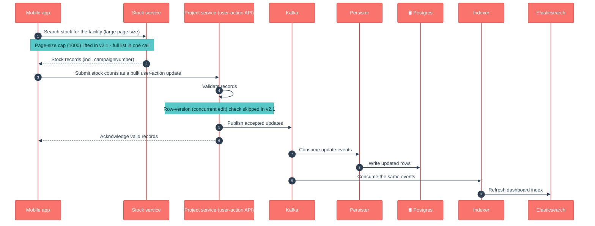
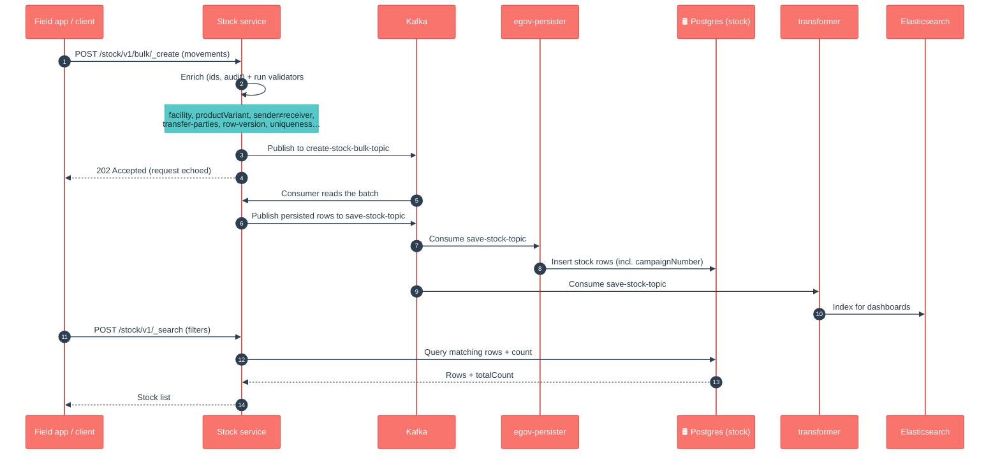

# Stock

## Enhancements in v2.1

Changes from v2.0 to v2.1, in plain language for product owners, QA and ops.

- **Stock records are now linked to campaigns by campaign number.** Create/update accept a `campaignNumber` on each record; it is stored (new column via migration `V20260422000000`, applied automatically on start) and flows to the database and the dashboard index, so stock can be tied back to the campaign it belongs to.
- **Search by campaign number.** `/stock/v1/_search` accepts `campaignNumber` as a filter to pull a campaign's stock directly.
- **Persisted data includes campaign number.** The deployed persister config for the stock topics (in the `configs/` repo) was updated to write `campaignNumber`. Environments must pick up the updated persister config alongside the new build, or the field is accepted but not saved.
- **Device sync can skip its own edits.** Search supports `includeOnlyUpdatedByOthers=true`; combined with a "changed since" time, results exclude records the calling user last modified, so a syncing device doesn't re-download what it just uploaded. Only takes effect when a since-time is provided (PR #1991).
- **Sync time can come from the request body.** Search accepts `lastSyncedTime` in the body; when present it takes precedence over the `lastChangedSince` URL parameter.
- **One facility, both directions, one search.** Passing the same facility id as both `senderId` and `receiverId` returns every record where that facility is either sender or receiver — a warehouse's full incoming/outgoing ledger in one call.
- **Bulk stock-count updates enabled — concurrent-update protection relaxed (QA note).** To support submitting stock counts in bulk: (1) the row-version (concurrent-edit) check is **skipped for stock-count user-action updates** (the user-action flow served by the project service) — simultaneous updates no longer fail with a version conflict on that path; last write wins; and (2) the search page-size cap (was 1000) was lifted so a facility's full stock list fetches in one page. QA should explicitly cover concurrent-edit scenarios on the user-action path. Regular transfer updates (`/stock/v1/_update`) still enforce the row-version check.
- **Search-by-id behaves like every other search.** Searching by ids now runs through the same database query as all other filters, so since-time, deleted-record and updated-by-others filtering behave consistently.

### Flow: bulk stock-count update (v2.1)

> **Note on the official LLD diagrams** (`docs.digit.org/health/design/architecture/low-level-design/services/stock`): the published Stock create/update/search sequence diagrams still match the current code at a high level (validate → async persist → search-from-DB). The campaign-number filter, the `includeOnlyUpdatedByOthers` sync filter, and the relaxed row-version check on the count path are **newer than the published diagrams** and are captured in the two mermaid flows above.

## 1. Purpose

Stock is the **supply-chain ledger** for a health campaign. Every time a commodity (vaccine, bed net, deworming tablet) moves — received into a warehouse, sent to a facility, handed out to a household, lost, or adjusted — Stock records one row for that movement. It also stores **physical-count reconciliations** so a facility's book stock can be checked against what's actually on the shelf.

In short: *"what did we have, where did it go, and does the count still add up?"*

## 2. Business Flow

- **During campaign setup**, opening stock is received into central/warehouse facilities.
- **During the campaign (runtime)**, field workers and storekeepers record transfers (warehouse → facility → sub-facility) and distributions (facility → beneficiary). Every hand-out of a commodity is a stock **OUT** transaction.
- **Periodically**, a storekeeper does a physical count and submits a **reconciliation** so discrepancies (theft, breakage, miscount) surface early.
- The numbers feed the **dashboards** (via the transformer → Elasticsearch) so programme managers can see stock-on-hand and consumption per facility.

## 3. Key APIs / Entry Points

Base path `/stock/v1` (transactions) and `/stock/reconciliation/v1` (counts). Each entity has single + bulk create/update/delete and a search.

| Endpoint | Purpose |
|---|---|
| `POST /stock/v1/_create`, `/bulk/_create` | Record a stock movement (single or bulk). |
| `POST /stock/v1/_update`, `/bulk/_update` | Correct a movement. |
| `POST /stock/v1/_delete`, `/bulk/_delete` | Soft-delete a movement. |
| `POST /stock/v1/_search` | Find movements (by facility, sender/receiver, product variant, **campaignNumber**, since-time …). |
| `POST /stock/reconciliation/v1/_create` … `_search` | Same shape for physical-count reconciliations. |

**Kafka entry points (async).** Bulk requests land on `create-stock-bulk-topic` / `update-…` / `delete-…` (and the reconciliation equivalents) and are processed by the service's own consumer. Persisted results go out on `save-stock-topic` / `update-stock-topic` / `delete-stock-topic` (+ reconciliation topics) for the persister and transformer.

**Swagger contract:** https://editor.swagger.io/?url=https://raw.githubusercontent.com/egovernments/health-campaign-services/v1.0.0/docs/health-api-specs/contracts/stock.yml

### Kafka topics

| Topic | Dir | Purpose |
|---|---|---|
| `create-stock-bulk-topic` | in | Bulk stock-movement create requests |
| `update-stock-bulk-topic` | in | Bulk stock-movement update requests |
| `delete-stock-bulk-topic` | in | Bulk stock-movement (soft) delete requests |
| `create-stock-reconciliation-bulk-topic` | in | Bulk reconciliation create requests |
| `update-stock-reconciliation-bulk-topic` | in | Bulk reconciliation update requests |
| `delete-stock-reconciliation-bulk-topic` | in | Bulk reconciliation delete requests |
| `save-stock-topic` | out | Persist new stock rows (persister + transformer) |
| `update-stock-topic` | out | Persist stock updates |
| `delete-stock-topic` | out | Persist stock soft-deletes |
| `save-stock-reconciliation-topic` | out | Persist new reconciliations |
| `update-stock-reconciliation-topic` | out | Persist reconciliation updates |
| `delete-stock-reconciliation-topic` | out | Persist reconciliation deletes |

## 4. Dependencies

- **idgen** — generates stock record IDs.
- **facility** — validates the facility a movement is for.
- **product** — validates the product variant being moved.
- **project / project-facility** — optional link of a movement to a project's facility.
- **health-services-common / -models** — shared clients, validators, POJOs.
- **Kafka** — async create/update/delete pipeline.
- **egov-persister** (deployed via the `configs/` repo) — actually writes the rows to Postgres off the `save-*` topics.
- **transformer → Elasticsearch** — builds the dashboard read-model from the same topics.
- **Redis** — caching used by the shared repository layer.

## 5. Processing Flow

Writes are **asynchronous**: the API validates, enriches and acknowledges, then a Kafka consumer persists. The service does not write Postgres directly — it emits a `save-*` event that **egov-persister** turns into a row, while the **transformer** indexes the same event into Elasticsearch for dashboards.

### Data model (DB UML)

## 6. Failure / Retry Handling

- **Async, no batch rollback.** A bulk request returns `202` before persistence. If one record in the batch fails validation in the consumer, it does not roll back the others — check consumer logs and the record's status.
- **Idempotency** is via `clientReferenceId` — re-submitting the same one should not create a duplicate row.
- **Optimistic locking** via `rowVersion` protects against concurrent edits on the normal transfer-update path. (See the v2.1 note above for the one place this is now relaxed.)
- **Soft delete** (`isDeleted`) everywhere — nothing is hard-deleted; unique constraints include the delete flag.
- If the **persister config** for the stock topics is missing/stale in an environment, the API will accept writes but rows will silently not appear in Postgres — a classic "it worked in QA" trap.

## 7. Known Risks / Limitations

- **`quantity` is signed** — negative values are valid (loss/consumption) and there is no DB constraint; bad data is an app/validation concern, not a DB guard.
- **`transactingPartyId` + `transactingPartyType` are polymorphic with no foreign key** — validation is app-level only.
- **`transactionType` / `transactionReason` are free strings.** Convention is IN/OUT/LOSS/ADJUSTMENT/TRANSFER, but the DB won't stop other values.
- **Reconciliation is per facility, not per product variant** — variant-level discrepancies live in a comments field, not structured columns.
- **`dateOfEntry` (field date) ≠ `createdTime` (system date)** — both matter for audit; don't conflate them.
- **Relaxed concurrency on the count path** (v2.1) means simultaneous count submissions are accepted with last-write-wins — acceptable for counts, but a behavioural change QA must be aware of.

## 8. Release Version

| Field | Value                                                                             |
|---|-----------------------------------------------------------------------------------|
| Release | **v2.1**                                                                          |
| Stack | Spring Boot 3.2.2 / Java 17                                                       |
| Shared libs | `health-services-common` 1.1.5-SNAPSHOT, `health-services-models` 1.0.35-SNAPSHOT |
| Doc updated | 2026-06-12                                                                        |
| Maintainers | Health Campaign Services team (CODEOWNERS: `@kavi-egov`, `@sathishp-eGov`)        |

## Pre-commit script

[commit-msg](https://gist.github.com/jayantp-egov/14f55deb344f1648503c6be7e580fa12)
