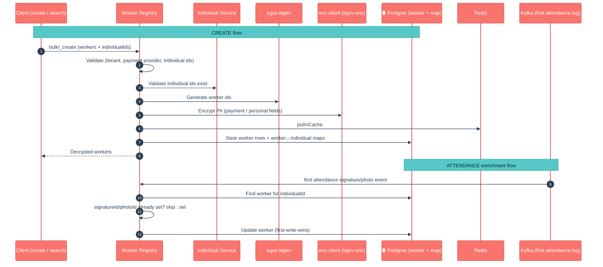

# Worker Registry Service

## Enhancements in HCM-v2.1

The headline change for v2.1 is simple: **this service is new.** It ships for the first time in this release, so everything below is a v2.1 addition.

What the service brings to v2.1, in plain language:

- **A dedicated registry for campaign workers.** Field workers (the people who administer commodities, run distribution, etc.) now have their own record — separate from, but linked to, their `individual` identity.
- **Payment details live here.** Each worker carries the payment context needed to pay them: payment provider, payee name, payee phone number, bank account, bank code, and a beneficiary code.
- **Worker ⇄ Individual mapping.** A worker can be linked to one or more `individual` records via a dedicated mapping table, so searches can go either direction (find the worker for an individual, or list the individuals behind a worker).
- **PII is encrypted at rest.** Sensitive worker fields (payment/personal data) are encrypted (via enc-client) before storage and decrypted only when returned to a caller.
- **Auto-captured signature & photo.** The service listens for the *first* attendance-log event and back-fills the worker's signature/photo file-store id automatically — no separate upload step.
- **Bulk-first APIs.** Create, update, and individual-mapping are all bulk endpoints, matching the ingestion patterns used elsewhere in the health stack.
- **Multi-tenant / central-instance aware.** The attendance Kafka listener supports both single-tenant and central-instance (multi-state) deployments via a tenant-id topic prefix.

## 1. Purpose

Worker Registry is the **system of record for campaign workers and how they get paid**. During a health campaign, individuals are recruited as field workers; this service holds the worker-specific data that does not belong on the generic `individual` record — chiefly **payment details** (provider, bank account, payee info) and **campaign artefacts** (signature, photo).

It does three jobs:

- **Maintains worker records** — create/update workers in bulk, keeping payment and identity data in one place.
- **Links workers to individuals** — a many-to-one mapping so the platform can resolve a worker from an individual id and vice-versa.
- **Enriches workers from events** — when the first attendance log for an individual arrives, it captures the signature/photo automatically.

In short: *"who are the workers on this campaign, how do we pay them, and what's their signature/photo?"*

## 2. Business Flow

- **Onboarding.** Workers are created in bulk. Each worker references one or more `individual` ids; those ids are validated against the Individual service, and a worker↔individual mapping row is written for each.
- **Payment readiness.** Payment provider and payee/bank details are validated on create/update so that downstream payment flows have what they need.
- **Attendance-driven enrichment.** The first time an attendance signature/photo document event is produced for an individual, the service finds the matching worker and back-fills the corresponding file-store id — but only if it is not already set (first-write-wins).
- **Search.** Workers can be searched by their own ids or by the individual ids linked to them; results come back with the linked individual ids attached.
- **Personal data is protected.** Worker payment/personal fields are encrypted before storage and decrypted only on the way out.

## 3. Key APIs / Entry Points

All REST endpoints are under the `/worker` context path with a `/v1` base.

**REST entry points:**

| Endpoint | Purpose |
|---|---|
| `POST /worker/v1/bulk/_create` | Bulk-create workers (validates individual ids, payment provider; writes worker + individual mappings). Returns the created workers, decrypted. |
| `POST /worker/v1/bulk/_update` | Bulk-update workers. Merges incoming fields over the existing record (partial update), re-validates, and returns decrypted workers. |
| `POST /worker/v1/_search` | Search workers by worker id and/or linked individual id (tenant id required). Returns workers with their linked `individualIds`. |
| `POST /worker/v1/individual/bulk/_create` | Bulk-create worker↔individual mappings (returns `202 ACCEPTED`). |

**Kafka entry points:**

| Topic listened to | Consumer | What it does |
|---|---|---|
| `first-attendance-log` (prefixable) | `AttendanceDocumentEventConsumer` | First attendance signature/photo event → resolves the worker for the individual → back-fills `signatureId` / `photoId` if unset. |

> An `attendance.kafka.tenant.id.pattern` prefix lets the same listener work in both single-tenant and central-instance (multi-state) deployments.

## 4. Dependencies

- **Individual (`individual` service)** — validates the `individual` ids referenced when creating/mapping workers (`individual.validation.enabled`).
- **IDGen (`egov-idgen`)** — generates worker ids (`worker.id`) when integration is enabled.
- **enc-client (egov-enc-service)** — encrypts/decrypts worker PII (payment and personal fields) on the way in and out.
- **MDMS (`egov-mdms-service`)** — tenant-scoped master data lookups.
- **health-services-common / -models** — shared clients, validators, models, and utilities (validation framework, `CommonUtils`, `ResponseInfoFactory`).
- **Kafka** — persistence writes and the attendance-log trigger flow through Kafka.
- **PostgreSQL + Flyway** — stores `eg_hcm_worker_registry` and `eg_hcm_worker_individual_map` (migrations applied on boot; Flyway disabled by default in local properties).
- **Redis** — caches worker and mapping records (`putInCache`).
- **egov-persister** (deployed via the `configs/` repo) — actually writes the worker create/update Kafka events to Postgres.

## 5. Processing Flow

> No official LLD sequence diagram is published for this service yet; the flow above reflects the current code.

## 6. Failure / Retry Handling

- **Validation is per-record, collected up front.** Create/update run the shared validator chain (`CommonUtils.validate`) and accumulate an `ErrorDetails` map; invalid workers are separated from valid ones before any writes happen.
- **Partial updates merge, they don't clobber.** On `_update`, missing fields on the incoming worker are filled from the existing DB record (`mergeWorker`), so an update that omits a field does not blank it out — this fixed an earlier bug where fields silently reverted to garbled/encrypted values on partial update.
- **Attendance events fail soft.** The consumer wraps processing in try/catch and only logs on error — a bad attendance event never crashes the listener. Invalid/incomplete events (missing individual/tenant/fileStore/type) are logged and skipped.
- **Signature/photo capture is first-write-wins.** If a worker already has a `signatureId`/`photoId`, the attendance event is logged and skipped rather than overwriting.
- **Empty individual-id search short-circuits.** A search by individual ids that matches no mappings returns an empty list immediately instead of running a broad worker query (fixes an earlier "no individual ids found" search issue).
- **Invalid tenant ids surface as `CustomException`.** `InvalidTenantIdException` from the repository layer is translated into a localized `CustomException` rather than a raw stack trace.

## 7. Known Risks / Limitations

- **No automatic retry / dead-letter on the attendance listener.** A failed attendance event is logged and dropped; there is no back-off or DLQ.
- **Signature/photo is capture-once.** Because enrichment is first-write-wins, a later/corrected signature or photo event will be ignored while a value is already present — updating it requires an explicit `_update`.
- **Individual validation depends on the Individual service.** If `individual.validation.enabled` is on and the Individual service is unreachable or the search limit (`individual.service.search.limit`, default 100) is exceeded for a very large batch, id validation can misbehave.
- **Flyway is disabled by default locally.** `spring.flyway.enabled=false` in `application.properties` — migrations must be run explicitly (or the flag flipped) when standing up a fresh local DB.
- **Search requires a tenant id.** Search with no tenant id is rejected; there is no cross-tenant listing.
- **Heavy reliance on enc-client correctness.** If the encryption service is misconfigured for the tenant, workers can be stored/returned garbled — the create/update path assumes encrypt→store→decrypt round-trips cleanly.

## 8. Release Version

| Field | Value |
|---|---|
| Release | **v2.1** — service first introduced in this line |
| Stack | Spring Boot 3.2.2 / Java 17 |
| Shared libs | `health-services-common` 1.1.1-SNAPSHOT, `health-services-models` 1.0.30-SNAPSHOT, `tracer` 2.9.0-SNAPSHOT, `enc-client` 2.9.0 |
| Doc updated | 2026-07-03 |
| Maintainers | Health Campaign Services team |
